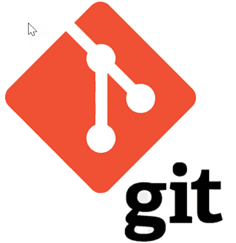

# Работа с GIT


## 1. Проверка наличия установленного Git
В терминале выполнить команду `git --version`
Если Git установлен, появится сообщение с информацией о версии программы, иначе будет сообщение об ошибке.

## 2. Установка Git
Загружаем последнюю версию с [сайта](https://git-scm.com/downloads). 
Устанавливаем с настройками *по умолчанию*.

## 3. Настройка GIT
При первом использовании Git необходимо представиться.
Для ээтого нужно ввести в терминале 2 команды: 

* git config --global user.name "Ваше имя на английском"

* git config --global user.email "Ваше почта"

## 4. Инициализация 
 Начинаем работу с помощью команды `git init` (*создаем репозиторий*)
 ## 5. Запись изменений 
 Последовательно выполнить в терминале 3 команды: 
 1. `git status` - позволяет посмотреть статус сохраненных версий и изменений в файлах; 
 2. `git add "имя файла" ` - позволяет выбрать файл для дальнейшего сохранения версии;
 3. `git commit` - позволяет сохранить версию;
 4. 'git commit -a -m "сообщение" - позволяет объединить функции add и commit с указанием сообщения

 ## 6. Просмотр истории 
 Введите в терминале команду `git log`, которая позволит посмотреть сохраненные ранее версии. Для выхода из данной команды нажмите **`q`**. Также удобно использовать функцию 'git log --oneline' для отображения информации по сохраненным версиям в одну строчку

 ## 7. Перемещение между репоситориями 
 Введите в терминале команду `git checkout` для переключения между разными версиями файла. Для выхода в последнюю версию файла воспользуйтесь командой `git checkout master` или 'git switch master'.

 ## 8. Игнорирование файлов

 Для того, чтобы исключить из отслеживания в репозитории определенные файли или папка необходимо создать там файл ***.gitignore*** и записать их названия или шаблоны, соответствующие этим названиям или папкам. 

 ## 9. Создание веток в GIT

 По умолчанию имя основной ветки в GIT - **master**.
 Создать ветку можно командами:

 ```
 git branch <имя новой ветки> 
```

>git checkout -b <имя новой ветки>

>git switch -c <имя новой ветки>


Список веток в репозитории можно посмотреть с помощью команды `git branch`. Текущая ветка будет отмечена звездочкой: **\* master**.


## 10. Слияние веток

Чтобы выполнить слияние веток, предварительно вернитесь в ветку master. Далее воспользуйтесь командой `git merge <имя ветки>`. 
```
git merge
```

## 11. Разрешение конфликтов

При слиянии веток может возникнуть конфликт. Он возникает в том случае, когда в одной из веток произошли изменения относительно предыдущего сохранения. В таком случае в процессе слияния  мы увидим сообщение в терминали, что возник конфликт, а VS Code покажет, в каких местах возникнет конфликт. Также VS code предложит следующие варианты действий:

* принять входящие изменения (то есть будет отражена входящая информация из ветки, которую мы объединяем);
* принять текущий вариант (то есть останется инфлрмация из текущей ветки, как правило это ветка master);
* принять оба варианта (в таком случае информация из двух источников будет объединена и отображена в последовательном порядке);
* посмотреть разницу.

После разрешения конфликтов необходимо сделать коммит слияния с помощью команды `git commit`.

## 12. Удаление веток

После слияния веток и сохранения информации в ветке master необходимо удалить уже неактуальную ветку. Это делается в целях оптимизации процессов и использования памяти. Удаление ветчки осуществляется с помощью команды
```
git branch -d <имя ветки>
```

Если ветка не сохраненина, но ее можно удалить, то используется команда принудительного удаления
```
git branch -D <имя ветки>
```

*Примечание*: нельзя удалить ветку, если вы в ней находитесь. Для удаления ветки, нужно выйти из нее, перейдя предпочтительно в ветку master, либо в любую другую.

## 13. Работа с удаленными репозиториями

Работа с удаленными репозиториями осуществляется через разные сервисы. Самый популярный и достпный сервис это GitHub.

Для полноценной работы на сайте GitHub необходимо последовательно сделать следующие шаги:

1. Создать аккаунт на GitHub
2. Создать локальный репозиторий
3. Создать удаленным репозиторий
4. Связать удаленный репозиторий с локальным


### ***Создание удаленного репозитория***

Первый способ **создания** удаленного репозитория - создать абсолютно новый пустой репозиторий на сайте GitHub (кнопка `Create a new repository`).


Второй способ - создать копию уже существующего репозитория другого пользователя. Для этого необходимо зайти в выбранный репозиторий на сайте GitHub. Далее нужно  сделать ответвления этого репозитория в свой аккаунт с помощью кнопки `Fork`.

### ***Связывание удаленного репозитория с локальным***

Для того, чтобы **связать** удаленный репозиторий с локальным нужно сначала скопировать url адрес удаленного репозитория (кнопка `Code`, копируем адрес с расширением `https`). Далее на локальном репозитории необходимо воспользоваться командой `git clone`, которая скопирует удаленный репозиторий в локаьлный.
```
git clone
```

Также можно добавить удаленный репозиторий к проекту:
   ```
   git remote add <имя репозитория> <URL адрес репозиторий в сети>
   ```


### ***Слияние изменения между локальным и удаленным репозиториями***


Для получения слияния изменений из удаленного репозитория в локальный используется команда `git pull`.
```
git pull
```

Отправить изменения из локального репозитория в удаленный можно с помощью команды `git push`.
```
git push
```
*Примечание*: перед слиянием изменений необходимо сделать коммит в репозитории (и в локальном, и в удаленном).


Список удаленных репозиториев можно посмотреть с помощью команды `git remote`.

### ***Слияние изменений на GitHub***

Для слияния изменений, зафиксированном в вашем удаленном репозитории, с изначальным оригинальным репозиторием необходимо воспользоваться кнопкой `Pull request`. 
```
Pull request
```
После чего запрос придет обладателю оригинального репозитория на GitHub. Обладатель репозитория обладает правами делать слияния и разрешать конфликты во время слияний разных веток.
