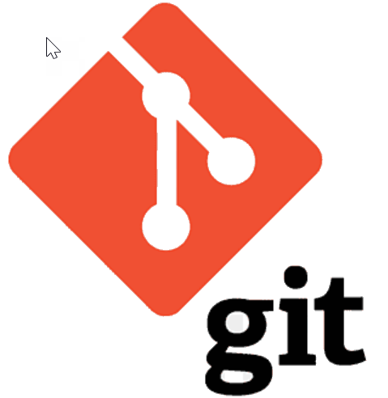

# Работа с Git

## 1. Проверка наличия установленного Git
Для проверки наличия установленного Git в терминале выполнить команду `git --version`
Усли Git установлен, появится сообщение с информацией об установленной версии программы, иначе будет сообщение об ошибке.

## 2. Установка Git
Загружаем последнюю версию Git с [сайта] (https://git-scm.com/downloads).
Устанавливаем с настройками по умолчанию.

## 3. Настройка Git
При первом использовании Git необходимо представится.
Для этого в терминале нужно ввести две команды:
```
git config --global user.name "Ваше имя английскими буквами"
git config --global user.email "Ваша почта@example.com"
```
## 4. Инициализация репозитория
Для создания пустого репозитория или инициализации усуществующего, нужно в терминале ввести команду: `git init`
После выполнения команды будет создан скрытый отслеживаемый файл содержащий все объекты и ссылки которые Git использует и создает в истории работы.
## 5. Запись изменений в репозитории
Для просмотра статуса репозитория,просмотра подготовленных, неподготовленных и неотслеживаемых файлов,нужно в терминале ввести команду: `git status`
Для просмотра списка изминений внесенных репозиторий, необходимо в терминале ввести команду `git diff`
Для внесения изменений в файлы перед сохранением нужно ввести в терминале команду:
`git add имя файла`
Для сохранения внесенных изменений необходимо в терминале ввести команду: 
`git commit -m "Сообщение или комментарии к изменению"`
## 6. Просмотр истории коммитов
Для вывода отображения истории коммитов в терминале, необходимо ввести в терминале комманду: `git log`
## 7. Перемещение между коммитами
При необходимости просмотра содержимого коммитов и отображения отдельного коммита в терминале, после выполнения команды `git log` в терминале ввести команду:`git checkout номер коммита`
После просмотра коммитов и переключения между ними, во избежании потери информации необходимо вернутся в актуальную версию проекта к последнему коммиту введя в терминале комманду: `git checkout master` или `git switch` либо `git switch master`.

## 9. Создание веток в GIT.

Команда `git branch`— главный инструмент для работы с ветвлением. С ее помощью можно добавлять новые ветки, перечислять и переименовывать существующие и удалять их.\

Команда `git branch`— главный инструмент для работы с ветвлением. С ее помощью можно добавлять новые ветки, перечислять и переименовывать существующие и удалять их.\

Чтобы в Git добавить ветку мы используем:

```
$ git branch <name of new branch>
```
Для перехода в вновь созданую ветку используем команду `git checkout <name of branch>`.

## 10.Слияние веток. Разрешение конфликтов в них.


Мы уже знаем, как создавать ветки и коммитить наши изменения. Теперь надо понять, как объединять изменения из двух разных веток, после того как вы выполнили свою задачу в отдельной ветке.

Способ объединения изменений, который мы рассмотрим - это `git merge` - слияние или просто мердж.

Мы уже знаем, как создавать ветки и коммитить наши изменения. Теперь надо понять, как объединять изменения из двух разных веток, после того как вы выполнили свою задачу в отдельной ветке.

Способ объединения изменений, который мы рассмотрим - это `git merge` - слияние или просто мердж.

Слияния создают особый вид коммита, который имеет сразу двух родителей. Коммит с двумя родителями обычно означает, что мы хотим объединить изменения из одного коммита с другим коммитом и всеми их родительскими коммитами.

Вот у нас есть две ветки _master_ и _newImage_. Мы сделали какую-то работу в ветке newImage, допустим это наш второй коммит. Теперь необходимо влить эти изменения в ветку _master_ командой `git merge newImage`.

Сбой В ПРОЦЕССЕ слияния говорит о наличии конфликта между текущей локальной веткой и веткой, с которой выполняется слияние. Git сделает все возможное, чтобы объединить файлы, но оставит конфликтующие участки, чтобы вы разрешили их вручную. 

Видно, что в файле появились новые странные дополнения:

<<<<<<< HEAD
=======
>>>>>>> new_branch_to_merge_newImage

Самый простой способ разрешить конфликт — отредактировать конфликтующий файл. 

После редактирования файла выполните команду `git add`, чтобы добавить новое объединенное содержимое в раздел проиндексированных файлов. Для завершения слияния создайте новый коммит, выполнив следующую команду: `git commit -m`.

## 11. Удаление веток.

Большинство веток в ваших репозиториях, скорее всего, будут короткоживущими: создали ветку, протестировали новую функцию, слили ветку с основной и удалили ее. О процессе слияния мы поговорили в предыдущем разделе, а сейчас давайте узнаем, как удалять ветки.

Большинство веток в ваших репозиториях, скорее всего, будут короткоживущими: создали ветку, протестировали новую функцию, слили ветку с основной и удалили ее. О процессе слияния мы поговорили в предыдущем разделе, а сейчас давайте узнаем, как удалять ветки.
 
Итак, для удаления мы воспользуемся уже знакомой командой `git branch` с ключами _-d_ и _-D_.

_-d_\
_--delete_\

С этим ключем команда удалит вашу ветку. Ветка будет удалена только в том случае, если она полностью слита с одной из других веток. В противном случае, Git выдаст предупреждение, о том, что в ветке есть неслитые изменения, и не даст ее удалить. JKLIU

С этим ключем команда удалит вашу ветку. Ветка будет удалена только в том случае, если она полностью слита с одной из других веток. В противном случае, Git выдаст предупреждение, о том, что в ветке есть неслитые изменения, и не даст ее удалить.


_-D_\
Этот ключ нужен, если вы хотите удалить ветку, игнорируя предупреждения Git. В отличие от _-d_, этот ключ удалит ветку в любом случае, даже если в ней есть изменения, которые вы можете потерять.

## 12. Работа с удаленными репозиториями.

Для создания удаленного репозитория необходим акаунт на ***GitHab***. Если его нет,необходимо зарегистрироваться по адресу ```GitHab.com``` и создать новый репозиторий через интерфейс ресурса.

Локальный репозиторий для работы с удаленным репозитрием необходимо создать на своем ПК.Для этого создается папка,необходимо ввести команду ***git init***, в папке создается файл и необходимо провести хотя бы один коммит.

Связать удаленный и локальный репозитории можно через подсказки GitHab ввиде набора последовательных команд при создании на ресурсе нового репозитория.
1.Для установки связи репозиториев (првязки):
***git remote add origin <адрес репозитрия в сети>***.

2.Для изменения имени ветки *master* на имя *main*
вводится команда:
***git branch -M main***.

3.Для отправки изменений в удаленный репозиторий необходимо в терминале ввести команду:
***git push -u origin main***

Проверить подключение к удаленному репозторию можно введением команды: 
***git remote***

A для получения путей получения и отправки изменения необходимо использовать команду:
***git remote -v***

При первой отправке информации в удаленный репозиторий GitHab сделает запрос на вашу авторизацию на ресурсе,необходимо будет её подтвердить.

Работать с информацией отправленной на удаленный репозитрий можно через интерфейс ресурса GitHab,редактировать, добавлять и сохранять данные.

Копировать  внешний репозиторий можно введением команды:

***git clone <адрес внешнего репозитория в сети>***

Команда не только загружает все изменения с удаленного репозитория, но и пытается слить все ветки на локальном ПК и в удаленном репозитории.

Команда:

***git pull***

Позволяет скачать всё изтекущего репозитория и автоматически сделать <merge> с вашей версией.

Для участия в стороннем проекте в GitHab у пользователя есть возможность предложить автору проекта свои изменеия или дополнения. Для этого пользователь должен предварительно скопировать репозиторий на свой ПК,сделать <fork> репозитория, клонировать версию на своем ПК,создать ветку с предлагаемыми изменениями отправить командой <push> на свой акаунт GitHab и только потом отправить командой:

***pull request***

автору проекта.
