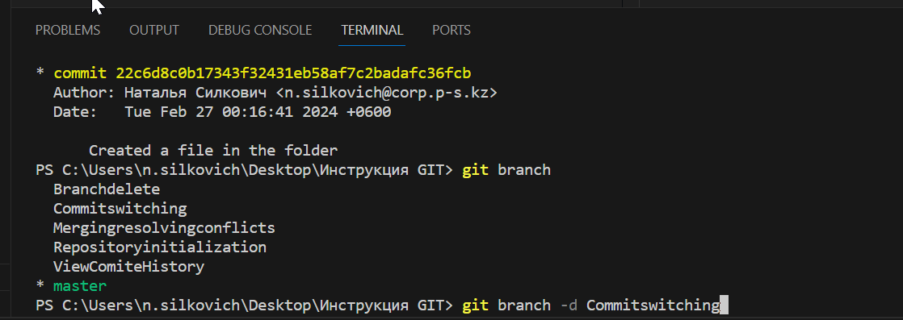

# Работа с GIT #
## 1. Проверка наличия установленного Git
В терминале выполнить команду `git version `
Если git установлен, появится версия установленной программы, иначе будет сообщение об ошибке

## 2. Установка Git 
Загружаем последнюю версию программы сайта: https://git-scm.com/downloadsм 

## 3. Основные команды Git
* Основные команды Git
* git status –получить информацию от git о его текущем состоянии
* git commit -m “message” –создание коммита.
* git add –добавить файл или файлы к следующему коммиту Команда 

```
git add
```

 внести требования к рабочему каталогу в индекс (промежуточную зону) для последующего коммита. По умолчанию **git commit** используется лишь этот индекс, так что можно использовать его 
 ```
 git add
 ```
  для сборки слепки следующего коммита.
* git log –вывод на экран истории всех коммитов с их хеш-кодами
* git checkout –переход от одного коммита к другому
 Команда 
 ```
 git checkout 
 ```
 работает с тремя различными объектами: файлами, коммитами и ветками. Под переключением также обычно понимают действие, связанное с выполнением команды **git checkout**

 При переключении ветки происходит обновление файлов в рабочем каталоге в соответствии с версией, хранящейся в этой ветке, а Git начинает записывать все новые коммиты в этой ветке. Рассматривайте эту команду как способ выбрать направление своей разработки.
 Если предположить, что ваш рабочий репозиторий уже содержит существующие ветки, вы можете переключаться между этими ветками с помощью команды git checkout. 
 Чтобы узнать, какие ветки доступны и как называется текущая ветка, выполните команду 
 ```
 git branch.
 ```


* git checkout master –вернуться к актуальному состоянию и продолжить работу
* git diff –увидеть разницу между текущим файлом и закоммиченным файлом.
Команда 
```
git diff
```
используется для расчета разницы между любыми двумя деревьями Git. Это может быть разница между рабочей копией и индексом (собственно git diff), разница между индексом и последним коммитом ( git diff --staged) или между любыми двумя коммитами ( git diff master branchB).
## 4. Синтаксис языка Markdown
Справочник по Markdown от Microsoft:
https://docs.microsoft.com/ru-ru/contribute/markdown-referens

## 5. Инициализация репозитория
Для создания нового репозитория используется команда 
```
git init
```
Команду *git init* выполняют только один раз для первоначальной настройки нового репозитория. Выполнение команды приведет к созданию нового подкаталога *.git* в рабочем каталоге. Кроме того, будет создана новая главная ветка.
## 6. Просмотр истории комитов
При помощи команды 
```
git log
```
 в консоли мы можем отслеживать историю коммитов в ветке. На самом **GitHub** мы можем увидеть последний коммит в файле и последний коммит в ветке. Всю историю мы можем просмотреть, кликнув по кнопке **n commits**, где n — количество запущенных на сервер коммитов
## 7. Перемещение между сохранениями (коммитами)
Команда 
```
git checkout
```
 позволяет перемещаться между ветками, созданными командой 
 ```
 git branch
 ```
  При переключении ветки, происходит обновление файлов в рабочем каталоге в соответствии с версией, хранящейся в этой ветке, а ***Git*** начинает записывать все новые коммиты в этой ветке.
## 8. Игнорирование файлов
Для того, что исключить из отслеживания в репозитории пределенные файлы или папки, необходимо создать файл **.gitignore** и записать в него их названия или шаблоны, соответствующие этим файлам или папкам.
## 9. Создание веток в GIT 
По умолчанию имя основной ветки в Git **master**.
Создать ветку можно командой :
```bash
git branch <имя новой ветки>
``` 
Список веток в репозитории можно посмотреть с помощью команды:
```bash
git branch
````
## 10.Слияние веток и разрешение конфликтов

Системы контроля версий предназначены для управления дополнениями, вносимыми в проект множеством распределенных авторов (обычно разработчиков). Иногда один и тот же контент могут редактировать сразу несколько разработчиков. Если разработчик "A" попытается изменить код, который редактирует разработчик "B", может произойти конфликт. Для предотвращения конфликтов разработчики работают в отдельных изолированных ветках. Основная задача команды 
``` bash
git merge
```
 заключается в слиянии отдельных веток и разрешении любых конфликтующих правок.
 При слиянии и возникновении конфликтов на экране может отобразиться сообщение об ошибке:
``` Bash
error: Entry '<fileName>' not uptodate. Cann
```


В открывшемся меню нет возможности вызвать команду, для этого необходимо в верхней строке для начала нажать **i**  в английской раскладке 


в нижней части экране появляется строка **Вставка**

набрать коммит в который вносятся изменения 


Далее нажимаем клавишу **ESC** поле "Вставка" в нижней части экрана пропадает и после этого  необходимо нажать **:** далее необходимо набрать **w** - write и **q** - quit 

в нижней части экрана нажимаем пробел и появляется командная строка 
``` Bash
PS C:\Users\n.silkovich\Desktop\Инструкция GIT>
```
в которой можно продолжить действия работы в **Git** Bash


## 11. Удаление веток

Для удаления уже смерженных веток, необходимо использовать  -d - это алиас для флага --delete , который удаляет ветку. Можно также использовать флаг -D , который является алиасом для --delete --force.

 после набора команды на экране отображается уведомление что ветка удалена
 
## 12. Работа с удаленным репозиторием ##
Удалённые репозитории представляют собой версии вашего проекта, сохранённые в интернете или ещё где-то в сети. У вас может быть несколько удалённых репозиториев, каждый из которых может быть доступен для чтения или для чтения-записи. Взаимодействие с другими пользователями предполагает управление удалёнными репозиториями, а также отправку и получение данных из них. Управление репозиториями включает в себя как умение добавлять новые, так и умение удалять устаревшие репозитории, а также умение управлять различными удалёнными ветками, объявлять их отслеживаемыми или нет и так далее.

Для того, чтобы просмотреть список настроенных удалённых репозиториев, вы можете запустить команду
```
 git remote
 
 ```
  Она выведет названия доступных удалённых репозиториев. Если вы клонировали репозиторий, то увидите как минимум **origin** — имя по умолчанию, которое Git даёт серверу, с которого производилось клонирование:


Вы можете также указать ключ **-v**, чтобы просмотреть адреса для чтения и записи, привязанные к репозиторию:

Если у вас больше одного удалённого репозитория, команда выведет их все. Например, для репозитория с несколькими настроенными удалёнными репозиториями в случае совместной работы нескольких пользователей, вывод команды может выглядеть примерно так:


Это означает, что мы можем легко получить изменения от любого из этих пользователей. Возможно, что некоторые из репозиториев доступны для записи и в них можно отправлять свои изменения, хотя вывод команды не даёт никакой информации о правах доступа.

## 13. Добавление удалённых репозиториев
Для того, чтобы добавить удалённый репозиторий и присвоить ему имя (shortname), просто выполните команду 
```
git remote add <shortname> <url>

```
 
 Теперь вместо указания полного пути вы можете использовать ***pb***. Например, если вы хотите получить изменения, которые есть у Саши, но нету у вас, вы можете выполнить команду 
 ```
 git fetch pb
 ```
  
  Ветка master из репозитория Саши сейчас доступна вам под именем pb/master. Вы можете слить её с одной из ваших веток или переключить на неё локальную ветку, чтобы просмотреть содержимое ветки Саши. 

  ## 14. Получение изменений из удалённого репозитория — Fetch и Pull ##

  Для получения данных из удалённых проектов, следует выполнить:
  ```
  git fetch [remote-name]
  ```
Данная команда связывается с указанным удалённым проектом и забирает все те данные проекта, которых у вас ещё нет. После того как вы выполнили команду, у вас должны появиться ссылки на все ветки из этого удалённого проекта, которые вы можете просмотреть или слить в любой момент.

Когда вы клонируете репозиторий, команда **clone**
 автоматически добавляет этот удалённый репозиторий под именем «origin». 
 Таким образом, ***git fetch origin*** извлекает все наработки, отправленные на этот сервер после того, как вы его клонировали (или получили изменения с помощью fetch). Важно отметить, что команда 
 ```
 git fetch
 
 ```
  забирает данные в ваш локальный репозиторий, но не сливает их с какими-либо вашими наработками и не модифицирует то, над чем вы работаете в данный момент. Вам необходимо вручную слить эти данные с вашими, когда вы будете готовы.

  Если ветка настроена на отслеживание удалённой ветки, то вы можете использовать команду 
  ```
  git pull
  ```
   чтобы автоматически получить изменения из удалённой ветки и слить их со своей текущей. Этот способ может оказаться более простым или более удобным. К тому же, по умолчанию команда 
   ```
   git clone
   ```
    автоматически настраивает вашу локальную ветку **master** на отслеживание удалённой ветки master на сервере, с которого вы клонировали репозиторий. 
    Название веток может быть другим и зависит от ветки по умолчанию на сервере. 
    Выполнение **git pull**, как правило, извлекает (fetch) данные с сервера, с которого вы изначально клонировали, и автоматически пытаетесь слить (merge) их с кодом, над которым вы в данный момент работаете.
## 15. Отправка изменений в удалённый репозиторий (Push) ##
Когда вы хотите поделиться своими наработками, вам необходимо отправить их в удалённый репозиторий. 
Команда для этого действия простая:
```
 git push <remote-name> <branch-name>. 
 ```
 Чтобы отправить вашу ветку **master** на сервер origin вы можете выполнить следующую команду для отправки ваших коммитов:

 ```
 git push origin master
 ```

 Эта команда срабатывает только в случае, если вы клонировали с сервера, на котором у вас есть права на запись, и если никто другой с тех пор не выполнял команду push. Если вы и кто-то ещё одновременно клонируете, затем он выполняет команду push, а после него выполнить команду push попытаетесь вы, то ваш push точно будет отклонён. Вам придётся сначала получить изменения и объединить их с вашими и только после этого вам будет позволено выполнить push.

 ## 16.Просмотр удалённого репозитория ##

Если хотите получить побольше информации об одном из удалённых репозиториев, вы можете использовать команду
```
 git remote show <remote>.
 ```
  Выполнив эту команду с некоторым именем, например, **origin**, вы получите следующий результат:
  
  Она выдаёт URL удалённого репозитория, а также информацию об отслеживаемых ветках. Эта команда любезно сообщает вам, что если вы, находясь на ветке **master**, выполните git pull, ветка master с удалённого сервера будет автоматически влита в вашу сразу после получения всех необходимых данных. Она также выдаёт список всех полученных ею ссылок.
  