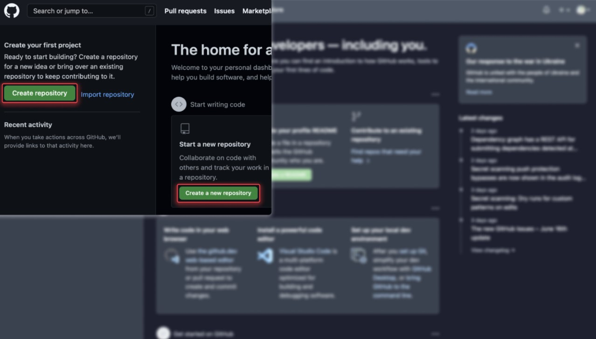
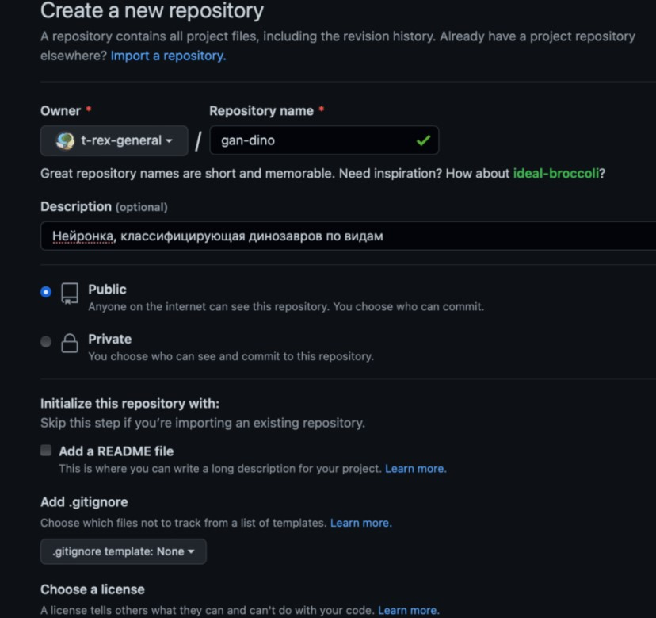
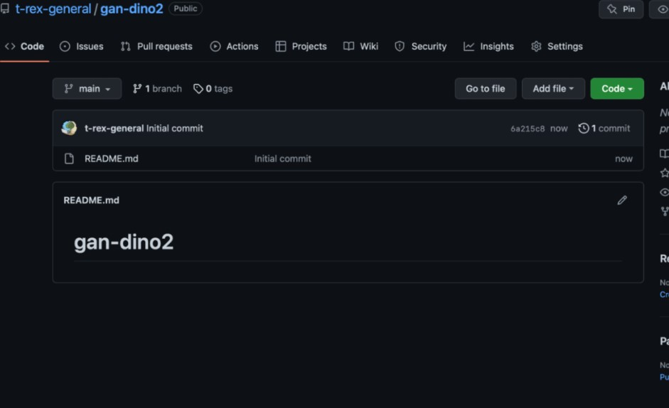
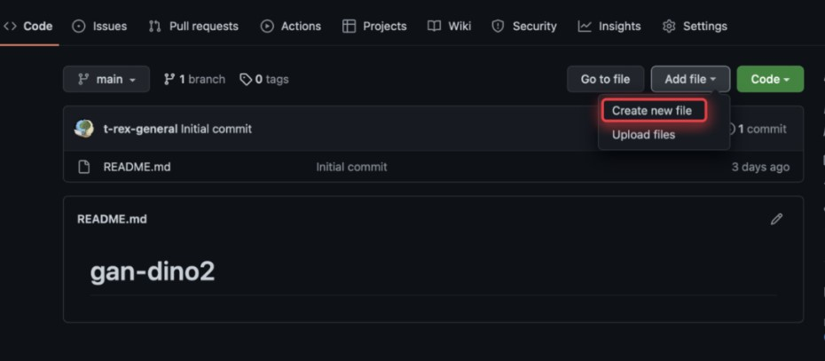
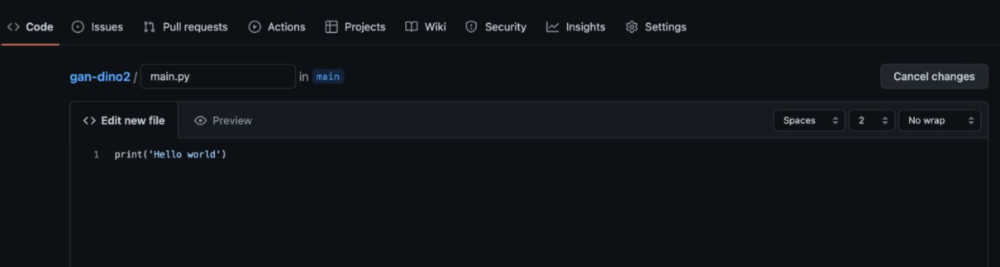
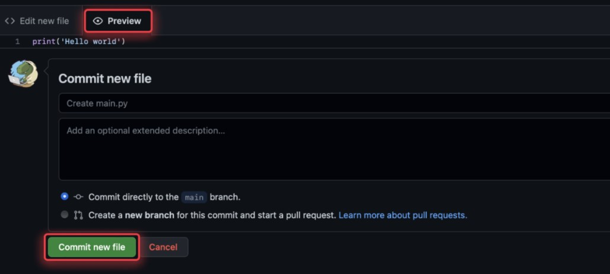

# Инструкция для работы с Git и удаленными репозитариями
## Что такое Git?
Git - это одна из реализаций распределенных систем контроля версий, имеющая как локальные, так и удаленные репозитарии. Являет самой популярной реализацией систем контроля версий в мире.
## 1. Проверка наличия установленного Git
В терминале выполнить команду `Git --version`. Если Git установлен, появится сообщение с информацией о версии программы, иначе будет сообщение об ошибке.
## 2. Установка Git
Загружаем последнюю версию Git с [сайта](https://git-scm.com/downloads) Устанавливаем с настройками по умолчанию.
## 3. Настройка Git
При первом использовании Git необходимо представиться. Для этого нужно ввести в терминале две команды:
```Bash
git config --global user.name "Ваше имя"
git config --global user.email ваша почта@example.com  
```
## 4. Инициализация репозитория
Чтобы нициализировать отслеживание git внутри текущего каталога необходимо открыть или создать новую папку(каталог). Затем в терминале выполнить команду:
```Bash
git init
```

## 5. Запись изменений в репозитории
Чтобы добавить файл или каталог в git для отслеживания нужно в терминале ввести следующую команду:
```Bash
git add <имя_файла_или_директории>
```
Чтобы сделать снимок изменения (коммит) с комментарием нужно в терминале ввести следующую команду:
```Bash
git commit -m "комментарий"
```

## 6. Просмотр истории коммитов
Просмотреть историю коммитов можно с помощью команды:
```Bash
git log - выводит подробный список коммитов
git log --oneline - выводит тоько список коммитов без лишней информации
git log --graph - выводит дерево коммитов
```

## 7. Перемещение между сохранениями
Для переключения между сохранениями(комитами) необходимо использовать команду:
```Bash
git checkout < номер сохраннения commit> 
```

## 8. Игнорирование файлов
Для того, чтобы изключить из отслеживания в репозитории определенные файлы или папки необходимо создать там файл ***.gitignore*** и записать в него их названия или шаблоны, соответствующие таким файлам или папкам. Добавить пример.

## 9. Создание веток в Git
По умолчанию имя основной ветки в Git `main` или `master`
Создать ветку можно командой: 
```Bash
git branch <имя_новой_ветки>
``` 
Список веток в репозитории можно посмотреть с помощью команды `git branch`

 ## 10. Слияние веток и разрешение конфликтов  
 Для слияния ветки с текущей нужно выполнить команду:
 ```Bash
 git merge <имя_ветки>
 ``` 
 Если была изменена одна и та же часть файла в обеих ветках, то может возникнуть конфликт, который потребует участия пользователя. После разрешения конфликта необходимо сделать коммит слияния, чтобы сохранить изменения.

 ## 11. Удаление веток
 Чтобы удалить ветку которая больше не нужна, нужно использовать команду:
 ```Bash
 git branch -d <имя_ветки>
 ```
 Перед удалением ветки необходимо выполнить команду коммит. Если не сделать коммит и попытаться удалить ветку то возникнет ошибка. 

 ## 12. Переключение между ветками
 Для перемещения между ветками можно использовать две комманды `switch` и `checkout`
 ```Bash
 git switch <имя_ветки>
 git checkout <имя_ветки>
 ```
 ## 13. Графический просмотр веток
 Просмотреть используемые ветки в графическом виде можно при помощи команды:
 ```Bash
 git log --graph
 ``` 

## 14. Работа с удаленными репозиториями
### Первый способ — синхронизация с локальным репозиторием
1. Создать аккаунт на Github
Для создания аккаунта необходимо зарегистрироваться на сайте github.com
2. Создать локальный репозиторий
Для создания локального репозитория необходимо: 
    1. Создать каталог и открыть его в Visual Studio Code. 
    2. Открыть терминал и в терминале инициализировать репозиторий с помощью команды `git init` 
    3. Создать какой либо файл или несколько, например Readme.md в текущем репозитории.
    4. Добавить все файлы проекта в своеобразный пакет изменений с помощью команды `git add .`
    5. Загрузить изменения с помощью команды `git commit -m <название_коммита>`
3. Создать удаленный репозиторий
Для создадания репозитория на GitHub, нужно нажать на кнопку Create repository.


В открывшемся окне обязательно к заполнению только поле с названием проекта. Оно должно быть кратким, но понятным. 


Далее GitHub показывает наборы команд, необходимые для загрузки исходного кода в репозиторий. В нашем случае нужны команды из второго блока:
```Bash
git remote add origin <url-путь к репозиторию на Github>
git branch -M main
git push -u origin main
```
4. Связать удаленный репозиторий с локальным
Чтобы связать репозитории необходимо последовательно выполнить команды в терминале на своем локальном компьютере:
```Bash
git remote add origin <url-путь к репозиторию на Github> - Добавляет удаленный репозиторий к проекту
git branch -M main - переименовывает главную ветку в main
git push -u origin main - отправляет данные из локального репозитория во внешний
```
Для получения и слияния изменений из 
удаленного репозитория используется
команда `git pull`.
Перед использованием команды необходимо выполнить комманду `commit` иначе терминал выдаст ошибку.
Также всегда прежде чем отправлять изменения на внешний репозиторий командой `git push` необходимо сначала загрузить из него данные командой `git pull`

### Второй способ — от глобального к локальному

Бывает другая ситуация, когда кода программы нет и нужно создать пустой репозиторий на GitHub, а после — сделать его локальный дубликат. Данный процесс называется локальным развертыванием. 

Повторяем все действия из первого способа (заполняем поля с названием, описанием, присваиваем режим доступа), но ставим галочку напротив README. Тогда создасться непустой новый репозиторий, в который не нужно ничего подгружать из локального проекта.



Чтобы клонировать репозиторий себе на компьютер, нужно нажать на зеленую кнопку Code, скопировать HTTPS-адрес, перейти в терминал, в нужную директорию и ввести команду:
`git clone <url-путь к репозиторию на Github>`

В результате файл README.md появится в выбранной директории — локальном репозитории.

С помощью этой же команды можно клонировать и чужие проекты. Например, чтобы не писать все модули для определителя динозавров самостоятельно, можно клонировать чужой репозиторий себе на компьютер. Или сделать fork («форк»), то есть скопировать чей-то проект в свой GitHub-профиль для его доработки. 

### Третий способ — внутри GitHub
Если нет возможности использовать Git-терминал или VSCode, можно работать напрямую с GitHub. Перед этим создаем репозиторий с файлом README.

Внутри GitHub есть онлайн-редактор кода и интерфейс работы с пространством имен (создание файлов, директорий и загрузка других элементов). 

Например, для создания нового файла достаточно нажать на кнопку Create new file. Откроется встроенный редактор кода. 





Потом необходимо сделать коммит.




   


