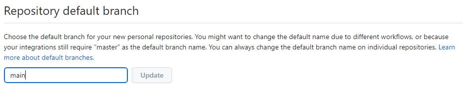

# Инструкция по использованию [**Git**](#git)
## Введение
В этой инструкции мы попытаемся установить и разобраться в работе программы [**Git**](#git) на примере русифицированного **Visual Studio Code**.
> Если желаете повторять описываемое также в **Visual Studio Code**, скачать его можно на оффициальном сайте <https://code.visualstudio.com/>, либо напрямую [отсюда](https://code.visualstudio.com/docs/?dv=win64user)

> Руссифицировать **Visual Studio Code** можно вызвав комбинацией клавиш <kbd>CTRL</kbd>+<kbd>SHIFT</kbd>+<kbd>P</kbd> окно ввода команд, где начать писать команду `Configure Display Language` до её появления в окне выбора комад, нажать на неё, и в открывшемся списке выбрать русский язык.
## Установка [**Git**](#git)
Установить [**Git**](#git) можно на на сайте <https://git-scm.com/>, или напрямую скачать установщик [отсюда](https://github.com/git-for-windows/git/releases/download/v2.42.0.windows.2/Git-2.42.0.2-64-bit.exe)

Во время установки оставляйте настройки по-умолчанию, кроме двух моментов:  
* На этом окне нужно выбрать редактор, к которому будет привязан [**Git**](#git)  

* На этом окне, если требуется, можно изменить название [ветки](#branch) по-умолчанию  

## Начало работы
Для начала нам нужно в редакторе: 
* во-первых, проверить правильно ли установлен *(или установлен ли вообще)* [**Git**](#git). Для этого нужно открыть терминал.
    * Вариант 1. Нажать на кнопку в меню сверху справа 
    * Вариант 2. Нажать на кнопку `Терминал` сверху слева, после чего нажать в появившемся окне `Создать терминал`  
    
    * Вариант 3. Комбинациями клавиш 
        * <kbd>CTRL</kbd>+<kbd>`</kbd>
        * <kbd>CTRL</kbd>+<kbd>SHIFT</kbd>+<kbd>`</kbd>
        * <kbd>CTRL</kbd>+<kbd>J</kbd>
        
    Далее, в открытом терминале нужно ввести команду `git --version`. Если [**Git**](#git) установлен правильно терминал выдаст следующий результат:  

* во-вторых, открыть папку, в которой будет находиться наш репозиторий *(что это такое расскажем чуть позже)*  
    * Вариант 1. Нажать на кнопку `Открыть папку` в окне приветствия.  

    * Вариант 2. Нажать на кнопку `Открыть папку` в проводнике слева *(выглядит так: )*  

    * Вариант 3. В меню сверху слева нажать `Файл`, после чего в открывшемся окне нажать `Открыть папку`  

    * Вариант 4. Последовательный ввод комбинаций клавиш <kbd>CTRL</kbd>+<kbd>K</kbd> <kbd>CTRL</kbd>+<kbd>O</kbd>, которые можно увидеть при выполнении варианта 3
### Термины
Для работы с гитом желательно знать определения для некоторых терминов:
> <a id="git">**Git**</a> — система контроля версий (файлов). Что-то вроде возможности сохраняться в компьютерных играх (в Git эквивалент игрового сохранения — коммит).

> <a id="wd">Рабочая директория</a> — файловая система проекта (те файлы, с которыми вы работаете).

> <a id="rep">Репозиторий</a> - отслеживаемая **Git-ом** рабочая директория.

> <a id="index">Индекс</a> — список отслеживаемых **Git-ом** файлов и директорий, промежуточное хранилище изменений (редактирование, удаление отслеживаемых файлов).

Любой файл в директории существующего репозитория может находиться или не находиться под версионным контролем (отслеживаемые и неотслеживаемые).  
Отслеживаемые файлы могут быть в 3-х состояниях: неизменённые, изменённые, проиндексированные (готовые к коммиту).

> Директория <a id=".git">**.git**</a> — все данные контроля версий этого проекта (вся история разработки: коммиты, ветки, теги и пр.).

> <a id="commit">Коммит</a> — «сохранение» (хранит набор изменений, сделанный в рабочей директории с момента предыдущего коммита). Коммит неизменен, его нельзя отредактировать.

У всех коммитов (кроме самого первого) есть один или более родительских коммитов, поскольку коммиты хранят изменения от предыдущих состояний.
### Инициализация
После того, как мы проверили работоспособность **Git-a** и открыли нужную папку, нам необходимо инициализировать репозиторий в этой папке. Для этого в терминале необходимо ввести команду `git init`. Теперь [**Git**](#git) будет отслеживать всё происходящее в этой папке.
> Если сейчас мы зайдём в папку нашей рабочей директориии, то обнаружим появление в ней папки [**.git**](#.git), о назначении которой написано в разделе [терминов](#terms)
### Первый коммит
Теперь, когда мы удачно инициировали [**Git**](#git) в нашей папке пора создать в ней файл и провести первый [коммит](#commit).  
Создать файл можно, как напрямую в пвпке, так и с поиощью функционала **Visual Studio Code**:
* Вариант 1. В проводнике *(напоминаю, что он выглядит так )* навести курсор на название папки, после чего нажать на появившийся значок 
* Вариант 2. Через знакомую нам кнопку `Файл`, где, в открывшимся окне на этот раз нажать `Создать файл`  

* Вариант 3. Комбинациями клавиш
    * <kbd>CTRL</kbd>+<kbd>N</kbd>
    * <kbd>CTRL</kbd>+<kbd>ALT</kbd>+<kbd>WIN</kbd>+<kbd>N</kbd>  

    При таком способе создания файл надо сохранить через меню окна `Файл` или комбинацией <kbd>CTRL</kbd>+<kbd>S</kbd>

Теперь, когда файл создан, пора провести первый коммит. Сначала проверим, заметил ли [**Git**](#git) наш новый файл. Для этого в терминале введём команду `git status`. Если всё верно, вы увидите следующее:  
  
Первые строки нас пока не интересуют, обратим внимание на строку `Untracked files`. Эта строчка указывает на файлы, которые **Git** видит, но не отслеживает, или отслеживаемые, но изменённые файлы *(их названия подсвечены красным)*  
> Необязательно писать назывние файла целиком. Достаточно первых четырёх символов, и автозаполнение, вызываемое клавишей <kbd>TAB</kbd> самостоятельно допишет название.  

Здесь же [**Git**](#git) нам подсказывает следующий шаг действий: необходимо ввести команду `git add <название файла>`, чтобы [проиндексировать](#index) *(подготовить к коммиту)* файл.  
Теперь, при вводе команды `git status` картина изменится:  
  
`Untracked files` сменится на `Changes to be commited` и теперь показывает список [проиндексированных](#terms) *(готовых к коммиту)* файлов *(теперь их название подсвечены зелёным)*.  
Пора [коммитить](#terms) *(сохранять)* наш файл. Для этого введём команду `git commit -m "комментарий"`
> Во избежание проблем не следует забывать про часть `-m "комментарий"`. в ковычках нужно оставлять комментарий, описывающий произошедшие изменения. Для первого [коммита](#terms) обычно пишут `"Initial commit"`. 

> При проведении своего самого первого [коммита](#terms) [**Git**](#git) попросит нас ему представиться, подсказав для этого нужные команды. Это необходимо для того, чтобы [**Git**](#git) знал и мог подсказать автора проведённого [коммита](#terms).

Успешный [коммит](#commit) отмечаем появившимся сообщением:  
  
Обратим внимание на третью строку. В ней нам описывают произошедшие изменения *(1 файл изменён, 0 строк добавлено, 0 удалено)*. Добавление файла в [репозиторий](#rep) тоже считается его изменением, поэтому да, мы изменили *(добавили)* 1 файл, в котором не было ни добавлено, ни удалено ни одной строки *(т. к. он пустой)*.
## Работа с файлами
Теперь, когда мы [закоммители](#commit) наш первый файл, пора в нём что-нибудь записать и посмотреть как и на что это повлияет.
> Главное помнить, что после любого изменения файл нужно сохранять. Можно это сделать уже знакомой комбинацией <kbd>CTRL</kbd>+<kbd>S</kbd>, или, чтобы уж совсем голова об этом не болела можно включить **Автосохранение** через также знакомое на меню `Файл`.
### Изменения
Нашей основной командой для проверки произошедших изменений является уже знакомая `git status`. Мы уже видели реакцию этой команды на непроиндексированные и проиндексированные изменения, но это ещё не всё:  
  
Такой вывод означает, что либо изменений не было, либо изменения были, но файл ещё не был сохранён.  
> Также командой `git status` обычно проверяют факт инициализации [репозитория](#rep) в [рабчей директории](#wd). Если инициализации не было, команда выдаст ошибку.

Второй командой, способной описать произошедшие изменения, является `git diff`. Она построчно сравнивает текущее состояние файла с его состоянием во время последнего [коммита](#commit) и показывает разницу.  
  
Красным цветом показаны удалённые строки, а зелёным - добавленые
> Как можно заметить, для [**Git-a**](#git) любое изменение существующего - это удаление старого и добавление нового. Поэтому "Строка" появилась и среди удалённый, и среди добавленных.

При необходимости мы можем отменить введённые нами изменения. В зависимости от того, что нам нужно, можно использовать разные команды:
1. Если нужно удалить изменения из [индека](#index) используется команда `git reset`, чтобы отменить все изменения, или `git reset <Название файла>`, чтобы отменить изменения в одном конкретном файле. Сами изменения в файле останутся.
2. Если нужно удалить изменения полностью используются команды:
    * `git checkout <Название файла>` - возвращает состояние файла к моменту [индексации](#index).
    * `git reset --hard` - возвращает файл к состоянию на момент последнего коммита *(или коммита, на который указывает ())*, оставляет неотслеживаемое не тронутыми.
    * `git clean -df` - удаляет всё неотслеживаемое
### Коммиты
Чтобы [**Git**](#git) зафиксировал произошедшие изменения, нужно
1. [Проиндексировать](#index) эти изменения коммандой `git add`
    * Если нужно [Проиндексировать](#index) изменения только в одном файле, к команде нужно добавить название этого файла: `git add <Название файла>`
    * Если нужно [Проиндексировать](#index) все произошедшие изменения, включая добавления и удаления файлов, к команде добавляется точка или `--all`: `git add .`/`git add --all`
2. Провести [коммит](#commit) командой `git commit -m "комментарий"`
    * Если [Проиндексировать](#index) нужно только изменённый файлы, путь можно срезать составной командой `git commit -a -m "комментарий"` или `git commit -am "комментарий"`  
    > Такая команда называется составной, т. к. состоит из двух комманд: `git add` и, собственно, `git commit`.
> Иногда нам нужно, чтобы [**Git**](#git) намеренно не замечал некоторые файлы. Для такого рода случаев в [рабочей дирректории](#wd) создаётся файл с названием **.gitignore**, куда вводятся названия файлов, которые должны стать "невидимками" *(Если нам нужно проигнорировать множество файлов одного расширения, например **.png**, в **.gitignore** можно написать `*.png`. Теперь [**Git**](#git) не увидит ни одного файла с таким расширением)*

В процессе работы у нас будет накапливаться всё больше и больше [коммитов](#commit), и они не будут пропадать бесследно. Мы можем вызывать историю всех проведённых [коммитов](#commit) и, даже, перемещаться между ними.  
Для вызова истории [коммитов](#commit) используется команда `git log`. Выглядеть это будет так:  
  
Список отображается в порядке от нового к старому. В нём мы можем видеть:
* Номер [коммита](#commit) *(Или, по другому, его **Хэш**)* выделенный жёлтым цветом. 
  > У первого в списке также можно увидеть указатель [**HEAD**](#head), который указывает, на каком [коммите](#commit) и на какой [ветке](#branch) мы сейчас находимся.
* Авторство коммита.
* Дата его проведения.
* Комментарий к этому коммиту.
> Если такое отображение кажется слишком гроиоздким, к команде можно добавить параметр `--oneline` *(`git log --oneline`)*  
  
Теперь на один [коммит](#commit) выделяется одна строка: выводится сокращённый **хэш** и комментарий.

Узнав из лога **хэш** нужного нам [коммита](#commit), мы можем к нему переместиться. Для этого есть команда `git checkout <хэш>`.
> Не обязательно переносить **хэш** полностью. Достаточно первых четырёх символов.

> Если из такого состояния вызвать `git log`, мы увидим историю только до отображаемого сейчас [коммита](#commit). Чтобы увидеть весь список, нужно к команде добавить параметр `--all`: `git log --all`

Перенесясь на определённый [коммит](#commit) мы увидим, в каком состоянии был репозиторий на момент этого [коммита](#commit), будь то состояние файлов, их наличие или отсутствие. Здесь мы можем свободно экспериментировать не опасаясь что-либо сломать, т.к. на актуальный коммит эти эксперименты [коммит](#commit) не повлияют.  
> Чтобы всё-таки иметь возможность повлиять на актуальный [коммит](#commit) изменениями в прошлом, нужно создать новую [ветку](#branch), находясь на нужном нам [коммите](#commit). Как это сделать, будет расказано чуть позже.

Для возвращения к актуальному состоянию можно ввести несколько команд: 
* `git checkout master`/`git switch master` - по сути своей, переносят нас на [ветку](#branch) с названием **master** *(основная [ветка](#branch) по умолчанию. Может иметь другое имя, в зависимости от настроек)*
* `git checkout -`/`git switch -` - "шаг назад". Делает переход в обратном направлении, поэтому, если было совершено несколько коммитов, команда вернёт вас не на актуальный [коммит](#commit), а на тот, с которого был сделан переход.

В случае, если в комментарии к [коммиту](#commit) была совершена ошибка, его можно изменить, а, если сам [коммит](#commit) был совершён по ошибке, то этот[коммит](#commit) можно и вовсе удалить. Для этого используются следующте команды:
* `git commit -amend "Исправленый комментарий"` - исправлаяет комментарий в последнем [коммите](#commit).
  > Как уже упоминалось, для [**Git-a**](#git) нет изменений - только добавления и удаления. И данная команда не является исключением. Она удаляет старый [коммит](#commit), а после создаёт новый с новым комментарием и новым же **хэшем**.
* `git reset --параметр <хэш>` - уже знакомая нам команда. В зависимости от дополнительного параметра результат удаления будет разный:
    * `--hard` - сбросит всё до состояния указанного [коммита](#commit).
    * `--soft` - сбросит только [коммиты](#commit), [индекс](#index) и [директория](#wd) останутся нетронутыми.
    * без параметра - сбросит [коммиты](#commit) и [индекс](#index), [директория](#wd) останется нетронутой.
  > Вместо **хэша** можно указать `@~`, тогда команда будет сбрасывать до предыдущего [коммита](#commit). Если, нужно сбросить на несколько [коммитов](#commit), после `@~` указывается их количество *(`@~2` - сбросит на 2 [коммита](#commit) назад).*
## Указатели
В предыдущем разделе был упомянут указатель **HEAD**. Помимо него существуют и другие. В этом разделе будут даны их определления:
* <a id="head">**HEAD**</a> - указатель текущего местоположения.
* **ORIG_HEAD** -указатель изначального местоположения после использования команд перемещения. Видно при исползовании команды `git log --all`
* **Название [ветки](#branch)** - указывает на актуальный для данной [ветки](#branch) [коммит](#commit).
* <a id="tag">**Теги**</a> - проcтые создаваемые неперемещаемые указатели на [коммит](#commit). 
## Работа с ветками
Здесь будет расказано про ветки, которые вскользь упоминались в прошлых разделах.
<a id="branch">Ветка</a> - последовательность [коммитов](#commit), имеющая название. При инициализации [репозитория](#rep) также создаётся и первая ветка с названием **master**, и все последующие [коммиты](#commit) будут попадать в неё, пока не будет создана другая.  
Изменения в одной ветке не влияют на другие до момента их слияния. Поэтому их используют для параллельной, когда над одним проектом трудятся несколько человек и нужно избегать путаницы, или фрагментированной работы, когда в разных ветках пишутся отдельные части одного проекта.
> Уже сейчас можно посмотреть, какте ветки у нас есть с помощью команды `git branch`, правда, покажет нам наличие только одной ветки.    

### Создание и переходы
Для создания новой [ветки](#branch) можно воспользовоться разными способами и командами:
* Создать её с помощью команды `git branch <название новой ветки>`. Теперь, при использовании команды `git branch` нам покажет не только изначальную, но и только что созданную:  
  
  > Звёздочкой возле названия и выделением зелёным цветом указывается наша текущая [ветка](#branch).

  Чтобы переместиться на созданную *(и, в принципе, любую)* [ветку](#branch) нужно востользоваться командой `git checkout <название ветки>` или `git switch <название ветки>`
  > После перемещения окажется, что в рабочей директории ничего не изменилось. Всё нормально, наша новая [ветка](#branch) ответвляется от [коммита](#commit), в котором была введена команда `git branch <название новой ветки>` *(в данном случае от последнего [коммита](#commit))*. Чтобы создать ветку из иного [коммита](#commit), нужно сначала на него переключиться.
* Создать и сразу перейти на созданную [ветку](#branch) командами `git checkout -b <название новой ветки>` или `git switch -c <название новой ветки>`.  
  > С этими командами также можно пропустить этап перехода на [коммит](#commit), от которого нужно отвести новую [ветку](#branch), если после названия создаваемой [ветки](#branch) ввести **хэш** этого [коммита](#commit) *(например, `git checkout -b new_branch  3196904` или `git switch -c new_branch  3196904`)*,  

> При перемещении с одной [ветки](#branch) на другую [незакоммиченные](#commit) изменения могут мешаться. Их можно сохранить во временное хранилище командой `git stash`, а после, при надобности, вернуть их командой `git stash pop`.

> С созданием новых [веток](#branch) для команды `git log` становится актуальным параметр `--graph` *(`git log --graph`)*. С этим параметром нам будет показана история [коммитов](#commit) со всеми ответвлениями на другие ветки:  

> Также, стоит упомянуть, что в одной команде могут использоваться в несколько параметров. Так команда `git log --oneline --all --graph` покажет все [коммиты](#commit) всех [веток](#branch) в одну строку и в графическом виде *(порядок ввода параметров не важен. Например, команда `git log --all --oneline --graph` также сработает, сделав ровно то же самое)*:  

### Слияние, копирование, переносы и конфликты
После работы в нескольких [ветках](#branch) нужно перенести из низ информацию в одну основную. 
Для этого в [Git-e](#git) есть команда `git merge`. Эта команда сливает всю информацию из одной [ветки](#branch) в другую. Применяется строго в [ветке](#branch), в которою мы вливаем информацию.
Полность эта команда выглядит так: `git merge <название ветки источника>`.
> Команда `git merge` не только переносит информацию из одной [ветки](#branch) в другую, но и сразу же [коммитит](#commit) произошедшие изменения.

> Для слияния нескольких веток одновременно нужно в команде прописать названия всех [веток](#branch)-источников: `git merge branch1 branch2 branch3`.

Иногда нам бывает нужно скопировать в ветку информацию из определённого [коммита](#commit). В этом нам поможет команда `git cherry-pick <хэш>`.  
> Как и `git merge`, `git cherry-pick` сразу [коммитит](#commit) изменения. Если нам это не нужно, в команду добавляется параметр `-n` *(`git cherry-pick -n <хэш>`)*

А иногда нам нужно синхронизировать информацию одной [ветки](#branch) с информацией другой. Для этого мы можем перенести точку ответвления этой [ветки](#branch) к актуальному [коммиту](#commit) нужной [ветки](#branch) с помощью команды `git rebase <название ветки>`. Вводить её нужно из [ветки](#branch), которую мы переносим.

У всех этих команд есть одна общая черта - они могут вызвать конфликт. Выглядит он так: 
  
Так происходит, когда после расхождения информация о [закоммиченных](#commit) изменениях из одной [ветки](#branch) перекрывает аналогичную информацию другой. При произошедшем конфликте команда прерывается, а [коммит](#commit) не производится.  
Чтобы продвинуться дальше этот конфликт необходимо разрешить. Сделать это можно  двумя способами:
* С помощью функционала **Visual Studio Code**. Помимо цветовой разметки текущих и входящих изменений над областью конфликта присутствуют кнопки, предлагающие способы разрешения конфликта. Нам нужно только выбрать подходящий.
* В ручную. Всё, что от нас требуется, это удалить лишнюю информацию, если она есть, а также удалить метки в начале, середине и конце области конфликта.

После разрешения конфликта нужно закончить фиксацию [коммитом](#commit).
### Удаление веток
После завершения слияния отработанная [ветка](#branch) нам становится не нужна и её можно удалить, чтобы не копить лишних ответвлений. Совершается это командой, аналогичной команде создания, но только с дополнительным параметром `-d`: `git branch -d <название ветки>`.
> Удалить такой командой можно только уже слитую [ветку](#branch), в которой не осталось подходящей для переноса информации. Если нам необходимо удалить ещё не слитую [ветку](#branch), параметр должен прописываться заглавным символом: `-D`. 

> Если слитые ветки всё же скопились, удалить их можно одной командой. Нужно просто ввести названия всех веток, подлежащих удалению : `git branch -d branch1 branch2 branch3`
## Работа с тегами
К [коммитам](#commit) можно присоединить указатель [**тег**](#tag). Он присоединяется к конкретному [коммиту](#commit) и никуда не сдвигается, поэтому подойдёт в качестве заметок. Для работы с [**тегами**](#tag) используют следующие команды:
* `git tag <название>` - создаёт [**тег**](#tag) на [коммите](#commit) с указателем [HEAD](#head)
* `git tag -a -m <"описание"> <название>` - создаёт [**тег**](#tag) с описанием.
* `git tag -d <название>` удаляет [**тег**](#tag).
* `git tag -n` - выводит список всех [**тегов**](#tag)
* `git tag -n -l <*часть названия*>` - выводит список всех [**тегов**](#tag) с данным фрагментом названия.
# Работа с удалёнными репозиториями
Если нужно, чтобы над проектом работало несколько людей, или работу приходится выполнять не на основном устройстве, пригодится сервис хранения и работы с удалёнными [репозиториями](#rep). Одним из самых популярных таких сервисов является **GitHub**. С ним мы и будем работать.
## GitHub
Сервис находится по следующему адресу: <https://github.com/>. Там нас встретит красивая страница, где рассказывается о возможностях **GitHub**. На ней нужно найти кнопку **Sign Up** и пройти процедуру регистрации.

> Вводите логин и почту ту же самую, что и при первом знакомстве [Git-a](#git) с вами. 

После регистрации и красивого перехода мы попадём на домашнюю страницу, с которой мы и будем работать дальше.
## Создание удалённого репозитория и его привязка к локальному
Перед переносом нашего локального [репозитория](#rep) нужно создать на **GitHub-e** удалённый, в который и будет переноситься наш локальный.  
Для этого на домашней странице мы можем найти аж три способа:
1. Кнопка **New** слева напротив **Top Repositories**  
    
2. В центре блок **Start a new repository**, где сразу предлагают назвать и выбрать приватность созданного [репозитория](#rep)   
  
3. **+** в верхнем правом углу, при нажатии на который открывается меню, где нужно выбрать **New repository**

> В способах 1 и 3, помимо названия и приватности, можно добавить описание, а так же сразу создать файлы **RADME.md** и знакомый нам **.gitignore**, но это нам пока не нужно, а потому - пропускаем.

После создания удалённого [репозитория](#rep) мы сразу же попадаем на его стартовую страницу. Здесь нас интересуют две вещи:
1. Синее окошко с ссылкой на ваш удалённый [репозиторий](#rep):  
  
2. Блок из трёх команд:
  

Теперь в консоль [**Git-a**](#git) в вашем локальном [репозитории](#rep) нужно ввести последовательно эти три команды, заменив ссылку из примера на свою.
> `origin` в первой команде - это краткое наменование вашего удалённого [репозитория](#rep), по которому к нему можно обращаться при выполнении некоторых команд работы с удалёнными [репозиториями](#rep) не повторяя копирование и вставку ссылки. На его место вы можете придумать и написать своё название.

Если всё пройдёт успешно, то после третьей команды, во-первых, вас попросят авторизоваться на **GitHub**, а во-вторых, после авторизации вы увидите следующий вывод:  
  
А теперь по порядку:
1. Первая команда `git remote` привязала к нашему локальному [репозиторию](#rep) указанную ссылку на удалённый.
2. Вторая команда `git branch -M` переименовала основную [ветку](#branch) с **master** на **main**.
3. Третья команда `git push` отпраила, или ***"протолкнула"*** *(т.к. push переводится как "толкать")*, вашу основную [ветку](#branch), которая теперь называется **main**, и всё, что с ней связано *(все отслеживаемые и [закоммиченные](#commit) в этой [ветке](#branch) файлы и директории)*, в удалённый [репозиторий](#rep).

> Вторая команда `git branch -M` нужна, т.к. основная [ветка](#branch) удалённого [репозитория](#rep) в **GitHub** по умолчанию называется **main**, и перед использованием команды `git push` нужно, чтобы и в удалённом и в локальном [репозиториях](#rep) название основной [ветки](#branch) совпадало.  
Однако, в двух случаях эту команду можно не использовать:  
 1 . Если вы ещё не создаваои какой-либо файл или директорию в удалённом [репозитория](#rep), т.к. в **GitHub** до их создания основной [ветки](#branch) не существует, и первая отправленная [ветка](#branch) сама становится основной.  
 2 . Если в вашем аккаунте на **GitHub** названием по умолчанию для основной [ветки](#branch) стоит **master**.  
Поменять название по умолчанию можно, если открыть меню аккаунта, нажав на свою аватарку в верхнем правом углу, где выбрать . После чего, в появившемся окне в меню слева выбрать , где в первой же настройке устанавливается имя онсновной [ветки](#branch) по умолчанию:  
  
В этих двух случаях третья команда будет выглядеть так: `git push -u origin master`, так как название основной [ветки](#branch) мы не меняли.
## Синхронизация данных
Для плодотворной работы с удалённым [репозиторием](#rep) в нём так же, как и в локальном, должна поддерживаться актуальность проведённых изменений. Достигается это путём использования двух команд, с одной из которых вы уже встретились:
* `git push` - отправляет, или ***толкает*** информацию о [ветке](#branch) в удалённый [репозиторий](#rep)
> Если, после действий из предыдущего раздела, для отправки последних изменений в [ветке](#branch) **main/master** достаточно написать просто `git push`, то, при необходимости отправить данные новой [ветки](#branch) команду нужно прописывать полностью: `git push --set-upstream origin <имя ветки>` или `git -u origin <имя ветки>`
* `git pull` - совершает обратное действие: скачивает, или ***тянет*** *(pull - тянуть)* информацию о проведённых изменениях в [ветке](#branch) из удалённого [репозитория](#rep) в локальный.
> `git pull` не просто скачивает информацию, но и проводит [коммит](#commit) слияния, как при выполнении команды `git merge`, что может вызывать конфликты в локальном [репозитории](#rep), но и они решаются точно так же, как и конфликты при команде `git merge`. Если необходимо произвести простую загрузку без объединения, используется команда `git fetch`.

> В отличии от локального, в удалённом [репозитории](#rep) конфликты не допускаются, поэтому, если при команде `git push` отправляемая информация будет конфликтовать с уже имеющейся, отправка не произойдёт. Поэтому при обновлении информации в локальном и удалённом [репозиториях](#rep) команда `git pull` должна выполняться первой.

После отправки информации о проведённом [коммите](#commit) в удалённый [репозиторий](#rep) команды исправления `git reset` и `git commit -amend` не дадут нужного эффекта, так как появившаясяя разница между удалённым и локальным [репозиторими](#rep) вынудит использовать команду `git pull`, что обнулит проведённые нами исправления. В этом случае нам поможет команда `git revert`, которая, проведя исправления встанет в [ветке](#branch) на [коммит](#commit) выше неверного, что позволит использовать команду `git push`. Выполняется двумя способами:
* `git revert HEAD --no-edit` - сохдаёт новый [коммит](#commit), отменяющий изменения последнего, без апуска редактора сообщений.
* `git revert <хэш> --no-edit` - делает то же самое, но отменяет изменение [коммита](#commit), **хэш** которого указан в команде.
## Работа с чужими репозиториями

**GitHub** хранит, помимо нашего, множество [репозиториев](#rep) других людей, и с ними мы также можем работать.  
Для этого на домашней странице в **GitHub** воспользуемся инструментами поиска:
* **Explore** в выдвигающемся через кнопку  в верхнем левом углу меню:  

* Через строку поиска в верхней части:  

После перехода в найденный [репозиторий](#rep), в зависимости от наших нужд, можно поступить двумя способами:
* Если мы хотим получить найденный [репозиторий](#rep) только в личное пользование в локальном [репозитории](#rep), то на странице [репозитория](#rep) нужно найти зелёную кнопку **Code<>**, и скопировать в открывшемся окне ссылку на этот репозиторий:  
  
После, находясь в папке, где [репозиторий](#rep) ещё не был инициализирован, в терминале ввести команду `git clone <ссылка>`.  
> Загруженный репозиторий будет иметь все ветки и всю историю коммитов оригинала.
* Если мы хотим предложить какие-либо изменения в найденный проект, то вместо прямого копирования сначала нужно создать связанную копию этого [репозитория](#rep), называемую **Fork** *(Вилка)*. Нужно это, чтобы вместо попытки напрямую залить проведённые изменения, на что у нас всё равно нет доступа, сделать предложение на проведение этих изменений, называемое **Pull request**.  
**Fork** создаётся через одноимённую кнопку в верхней части окна [репозитория](#rep):   
В открывшемся окне мы, как и при создании своего [репозитория](#rep), можем назвать репозиторий по своему, добавить к нему описание, а также выбрать, переносить все, или только основную [ветку](#branch). 
Созданный **Fork** будет отображаться, как наш [репозиторий](#rep) на нашем аккаунте. Чтобы склонировать его в локальный [репозиторий](#rep), нужно произвести те же действия, что и в способе выше. Однако, здесь, после проведения локальных изменений и отправки их с помощью `git pull`, на странице **Fork-a** появится кнопка **Pull request**, которая и является отправлением запроса на добавление предложенных изменений.  
После нажатия нас перебросит на окно, где **GitHub** проверит возможность слития изменений, и, если конфликтов не обнаружется, предлагает подтвердить отправку **Pull request-a**.

> Хорошим тоном считается для проведения изменений создавать в локальном [репозитории](#rep) **Fork-a** отдельную [ветку](#branch).