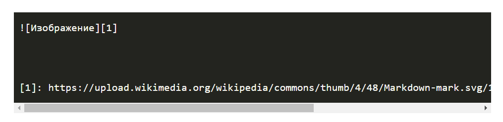
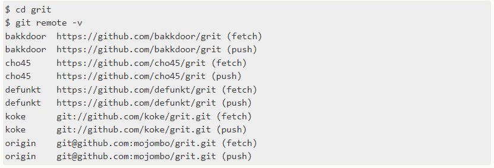
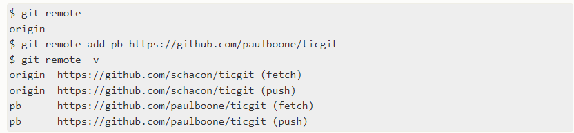
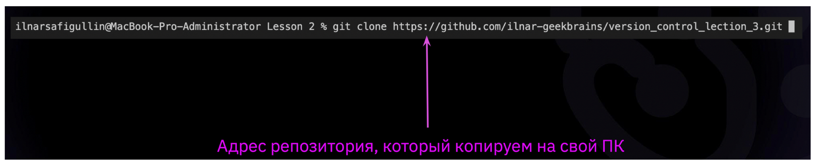
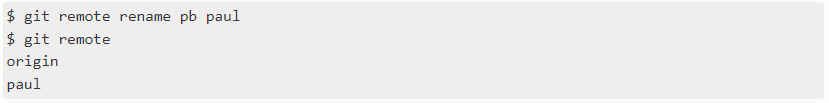
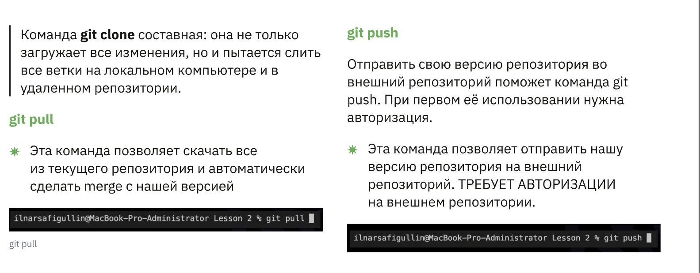

# Работа с Git

## 1. Проверка наличия установленного Git

Чтобы проверить установлен ли Git, откройте терминал в Visual Studio Code и пропишите:  `git --version`.

Если Git установлен появится сообщение с информацией о версии программы, например:

```text
вводим сообщение в терминале:          git --version
сообщение с информацией:               git version 2.42.0.windows.2
```

Иначе будет сообщение об ошибке.

## 2. Установка Git

Если Git не установлен, то загружаем последнюю версию Git с [сайта](http:/git-scm.com/downloads).

Устанавливаем с настройками по умолчанию.

## 3. Настройка Git

```text
При первом использовании Git необходимо представиться.
Для этого нужно ввести в терминале 2 команды:
git config --global user.name «Ваше имя английскими буквами»
git config --global user.email ваша почта@example.com
```

## 4. Инициализация репозитория `git init`

Перед тем как произвести инициализацию репозитория необходимо создать папку в проводнике и открыть ее в программе Visual Studio Code.

_**a.**_ `Создаем папку в проводнике`, даем ей название, например - `«DZ»`.

_**b.**_ `Открываем эту папку` в программе Visual Studio Code и `проверяем является ли эта папка репозиторием`.

`Пишем в терминале:`

```text
 git status
```

(если папка не является репозиторием в терминале появится ошибка и это значит что можно работать в этой папке и создать в ней репозиторий)

_**c**_. Далее необходимо инициализировать репозиторий, при чем можно сначала добавить файлы в эту папку, а потом произвести инициализацию репозитория, или инициализировать репозиторий, а потом добавить файлы, в этих случаях последовательность действий не имеет принципиального значения.

_**d.**_ Инициализация (создание) репозитория  

Для создания нового репозитория используется команда `git init`. Команду git init выполняют только один раз для первоначальной настройки нового репозитория. Выполнение команды приведет к созданию нового подкаталога .git в нашем рабочем каталоге.

`Выполняем команду в терминале:`

```text
git init
```

В терминале выводится информация, что инициализирован пустой репозиторий Git и указывается путь к нашей папке

_**e.**_ Дальше мы можем проверить статус.

**Получить информацию от git о его текущем состоянии можно командой - `git status`**

`Выполняем команду в терминале:`

```text
git status
```

Выводится сообщение что мы находимся на ветке мастер, а также, что коммитов пока нет, нечего фиксировать (создавать/копировать файлы и использовать «git add» для отслеживания)

```text
Ура! Мы создали новый репозиторий!!!
```

## 5. Запись изменений в репозиторий

Итак, после создания репозитория `добавляем` в Visual Studio Code `файл` и присваиваем ему имя, например:
`GitInstruction.md` применяем это и открывается наш файл в проводнике.

`Проверим что изменилось:`

`Выполняем команду в терминале:`

```text
git status
```

В терминале выводится сообщение о том, что есть неизвестный файл GitInstruction.md и он подсвечивается красным цветом это значит, что необходимо добавить файл к отслеживанию с помощью команды git add с указанием названия файла.

Далее нам надо добавить этот файл в отслеживаемый:

`Выполняем команду в терминале:`

```text
git add GitInstruction.md
```

*Важно!

```text
(для авто заполнения имени файла, в моем случае это - GitInstruction.md, можно использовать клавишу `TAB` на клавиатуре, после ввода git add нажимаем на клавиатуре `TAB`, если авто заполнение не произвелось, попробуйте ввести первые буквы из названия вашего файла - и вуаля наша строка до заполнится автоматически)
```

`Проверяем что изменилось:`

`Выполняем команду в терминале:`

```text
git status
```

В терминале появляется сообщение, что есть изменения, которые необходимо зафиксировать, появился новый файл GitInstruction.md и теперь он подсвечивается у нас зеленым цветом, также для отмены промежуточной стадии Git предлагает нам ввести команду "git rm --cached <GitInstruction.md>..."

И так зафиксируем наш файл, добавив свой первый коммит:

`Выполняем команду в терминале:`

```text
git commit -m "Initial commit"
```

В терминале появляется сообщение, что произведена первоначальная фиксация

```text
[master (root-commit) 9e0071e] Первоначальная фиксация
Изменен 1 файл, 0 вставок(+), 0 удалений(-)
Режим создания 100644 GitInstruction.md
```

`Проверяем что изменилось:`

`Выполняем команду в терминале:`

```text
git status
```

В терминале выводится сообщение:

```text
git status
On branch master
No commits yet
```

это означает, что мы находимся на ветке мастер и что у нас нет коммитов и нам нечего коммитировать, рабочее дерево чисто.

Добавляем в наш файл информацию например, пишем какой-то текст...

```text
## 5. Запись изменений в репозиторий
```

`Проверяем что изменилось:`

`Выполняем команду в терминале:`

```text
git status
```

и в терминале мы видим сообщение что:

```text
на ветке мастера появились изменения, которые не были проиндексированы для фиксации:
(используйте команду "git add <file>..." для обновления того, что будет зафиксировано)
(используйте команду "git restore <file>..." для отмены изменений в рабочем каталоге)
Изменено: GitInstruction.md
В коммит не добавлены изменения (используйте "git add" и/или "git commit -a")

```

Итак продолжаем =)

`Выполняем команду в терминале:`

```text
git add GitInstruction.md
```

`Проверем что изменилось:`

`Выполняем команду в терминале:`

```text
git status
```

В терминале выводится сообщение:

```text
На ветке мастера произошли изменения, которые необходимо зафиксировать:
(используйте команду "git restore --staged<file>..." для отмены промежуточной стадии)
Изменено: GitInstruction.md
```

Фиксируем наши изменения!

`Выполняем команду в терминале:`

```text
git commit -m "добавила п.5 - Запись изменений в репозиторий"
```

`Проверяем что изменилось:`

`Выполняем команду в терминале:`

```text
git status
```

и в терминале нам выводится сообщение, что добавлен такой-то комммит, и произведена запись в репозиторий.

Допустим мы отвлеклись и когда вернулись к работе мы не помним на чем мы остановились? Добавляли ли файл или файлы к следующему коммиту с помощью команды git add –? Создавали ли мы коммит для внесенной информации с помощью команды git commit -m “message”? В этом нам поможет разобраться такая команда, как `git diff`.

`git diff` служит для вывода изменений в файлах по сравнению с последним коммитом и вводится в терминал она без параметров.
Если мы ни чего не меняли и уже добавили файлы к следующему коммиту, и создали коммит, то в терминале ни чего не отобразиться, а если нет то в терминал будут выведены изменения, которые мы произвели.

## 6. Просмотр истории коммитов

После того, как мы создали несколько коммитов, вероятно нам понадобится возможность посмотреть что было сделано — историю коммитов. Одним из основных и наиболее мощных инструментов для этого является команда `git log`.
Если мы запустим команду `git log`, мы увидим все действия, которые мы совершали с этим файлом.

`git log` перечисляет коммиты, сделанные в репозитории в обратном порядке — последние коммиты находятся вверху.

Выглядит это примерно так:

```text
commit e63c2fe7ed5a7b4ae249bc9e499dd8f27c58d756
Author: Silentlay <gerka185@gmail.com>
Date:   Thu Oct 2 12:33:48 2023 +0300

добавила информацию в п.5

commit acaeae619426510ad0391e4f8fea62e8ade88115
Author: Silentlay <gerka185@gmail.com>
Date:   Thu Oct 2 11:54:58 2023 +0300
```

Чтобы увидеть всю историю коммитов в терминале, после выполненной команды git log нажимайте на клавиатуре стрелочку вниз, в конце мы видим надпись (END), нажимаем q на клавиатуре, чтобы продолжить работу с терминалом, проследите чтобы в это время у вас стояла английская раскладка.

Также можно воспользоваться командой `git log --graph`, с помощью нее мы сможем увидеть небольшой граф в формате ASCII, который показывает текущую ветку и историю слияний.

## 7. Перемещение между сохранениями

Git позволяет не только просматривать историю. Еще мы можем перемещаться по истории, загружая в рабочую директорию состояние кода на момент выполнения любого коммита. Перемещаться по истории коммитов можно с помощью команды `git checkout`.
Поскольку git сохраняет изменения в файле в репозитории целиком, это позволяет перемещаться между коммитами командой git `checkout [commit hesh]`. Узнать хеш коммита можно командой git log. Перемещаться между коммитами можно для просмотра удаленных частей кода или восстановления удаленных файлов.
Важно помнить, после просмотра интересующего нас коммита обязательно нужно выполнить команду в терминале `git checkout master` она возвращает нас к актуальному состоянию и мы сможем продолжить работу, если мы не воспользуемся этой командой, какая-то часть нашей работы просто исчезнет с экрана.

## 8. Игнорирование файлов

Для того чтобы исключить из отслеживания в репозитории определенные файлы или папки необходимо создать там файл ***.gitignore*** и записать в него их названия или шаблоны, соответствующие таким файлам или папкам.

Итак попробуем создать файл gitignore и посмотрим на деле как это работает, как работать с файлами которые не нужно добавлять для отслеживания в репозиторий.

Начнем с добавления изображения.

Добавим изображение например логотип, или какую-либо картинку, для этого например, скачиваем изображение и добавляем его в папку с нашим репозиторием.

В проводнике в VSC мы видим, что он к нам добавился, но пока не отслеживается, а нам это и не нужно, добавляем в игнорирование – для этого добавляется специальный служебный файл для Git(а) - это `.gitignore`.

создаем новый файл в VSC и даем ему имя:

```text
.gitignore
```

`(ОБЯЗАТЕЛЬНО!!!! первой ставим точку)` - иначе наш gitignore не будет работать

Создали, и в этот файл добавляем название файлов, которые мы хотим игнорировать или их шаблоны.

Итак... Добавляем название файла. Как это сделать? Кликаем на нашу картинку, которую хотим проигнорировать, правой кнопкой мыши, выбираем из всплывающего меню команду `переименовать` и
копируем наше название... и вставляем в наш файл gitignore, или нажимаем на изображение правой кнопкой мыши и выбираем из всплывающего меню команду `скопировать относительный путь`, идем в gitignore, кликаем правой кнопкой мыши и в всплывающем меню нажимаем на команду вставить, и теперь мы видим, что название нашей картинки стало подсвечиваться серым, это означает, что этот файл Git уже не видит, он игнорируется. Но удобнее и проще делать по-другому, если у нас много изображений нам придется все их названия копировать и этот большой список вставлять в файл  gitignore, поэтому так не делают, а используют шаблоны.

В файл  gitignore можно добавить шаблон, вот например для файлов с расширением .png, мы ставим звездочку (*) и потом все файлы с таким расширением будут игнорироваться.
Выглядит это так:

```text
*.png
```

`(все файлы которые заканчиваются на эти 4 символа будут игнорироваться)`.

Так же шаблонно в gitignore можно добавлять и папки, или добавить все изображения в gitignore кроме одного.

Вставили.
Переходим в наш проект, в моем случае, в файл GitInstruction.md где, я создаю инструкцию по работе с Git, выбираем место куда мы хотим добавить изображение, например: я проследую к началу своей инструкции и добавлю там логотип Git(а). 

Как правильно вставить изображение?

Выглядит это так:

```text

```

Поясню что зачем:

[ ] – тут пишем любой текст, который будет отображаться в случае если картинка не сможет загрузиться по каким-то причинам

( ) – сюда мы добавляем относительную ссылку на изображение (нажимаем на изображение, правая кнопка мыши, выбираем – скопировать относительный путь – вставляем в () )

И теперь чтобы оно появилось нам нужно добавить восклицательный знак в начало и логотип появился, изображение видно.

А дальше нам надо поработать с Git и зафиксировать изменения.

Посмотрим что же изменилось с помощью команды `git status`

Выполняем:


В терминале нам сообщается что:

Я нахожусь на ветке мастера, есть изменения, которые не были проиндексированы для фиксации, изменен файл GitInstruction.md, есть не отслеживаемые файлы: .gitignore

Сохраним изменения в файле GitInstruction.md и добавим коммит о том что мы добавили файл gitignore.

## 9. Создание веток в Git

Допустим у нас есть готовый чистовой вариант нашего файла и мы хотим внести какие-то изменения в нем не затрагивая наш чистовик, для этого в Git существует возможность создать так сказать черновик, где мы можем добавить какую-то информацию, для этого можно создать новую ветку и продолжить работу в ней.

Допустим у нас есть готовый чистовой вариант нашего файла и мы хотим внести какие-то изменения в нем не затрагивая наш чистовик, для этого в Git существует возможность создать так сказать черновик, где мы можем добавить какую-то информацию, для этого можно создать новую ветку и продолжить работу в ней.

По умолчанию имя основной ветки в Git - **master**

Создать ветку можно командой:

```text
git branch <имя новой ветки>
```

Или командой:

```text
git checkout –b <имя новой ветки>
```

**Внимание:** `Эта команда создает ветку и сразу переключает на нее`.

Или командой:

```text
git checkout –b <имя новой ветки>
```

**Внимание:** `Эта команда создает ветку и сразу переключает на нее`.

Список веток в репозитории можно посмотреть с помощью команды `git branch`.

`git checkout -b (название ветки)` - эта команда создает ветку и сразу переключает на нее

Текущая ветка будет отмечена звездочкой: **\* master**

Итак попробуем на примере создать новую ветку в Git.

Приступим)

Для начала посмотрим список веток которые есть у нас в репозитории командой `git branch`

Выполняем:



У нас одна ветка в репозитории – это master, ее по умолчанию создает Git при инициализации репозитория, но когда будем работать с GitHub - с удаленными репозиториями, то на GitHub создается по умолчанию ветка main, из-за этой нестыковки придется переименовывать потом ветку master, хотя можно не переименовывать, а просто добавить еще одну ветку.

В нашем случае у нас ветка мастер и она текущая и активная и отмечена звездочкой.

Добавлю новую ветку.

Выполняю:


Еще раз посмотрим список веток

Выполняю:


Теперь у нас в списке 2 ветки master и fileIgnore, и мы находимся на ветке мастер `(выделяется активная ветка зеленым цветом и звездочкой)`.

Чтобы перемещаться между ветками используются следующие команды:

```text
git checkout <имя ветки>
```

Или командой:

```text
git swith <имя ветки>
```

## 10. Слияние веток и разрешение конфликтов

Слияние и конфликты являются неотъемлемой частью работы с Git.
Git позволяет выполнять слияния очень просто. В большинстве случаев Git самостоятельно решает, как автоматически интегрировать новые изменения.

Допустим, мы записали какую-то информацию в другой ветке, например: в моем случае в ветке fileIgnore, добавили изменения и закоммитили все изменения и решили вернуться на ветку master. Что мы там увидим, а то что записанная информация в другой ветке не отображается на ветке master. И если мы хотим чтобы наша информация отображалась в master мы должны сделать слияние веток.
Теперь нам нужно слить информацию которую была добавлена в ветку fileIgnore с веткой master, чтобы у нас добавилась эта информация.

Выполняем слияние веток с помощью команды `git merge` (тут указываем ту ветку, которую мы хотим слить с текущей), это значит мы переключаемся на ту ветку в которую мы хотим добавить информацию и только потом добавляем слияние и записываем это так: git merge fileIgnore
Выполняем:



Теперь в ветке master появилась информация из ветки fileIgnore и видим информацию результата нашего слияния в терминале.

Если нам больше не нужна ветка, то мы ее удаляем (но вернемся к удалению чуть позже).

Добавим еще одну ветку

Добавляем в наш файл какой-то новый раздел

И пока сохранять не будем, а создадим новую ветку но уже другим способом git checkout (с параметром) –b (она создаёт новую ветку) (назовем ее `createbranch`) - эта команда создает ветку и сразу переключает на нее, выполняем:



и видим сообщение в терминале, что мы создали и сразу переключились на новую ветку `createbranch`

Так же таким способом мы можем использовать команду `git switch`, но там будет другой параметр (параметр: -с) - git switch -с <имя ветки>
Посмотрим список веток.

Выполняем команду:


Тут мы видим, что у нас уже 3 ветки и активна у нас `createbranch`

Добавим сюда любую информацию, например:

```text
## 9. Создание веток в Git

По умолчанию имя основной ветки в Git - **master**

Создать ветку можно командой:

```text
git branch <имя новой ветки>
```

Теперь сохраним эти изменения, только сначала посмотрим что добавили.

Выполняем команду (git diff):


Перейдем в ветку master командой git switch master

Выполняем:


В терминале у нас выводится, что мы теперь на ветке мастер, и что у нас есть изменения, возвращаемся обратно в ветку createbranch

Выполняем:


И что мы тут сделаем например скопируем что мы тут добавили, но прежде чем это сделать зафиксируем изменения
Посмотрим гит статус

Выполняем:



Фиксируем.

Выполняем:



Копируем наш 9-й раздел и переходим на ветку мастер.

Выполняем:


И видим, что тут нет нашего 9-го раздела.

Вставляем сюда то, что скопировали (мы имитируем параллельную работу) мы в той ветке добавили и в этой, ну и можно что-то здесь изменить, например: добавляем несколько лишних букв.


Можем использовать такой же коммит для этой ветки, фиксируем.


Посмотрим что у нас произойдет если мы начнем сливать эти ветки, но для начала посмотрим список веток командой git branch:

Выполняем:


Видим, что мы находимся в мастере, сейчас нам надо слить с веткой master ветку createbranch.

Выполним это слияние:


Тут мы видим, что у меня получился конфликт при слиянии веток, потому что я внесла изменение.
И тут VSC и Git показывают нам что здесь что-то не так и возник конфликт.

Мы тут в терминале видим информацию о том, что:

```text
Авто слияния не получилось, ошибка слияния, предлагается зафиксировать конфликт и выполнить результирующий коммит
Нам предлагается определить это вручную, как это делается
Выберем вариант который нам предлагается.
```


Таких конфликтов в файле с кодом может быть много и их нужно все разрешать, но в данном случае мне нужно принять входящее изменение, т.к. оно меня устраивает и VSC оставляет мне нужный вариант.

Также обращаю внимание на кнопку – разрешить в редакторе слияния – это уже новый функционал в VSC который появился недавно, но это работа в основном с интерфейсом, который предлагает VSC для работы с Git(ом), не через терминал, а через интерфейс, но в большинстве случаев можно обойтись тем что было проделано.

Мы приняли нужные изменения, но пока еще не все сделали, теперь мы видим, что наш файл подсвечен красным цветом с восклицательным знаком


Это значит, что нужно выполнить фиксацию тех изменений, которые мы внесли и зафиксировать коммит слияния.

Посмотрим статус.

Выполняем:


Итак, мы видим сообщение, что мы на ветке мастер, есть не слитые пути, просит исправить и зафиксировать эти изменения с помощью команды "git commit -a", сделать коммит слияния, также можно отменить это слияние с помощью команды "git merge --abort"

`!!! После каждого слияния важно на забывать делать фиксацию коммита.`

Выполняем:


Теперь посмотрим как будет выглядеть в истории коммитов git log –-graph



И теперь мы видим ветку, и указывается что здесь ветка мастер в конце. Посмотрим на список веток еще раз.

Выполняем:


Продолжим работать, добавим еще в ветку createbranch информацию.

Переключимся на ветку createbranch с помощью команды git switch createbranch и добавляем туда новую информацию. Сохраним и закоммитим эти изменения.

Попробуем еще раз создать конфликт, скопируем что мы добавили в этой ветке. Переключаемся в ветку master, вставляем сюда то что мы скопировали, ну и тоже внесем какие-то изменения, например изобразим что у нас произошло залипание клавиш и добавим несколько лишних букв. Сохраним в ветке master эти изменения и выполняем слияние

Выполняем:


Тоже получился конфликт.


И соответственно мы должны его разрешить.
Выбираем то, что нас устраивает, в данном случае меня устраивает текущее изменение и получает тот результат который мы выбрали.

Смотрим git status

Выполняем:


Теперь нужно выполнить коммит слияния, выполняем этот коммит:


И так, мы разрешили конфликт и выполнили коммит слияния.

По итогу, когда мы выполнили все работы в ветке и все согласовали, ветки нужно удалять, их не нужно накапливать, т.к. они будут путать и в них можно будет запутаться, они нам нужны только как черновик.

## 11. Удаление веток

Переходим к удалению веток

Удаление ветки реализуется с помощью команды:

```text
git branch -d <название ветки>
```

Итак, как это выглядит на примерах?
Мы сейчас удалили слитую ветку
Посмотрим наш список веток с помощью команды git branch

`Выполняем:`


У нас три ветки,  первая ветка у нас была fileIgnore. Удаляем ее с помощью команды git branch (с параметром) -d от слова delete.
В Git есть полные и сокращенные команды в данном случае это –d.
Если мы напишем git branch –delete <название ветки> – это тоже будет работать.
Полные команды пишутся с двумя дефисами, сокращенные с одним, удобнее конечно пользоваться короткими названиями.

`Выполняем:`

```text
git branch -d fileIgnore
```


Смотрим список веток:


Мы удалили слитую ветку и у нас осталось две ветки. Также можно удалять и не слитые ветки, но в этом случае придется удалять принудительно следующей командой:

```text
git branch -D createbranch <название ветки>
```

В Git все переменные, которые обозначены заглавной буквой это принудительные команды.

`!!! Еще один момент, ветку нельзя удалить, находясь в ней!`

## Краткий список основных команд в Git

* git init – инициализация локального репозитория
* git status – получить информацию от git о его текущем состоянии
* git add – добавить файл или файлы к следующему коммиту
* git commit -m “message” – создание коммита.
* git log – вывод на экран истории всех коммитов с их хеш-кодами
* git branch – посмотреть список веток в репозитории
* git branch <название ветки> – создать новую ветку
* git checkout <название ветки> – переход к другой ветке
* git branch -d <название ветки> – удалить ветку
* git clone <url-адрес репозитория> – клонирование внешнего репозитория на локальный ПК
* git pull – получение изменений и слияние с локальной версией
* git push – отправляет локальную версию репозитория на внешний

## 12. ***Работа с удаленными репозиториями***

В этом разделе мы рассмотрим как работать с удаленными репозиториями

Коммит, созданный нами, хранится в репозитории, привязанном к конкретной папке на нашем компьютере, т.е. является локальным. Это полезно, если мы работаем над проектом самостоятельно. Однако в большинстве случаев возникает необходимость обеспечить доступ к результатам работы или доставить код на сервер, где он будет выполняться.

Распишем по шагам что необходимо для этого сделать:

### 1. Создать аккаунт на GitHub

Для того чтобы создать аккаунт на GitHub необходимо пройти [по ссылке](https://www.GitHub.com) и зарегистрироваться в нем.

Как подключиться к удаленному репозиторию?

Для загрузки данных в удаленный репозиторий сначала нужно к нему подключиться. В моем примере я использую адрес [ссылка](https://github.com/Silentlay), однако пользователь может создать собственный удаленный репозитарий на GitHub, BitBucket или другом подобном сервисе. Это занимает некоторое время, однако в дальнейшем полностью себя оправдывает, тем более, что подобные службы имеют пошаговые инструкции для правильно выполнения нужных действий.

### 2. Создать локальный репозиторий

(как создавать локальный репозиторий было описано выше)
### 3. Создать удаленный репозиторий

```text
(2 и 3 пункт равноценно равны, поэтому не принципиально важно в какой последовательности они будут выполняться)
```

Нас интересует сейчас создание нового репозитория, тут это очень просто найти, это единственное место которое мы видим на странице это знак «плюс» и он находится только в одном месте справа наверху, нажимаем на него и открывается список и первым пунктом там идет как раз New repository, кликаем на него

Далее открывается страница


Еще есть дополнительные опции, как описание, тип доступа - публичный (открытый) или приватный (закрытый) доступ. Можно создать файл README.md, нам он не нужен, потому что он у нас уже есть в локальном репозитории, можно добавить файл gitignore, здесь представлено большое количество шаблонов для всех случаев и для любых проектов, любых типов и языков программирования можно выбрать любой шаблон и самим не нужно заполнять этот файл gitignore, еще можно выбрать какой-то стандартный шаблон лицензии при необходимости. Нажимаем на кнопку Create repository (создать репозиторий)


После этого у нас открывается следующая страница, где GitHub предлагает совершить нам следующие действия:

Первый блок - команды которого мы выполняем в случае если у нас еще нет локального репозитория, т.е. те которые бы мы делали если б создавали с нуля репозиторий

```text
echo "# 2" >> README.md
git init
git add README.md
git commit -m "first commit"
git branch -M main
git remote add origin https://github.com/Silentlay/Remote.git
git push -u origin main
```

У меня есть локальный репозиторий поэтому мы переходим ко второму варианту и командам

```text
git remote add origin https://github.com/Silentlay/Remote.git
git branch -M main
git push -u origin main
```

где команда `git remote add origin https://github.com/Silentlay/Remote.git` -  выполняет связывание удаленного репозитория с локальным

`git branch -M main` – выполняет переименование текущей ветки в main, если ветка на локальном компьютере называется не main а master, и чтобы в дальнейшем не возникло конфликтов мы должны переименовать ветку master в main

`git push -u origin main` – отправляет изменения в локальном репозитории в удаленный

### 4. Связать удаленный репозиторий с локальным (в п.4 должны уже существовать локальный и глобальный репозиторий)

Для того, чтобы связать созданный нами локальный репозиторий с удаленным, выполним такую команду в нашем локальном репозитории:

```text
# This is only an example. Replace the URI with your own repository address.
$ git remote add origin 
```

Первая строка напоминает нам, что url репозитория, который приведен в примере, нужно изменить на свой.

Иногда бывает так, что проект имеет несколько удаленных репозиториев – в таком случае каждому из них присваивается собственное имя. Главный репозиторий принято называть origin.

Чтобы проверить есть ли у нас связь между локальным и глобальным репозиторием мы можем использовать команду - `git remote`

Чтобы более детально получить информацию необходимо ввести следующую команду:

```text
git remote -v
```

```text
origin  https://github.com/профиль_на_git_hub/Remote.git (fetch) - загрузка изменений с удаленного репозитория
origin  https://github.com/Silentlay/Remote.git (push) - отправка 
```

Как отправить изменения в удаленный репозиторий?

Теперь, когда у нас в локальном репозитории создан коммит и мы подключились к удаленному, можем отправить его на сервер. Мы это будем делать каждый раз, когда хотим обновить данные в удаленном репозитории.

`Отправка коммита` осуществляется с помощью команды `push`, которая имеет два параметра - имя удаленного репозитория (в нашем случае origin) и ветку, в которую необходимо внести изменения (main — это ветка по умолчанию для всех репозиториев).

```text
git push origin main
```

Если мы все сделали правильно, то отправленный файл мы можем увидеть с помощью браузера на удаленном сервере.

Как клонировать удаленный репозиторий?

Если возникла необходимость клонировать удаленный репозиторий, можно получить полностью работоспособную копию при помощи команды clone:

```text
git clone
```

GitHub автоматически создаст новый локальный репозиторий в виде удаленного на собственном сервере.

Как запросить изменения с удаленного репозитория?

В случае, если нет необходимости делать клон удаленного репозитория, а нужно просто получить информацию об изменениях, это можно сделать с помощью команды pull:

```text
git pull origin master
```

Она скачивает новые изменения. Так как мы ничего нового не вносили с тех пор, как клонировали проект, изменений, доступных к скачиванию, нет.

**`Работа с чужими репозиториями`**

Что нужно делать, когда мы хотим работать с чужим репозиторием и предложить свои изменения? Для этого необходимо сделать копию чужого проекта на свой репозиторий, выбираем интересующий нас чужой проект и кликаем по кнопке Fork


По другому сделать ни как не получится, потому что у вас нет доступа сюда – это чужой репозиторий.

После того как мы нажади кнопку Fork, открывается другая страница на которой мы нажимаем кнопку `Create fork` как представлено на картинке


После чего выполняется процесс копирования


И вот открылся этот репозиторий но уже в моем репозитории, мой репозиторий копии чужого

И тут мы можем уже клонировать его на наш локальный репозиторий, для дальнейшей работы с ним. Нажимаем на кнопку Code, копируем HTTPS ссылку, и переходим к себе на компьютер.
И у себя на компьютере я клонирую в нужную мне папку командой:

```text
git clone <скопированная ссылка>
```
в следствии чего копия чужого репозитория появляется на нашем локальном репозитории.

Теперь мы можем вносить изменения в этот репозиторий, что-то добавить или изменять, но обращаю внимание это предложение каких-то своих наработок, пока они не будут согласованы они будут считаться черновиками, поэтому мы должны все эти изменения, которые мы хотим предложить автору делать в отдельных ветках.

Создаем новую ветку (или ветки) и вносим свои предложения для данного проекта, для этого вводим в терминал команду:

`git switch -c <имя нашей ветки>`

Создали новую ветку и сразу на нее переключились и в этой ветке мы можем добавлять какие-то изменения, можно добавить новый файл (или файлы) или изменить что-то в имеющихся файлах.

После того как мы внесли изменения, которые мы хотели внести мы должны отправить этот файл в удаленный репозиторий.

отправляем следующей командой: `git push --set-upstream origin <имя файла>`

После успешного отправления необходимо перейти на GitHub.


Если есть кнопка `Compare & pull request`, то идем по всем зеленым кнопкам и делаем pull request.

Если возникла ситуация, что кнопки `Compare & pull request`, как на изображении ниже


необходимо сделать следующее

Посмотреть список веток - наша ветка появилась, в данном случае это ветка new


Переходим на нее и мы видим, что там есть добавленный нами файл, в данном случае это файл New.md.


Далее мы переходим во вкладку pull request


Кликаем и появляется перед нами следующая картина


Кликаем на New pull request


Здесь говорится что в ветке main изменений нет, а мы, в данном случае, вносили изменения в ветку New, поэтому здесь нужно выбрать нужную ветку в списке, выбираем нужную ветку - New


И тут уже написано, что можно сделать слияние и появилась кнопка `Create pull request` нажимаем на эту кнопку.

Далее у нас открывается окно


И ниже нажимаем кнопку 

Внизу будет видна информация, какая внесена и добавлена, по сравнению с исходным репозиторием.... все успешно.


Мы тут видим галочку это означает, что pull request успешно отправлен, и эта страничка открылась уже в репозитории автора.

Посмотрим как это будет выглядеть со стороны автора


Зачем автору нужны pull request? Чтобы слить со своим репозиторием, чтобы он принял это. Тут мы видим, что добавились какие-то pull request, открываем


Тут автор видет от кого это пришло, название аккаунта и название ветки и соответственно здесь появился новый раздел который позволяет автору работать с pull request(ом)


Автор может принять его и слить со своей работой, также тут есть команды для работы на компьютере в локальной версии, т.е. с клоном этого репозитория на локальном компьютере, если что-то не понравилось или автор хочет какое-то сообщение написать пользователю, который прислал это предложение автору на доработку
Автор может написать сообщение например:


С детальным описанием что доработать, соответственно это уйдет сообщением к тому человеку на которое ответил автор проекта.


