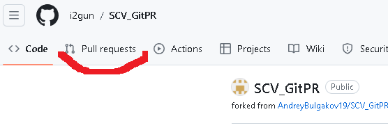
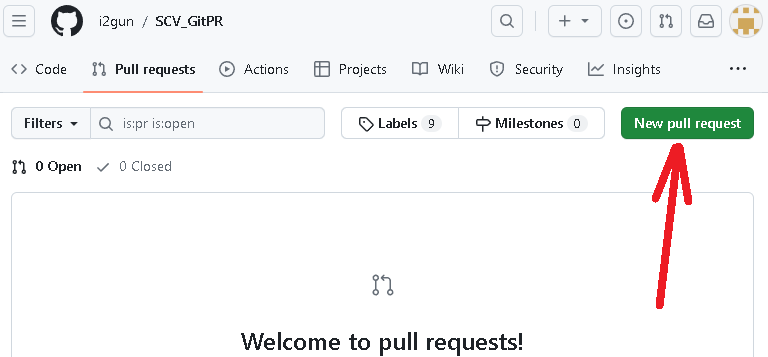
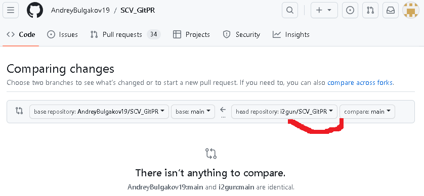
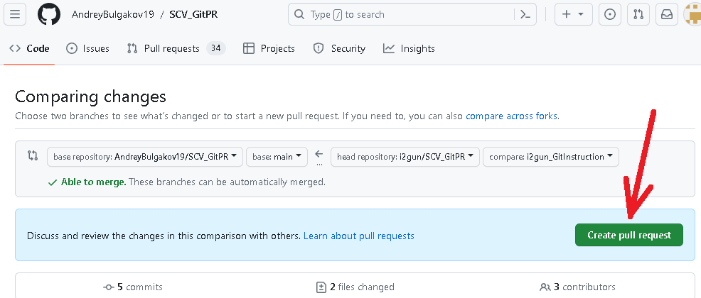

# Working with "Git" Version Control System (VCS)

## _What is VCS and what is it for_
Version control is the organization of structured tracking and management of changes occurring in the program code. VCS are tools that help software (SW) developers manage changes to source code over time. These tools are especially useful for DevOps teams, as they help reduce the time spent on project development and increase the number of successful deployments.

Git is one of the most popular free and open-source VCS tools today. It is also called a category of Distributed VCS (DVCS).

Below is the instruction on how to install and use the Git VCS for any of the uses including SW development.

## 1. Check if "Git" has been already installed

Execute the command ***git --version*** in the terminal. If "Git" is installed then information about the version of the software will be shown, otherwise, the error message will occur.

## 2. Installing "Git"

Download the latest version of "Git" from the [website](https://git-scm.com/downloadsj)
Install using the default settings

You can also download and install the VSCode tool to improve your Git experience (see [VSCode](https://code.visualstudio.com/)).

## 3. Setting up "Git"

At first use Git, you need to introduce yourself. To do so you are going to enter two commands in the terminal:
```Bash
git config --global user.name "Your name using English letters"
git config --global user.email your_email@example.com
```

## 4. Getting a Repository

"Git" repository is obtained in two ways:
1. Turn a current local directory into a Git repository using the ***git init*** command;
2. Clone an existing repository using the ***git clone*** command _(see chapter 15)_.

#### 4.1. Initializing a Repository in the current directory
* Make your project directory a current directory: ***cd "G:\Python Learning\GB_lessons>"***;
* Type initialization command: ***git init*** (make sure the directory doesn't already have a Git repository, by checking for hidden <u>```.git```</u> subdirectory).

#### 4.2. Clone an existing repository 
* To make a copy of the existing repository type ***git clone <<u>URL</u>>***. This method is described in **Chapter 15** in more detail.

## 5. Recording changes to the repository

To check the current state of the Git repository the ***git status*** command is used. To see the short status information use the ***git status -s*** command, as in the example shown below:
```
PS G:\Python Learning\GB_lessons> git status -s
 M GitInstructions.md
PS G:\Python Learning\GB_lessons>
```

If there are any untracked files in the repository then the ***git add <<u>file name</u>>*** command should be used to start tracking that file. To track all the files in the current directory the ***git add .*** command (_with the dot at the end_) can be used.

If any file has been modified after the last committed changes then to accept new modifications type ***git commit***. This command will open a new file in the editor for your comments related to the current changes. To commit the changes without opening the editor type ***git commit -m "<u>your_comments_on_the_current_changes</u>"***. Adding ***-a*** option will let you skip explicit staging of the file with ***git add*** command.

---
---
> An important note about ***git commit*** and ***git add*** commands:

- Any created or modified files have to be staged by ***git add*** command before the execution of the ***git commit*** command.
---
---

To view the details of changes made before committing them use ***git diff*** command

## 6. Browsing the History of Commits

To show the list of the commits made previously run ***git log*** command. In order to limit the number of committed entities use ***-n*** option, where ***n*** - is the number of last commits to show. Another helpful option is ***-p***, which shows the difference in each displayed commit.

## 7. Transition from one commit to another

To change the current state from one commit to another use the command ***git checkout <<u>commit_hash</u>>***. A git _<<u>commit_hash</u>>_ is a SHA1 hash of the state of the git repository at the time of the commit. This hash code is shown in the output of the ***git log*** command.

## 8. Ignoring the intentionally untracked files

A ***".gitignore"*** file specifies intentionally untracked files which Git will ignore.
Each line in the ***".gitignore"*** file is a file name or a pattern that determines the path and name of files that should be ignored by Git.
The ***".gitignore"*** is affecting the content of the current directory and subdirectories. If the subdirectory has its own ***".gitignore"*** file then this local file will have priority.
The ***".gitignore"*** does not affect files that are already tracked by Git.

## 9. Git Branching

#### 9.1. Creating a new Branch
``` $ git branch <new_branch_name> ``` - creates a new pointer (branch) with the name <u>new_branch_name</u> to the current commit (which is referred to by the pointer called HEAD)

#### 9.2. Switching Branches
To switch to an existing branch run the ***git checkout <<u>branch_name</u>>*** or the ***git switch <<u>branch_name</u>>*** commands

#### 9.3. Checking Branches
Full information on all the observable branches can be obtained by ***git log --all*** command.

A more convenient view of the branches in the terminal window is provided by the following command:
```
git log --oneline --decorate --graph --all
```
This will print out the history of commits, showing where branch pointers are located.

## 10. Merging Branches

#### 10.1. Basic Merging
The command used for merging two branches is given below:
```
git merge <branch_name>
```
During the execution of this command, the branch with the name <u>branch_name</u> is going to be merged with the current (active) branch. If the current branch is "master" then <u>branch_name</u> will be merged with the "master" branch.

#### 10.2. Fast-forward merging
In case there were no activities in the first "current" branch during the time of creation and modification of the second "merging" branch (up to the moment of the merge) then the second branch is going to be simply joined with the first branch.

#### 10.3 Merging Conflicts
Occasionally, the merging process doesn't go well and smoothly. If the same part of the same file in both branches is changed differently then Git won't be able to decide for you which of them is the right one to leave and which of them should be rid of. At this moment the merge conflict emerges.

Below is the example of the ***git merge*** command with conflict:
```
PS G:\Python Learning\GB_lessons> git merge section-about-ignoring-files   
Auto-merging GitInstructions.md
CONFLICT (content): Merge conflict in GitInstructions.md
Automatic merge failed; fix conflicts and then commit the result.
```
In this case, Git pauses the process and gives the control to developer to solve the situation. Below is the result of ***git status*** command in case of merge conflict:
```
PS G:\Python Learning\GB_lessons> git status
On branch master
You have unmerged paths.
  (fix conflicts and run "git commit")
  (use "git merge --abort" to abort the merge)

Unmerged paths:
  (use "git add <file>..." to mark resolution)
        both modified:   GitInstructions.md
Untracked files:
  (use "git add <file>..." to include in what will be committed)
        Git-Logo-White_small.png
```
An additional option is to use ***git mergetool*** command which gives an appropriate visual merge tool. The default tool for merge conflicts is ***opendiff***

When the merge conflict is resolved by the developer (a programmer) ***git commit*** command should be executed to approve and fix the changes, as shown below:
```
PS G:\Python Learning\GB_lessons> git commit -am "Resolving the conflict between master branch and section-about-ignoring-files"
[master 4c02de8] Resolving the conflict between the master branch and section-about-ignoring-files
```

## 11. Removing unnecessary files

After merging branches usually, they become obsolete and should be deleted.

For these purposes, the same ***git branch*** command is used, but with the "-d" option, as shown in the next example:
```
PS G:\Python Learning\GB_lessons> git branch -d section-about-ignoring-files
Deleted branch section-about-ignoring-files (was 7e4011f).
```

The branch we are trying to delete shouldn't be the current (active) branch.

In case if unmerged branch needs to be deleted using "-D" (capital "D") option of ***git branch*** command

## 12. Using the Secure Shell (SSH) protocol

SSH protocol allows to connect and authenticate to GitHub without supplying a username and personal access token at each visit. It can also be used for signing commits.
More detailed information can be found in the GitHub document: [About SSH](https://docs.github.com/en/authentication/connecting-to-github-with-ssh/about-ssh)

In order to apply ssh protection there are 2 steps:
1. generate a new SSH key on your local machine;
2. add the public key to your account on GitHub.com to enable authentication for Git operations over SSH.

#### 12.1. Generate an SSH key on a local user account
- Open a terminal;
- Switch to home directory;
```
cd ~
```
- execute the following command:
```
ssh-keygen -t rsa -b 4096 -C "your_email@example.com"
```
When you're prompted to "Enter a file in which to save the key", you can press Enter to accept the default file location. At the prompt, type a secure passphrase.
For additional information: [Generating a new SSH key](https://docs.github.com/en/authentication/connecting-to-github-with-ssh/generating-a-new-ssh-key-and-adding-it-to-the-ssh-agent)

#### 12.2. Adding a new SSH key to your account on GitHub

- Type in terminal:
```
cat ~/.ssh/id_ed25519.pub 
```
- Copy the output to the clipboard;
- In the upper-right corner of the GitHub account home page, click your profile photo, then click Settings;
- In the "Access" section of the sidebar, click  SSH and GPG keys;
- Click New SSH key or Add SSH key;
- In the "Title" field, add a descriptive label for the new key;
- Select the type of key, either authentication or signing;
- In the "Key" field, paste your public key from the clipboard;
- Click Add SSH key.
For additional information: [Adding a new SSH key](https://docs.github.com/en/authentication/connecting-to-github-with-ssh/adding-a-new-ssh-key-to-your-github-account)

## 13. Additional instruments: installing GitKraken

There are three steps to start working with GitKraken Client:
- Download GitKraken Client
- Install GitKraken Client
- Use GitKraken Client

No Git tools are required for GitKraken Client, so once you’ve run the installer, you can open the app and get going.

More detailed information about 
[Installing GitKraken](https://help.gitkraken.com/gitkraken-client/how-to-install).

## 14. Discarding operations made by mistake

### - git reset
  The ***git reset*** command is a complex and versatile tool for undoing changes. It has three primary forms of invocation. These forms correspond to command line arguments --soft, --mixed, --hard. The three arguments each correspond to Git's three internal state management mechanisms, The Commit Tree (HEAD), The Staging Index, and The Working Directory.
  
  The ***git reset HEAD~n*** command moves the current branch backward by <**n**> commits, effectively removing the <**n**> snapshots we just created from the project history. However, if you know the exact reference to removed commits, it is possible to _reset_ back to those commits.

  More detailed information is available in the [git reset](https://www.atlassian.com/git/tutorials/undoing-changes/git-reset) document

### - git revert
  The ***git revert*** command can be considered an 'undo' type command, however, it is not a traditional undo operation. Instead of removing the commit from the project history, it figures out how to invert the changes introduced by the commit and appends a new commit with the resulting inverse content. This prevents Git from losing history, which is important for the integrity of your revision history and for reliable collaboration.

    Note that the git _revert_ operation in its turn can be reverted by the same command.
More detailed information is available in the [git revert](https://www.atlassian.com/git/tutorials/undoing-changes/git-revert) documentation

### - git clean
  ***Git clean*** can be considered complementary to other commands like git reset and git checkout. Whereas these other commands operate on files previously added to the Git tracking index, the ***git clean*** command operates on untracked files.

  More detailed information is available in the [git clean](https://www.atlassian.com/git/tutorials/undoing-changes/git-clean) documentation

## 15. Rewriting history

### git commit --amend
  This command is a convenient way to modify the most recent commit. It lets you combine staged changes with the previous commit instead of creating an entirely new commit. It can also be used to simply edit the previous commit message without changing its snapshot. But, amending does not just alter the most recent commit, it replaces it entirely, meaning the amended commit will be a new entity with its own ref.

  More detailed information is available in the [git commit --amend](https://www.atlassian.com/git/tutorials/rewriting-history#git-commit--amend) documentation

### - git rebase
  Changes the base of the developer’s branch from one commit to another, so it looks like they have created their branch from a different commit. Internally, Git creates a new commit and applies it to the specified base. However, it's essential for everyone involved to understand that although the branch appears the same, it's made up of entirely new commits. When you perform a Git rebase, you are, in effect, rewriting history.
  
  Git **merge** and **rebase** are two different ways that can be used to merge changes from one branch into another. Git **merge** can develop a new commit that can integrate the changes from two branches. This new commit has two parent commits, one from each branch. Git **rebase**, execute the changes from one branch onto another, and explore it as though the changes were made directly on that branch.

  More detailed information is available in the [git rebase](https://www.atlassian.com/git/tutorials/rewriting-history/git-rebase) documentation

## 16. Working with GitHub and execution of ***pull request***
> In order to follow the next steps the GitHub account should be registered first (see [Sign up for GitHub](https://docs.github.com/en/get-started/signing-up-for-github/signing-up-for-a-new-github-account)).

### 16.1 Creating a Repository on GitHub
1. Create a remote repository on GitHub:
  - click on _"New repository"_ -> fill in the _"Repository name"_
  - Select the access type of the new repository (_private_ or _public_ - default);
  - Initialize the repository with the README file (optional);
  - Click on the "Create repository" button.
2. Create a local repository (***mkdir, git init*** commands):
  - Create a README.md file (optional);
  - Add some content into README.md file;
  - Move the file into the stage area of the repository and commit the change (***git add, git commit*** commands);
  - If necessary rename the master branch of the local repository by ***git branch -M <<u>_new name_</u>>*** command;
  For example:
  ``` git branch -M main ```, where -M option implicitly implies forced mode (-f option);
3. Create a remote repository on GitHub (_github.com_);
4. Link the remote repository with the local repository (_github.com_):
  - Run the command ***git remote add origin <<u>_URL to the remote repository_</u>>*** ;
 >  **(make sure that the URL is correct and that there are no additional letters in the front and in the end of the URL)**
  - To check the link type ***git remote -v***; There should be 1 link for push request and 1 link for fetch request
5. Upload the content of the local repository to the remote one.
  5.a. For the first upload execute ***git push --set-upstream origin <<u>_branch name_</u>>*** (or short version as in the following example: ***git push -u origin main***);
Next, the push request may be executed without any parameters (if the upload is going into the main repository);
  > For **push** operations, the remote repository shouldn't be ahead of the local repository..
6. Receiving and merging repositories occurs using the ***git pull*** command (again, if we are pulling data from main repositoriy);
  > For **pull** operations, the local repository shouldn't be ahead of the remote repository.

### 16.2 Clonning a repository from GitHub
1. Change current directory choosing one with no registered repository (e.g. has no _.git_ hidden folder);
2. Open the GitHub page with the required repository and copy the URL link dedicated for glonning the repository.
3. Execute the ***git clone <<u>URL</u>>*** command. This creates a folder in current directory, registers a repository in a newly created folder and copies all the data from remote repository to newly formed local repository.
4. From here all the operations like modification, branching, committing, pushing and pulling are available for the project.

### 16.3 Forking a repository from GitHub
> A fork is a repository that shares code and visibility settings with the original “upstream” repository. Forks are used to allow developers to contribute to a project without having the right to change the main branch of the project.

### Three steps of working with the forked projects:
#### - Fork the repository:
       1.  On GitHub.com, navigate to the repository;
       2.  In the top-right corner of the page, click  **Fork**;


       
       3.  Under "Owner," select the dropdown menu and click an owner for the forked repository;
       4.  By default, forks are named the same as their upstream repositories. Optionally, to further distinguish your fork, in the "Repository name" field, type a name;
       5.  Optionally, in the "Description" field, type a description of your fork;
       6.  Optionally, select  **Copy the DEFAULT branch only**;
    For many forking scenarios, such as contributing to open-source projects, you only need to copy the default branch. If you do not select this option, all branches will be copied into the new fork;
       7.  Click  **Create fork**.

#### - Clone the forked repository as it is described in the previous section.

#### - Create and submit a pull request to the project owner after making changes and fixes.
       1.  On GitHub.com, navigate to the main page of the repository;
       2.  In the "Branch" menu, choose the branch that contains your commits;


       3.  Above the list of files, in the yellow banner, click  **Compare & pull request**  to create a pull request for the associated branch;


       
       4.  Use the base  branch dropdown menu to select the branch you'd like to merge your changes into, then use the  compare  branch drop-down menu to choose the topic branch you made your changes in;
       5.  Type a title and description for your pull request;
       6.  To create a pull request that is ready for review, click  **Create Pull Request**. To create a draft pull request, use the drop-down and select  **Create Draft Pull Request**, then click  **Draft Pull Request**.   

### In case if the yellow banner with green **Compare & pull request** button didn't not appear follow the next steps:
    1. Find and click the "Pull requests" link in the top left corner of the page (second from the left):


    2. Push the green "New pull request" button:


    3. Select the required branch from drop-down list:


    4. Clic on the green "Create pull request" button which appears on the left side of the page:


  For more information about draft pull requests, see "[Pull_requests](https://docs.github.com/en/pull-requests/collaborating-with-pull-requests/proposing-changes-to-your-work-with-pull-requests/about-pull-requests#draft-pull-requests)."

## 17. Additional books and references about 'Git'

Find a rich and friendly guidance through Git in the ***[Git Book](https://git-scm.com/book/en/v2j)*** which can be downloaded as a PDF file also.
Check for the link [Git for newbies - Part 1](https://habr.com/ru/articles/541258) and [Git for newbies - Part 2](https://habr.com/ru/articles/542616) that helps newcomers to get in touch easily.
Visit the ***[Bitbucket Cloud](https://www.atlassian.com/ru/git)*** learning site for useful information about Git
The purposive and understandable [screencast](https://vimeo.com/showcase/5616060) from Ilya Kantor

## 18. Some alternative VCSs.

### SVN
> SVN stands for Subversion, which is a Version Control System (VCS) for software development. Subversion is an open-source VCS that allows developers to manage and track changes to their codebase over time. It offers features like branching and merging, atomic commits, and support for multiple users.

### Mercurial
> Mercurial is a Distributed Version Control System (DVCS) for software development projects. Developed in Python, Mercurial offers features such as support for multiple users, branching and merging, atomic commits, and efficient handling of large codebases.

### Fossil
> Fossil is a simple, high-reliability, distributed software configuration management system that is free and open source. This DVCS is similar to Git and Mercurial, but it also offers bug tracking and wiki capabilities, making it a complete project management solution.