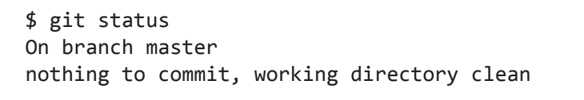
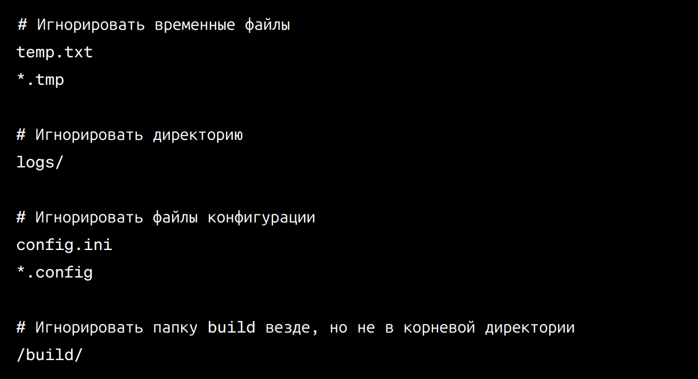

    
# Работа с Git и GitHub
## 1. Проверка наличия установленного Git
В терминале выполнить команду `git version`.
Если git установлен, появится информация о версии программы.
Иначе будет сообщение об ошибке.
## 2. Установка Git
Загружаем последнюю версию Git с [сайта](https://git-scm.com/download).
Устанавливаем с настройками по умолчанию.
## 3. Настройка Git
При первом использовании Git необходимо представиться. Для
этого нужно ввести в терминале 2 команды:
```
git config --global user.name «Ваше имя английскими буквами»
git config --global user.email ваша почта@example.com
```
## 4. Инициализация репозитория
Чтобы начать слежение за существующим проектом, перейдите в папку
этого проекта и введите команду `git init`.
В результате в существующей папке появится еще одна папка с именем
**.git** и всеми нужными вам файлами репозитория — это будет 
основа вашего Git-репозитория.
## 5. Запись изменений в репозиторий
### *1. Проверка состояния файлов*
Основным инструментом определения состояния файлов является команда
`git status`.
Пример вывода данных командой **git status**:



Это означает, что в рабочей папке отсутствуют отслеживаемые 
и измененные файлы. Кроме того, система Git не обнаружила 
неотслеживаемых файлов, в противном случае они были бы перечислены 
в выводимых командой данных. Также команда сообщает имя ветки, 
на которой в данный момент находитесь.
### *2. Слежение за новыми файлами*
Чтобы начать слежение за новым файлом, воспользуйтесь командой 
`git add <file_name>`. Теперь команда **git status** покажет, что
этот файл является отслеживаемым и проиндексированным.
### *3. Фиксация изменений*
Когда область индексирования настроена нужным образом, можно 
зафиксировать внесенные туда изменения. Осуществить фиксацию
можно командой `git commit`. Сообщение фиксации можно задать, 
поставив перед командой флаг -m:
```
git commit -m "message"
```
Вместо "message" укажите описание ваших изменений.
## 6. Просмотр истории коммитов
После сохранения нескольких версий файлов, чтобы взглянуть на то, 
что было сделано ранее, воспользуйтесь командой `git log`.
По умолчанию при отсутствии параметров команда **git log** выводит 
в обратном хронологическом порядке список сохраненных в данный 
репозиторий версий. **git log** используется также для того, чтобы 
узнать идентификатор коммита. Для понимания структуры истории коммитов 
используется команда `git log --graph`. Когда вы выполняете 
**git log --graph**, вы увидите вывод, представляющий собой 
графическое представление истории коммитов. 
## 7. Просмотр индексированных и неиндексированных изменений
Если команда git status дает недостаточно подробный, с вашей точки 
зрения, результат, например, если вы хотите не только получить 
список отредактированных файлов, но и узнать, что именно изменилось, 
воспользуйтесь командой `git diff`.
Сама по себе команда **git diff** показывает не все изменения, 
сделанные с момента последней фиксации состояния, а только те, 
которые еще не проиндексированы. То есть если вы проиндексировали 
все сделанные изменения, команда **git diff** ничего вам не вернет.
## 8. Перемещение между сохранениями
Для перемещения на определенный коммит, используется команда 
`git checkout` с идентификатором коммита:
```
git checkout <идентификатор_коммита>
```
**git checkout** используется также для переключения между ветками:
```
git checkout <имя_ветки>
```
Чтобы вернуться к актуальному состоянию и продолжить работу, 
воспользуйтесь командой `git checkout master`.
Также для перемещения между коммитами и ветками используется 
команда `git switch`:
```
git switch <идентификатор_коммита>
git switch <имя_ветки>
```
## 9. Игнорирование файлов
Для того, чтобы исключить из отслеживания в репозитории определенные
файлы или папки, необходимо создать там файл ***.gitignore***
и записать в него их названия или шаблоны, соответсвующие таким файлам
или папкам.
Пример:

Когда вы добавляете файлы и директории в **.gitignore**, Git будет 
игнорировать их при выполнении операций добавления в индекс и коммитов. 
Если вы изменили файл **.gitignore**, убедитесь, что вы внесли изменения 
в репозиторий (сделали коммит), чтобы новые правила начали действовать. 
Файл **.gitignore** очень полезен для управления тем, какие файлы и 
директории попадают в репозиторий, и какие остаются вне него.
## 10. Создание веток в Git
Создать ветку можно командой:
```
git branch <имя_новой_ветки>
```
По умолчанию имя основной ветки - *master*.
Список веток в репозитории можно посмотреть с помощью команды:
```
git branch
```
## 11. Слияние веток и разрешение конфликтов
Для слияния выбранной ветки с текущей нужно выполнить команду:
```
git merge <название_выбранной_ветки>
```
Если была изменена одна и та же часть файла в обеих ветках, может
возникнуть конфликт, который потребует участия пользователя. VSCode 
предлагает варианты разрешения. Чтобы разрешить конфликт, нужно
выбрать один из вариантов, либо объединить содержимое по-своему.
После разрешения конфликта нужно выполнить коммит слияния.
## 12. Удаление веток
Чтобы удалить локальную ветку Git, вы можете выполнить команду:
```
git branch -d <branch_name>
```
Перед удалением локальной ветки обязательно переключитесь на другую, 
которую не собираетесь удалять. Удалить ветку, в которой вы находитесь 
и которую просматриваете в данный момент, нельзя.
Если в ветке присутствуют несмерженные изменения или незапушенные коммиты, 
флаг -d не позволит удалить такую локальную ветку. Если все же попытаться 
удалить такую ветку, Git выдаст ошибку. Как будет предложено в тексте 
ошибки, можно воспользоваться флагом -D:
```
git branch -D <имя_ветки>
```
В отличие от **git branch -d**, команда **git branch -D** не выполняет 
проверку слития веток. Она немедленно удаляет ветку, включая все коммиты, 
которые на ней находились.


