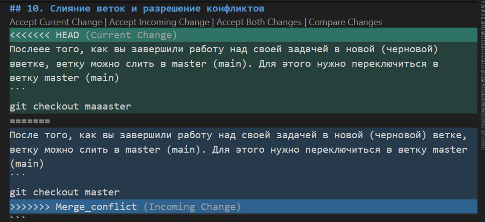

# Работа с Git

## 1. Проверка наличия установленного Git
В терминале выполнить команду `git --version`.
Если Git установлен появится сообщение с информацией о версии программы, иначе будет сообщение об ошибке.

## 2. Установка Git
Загружаем последнюю версию Git с [сайта](https://git-scm.com/downloads).
Устанавливаем с настройками по умолчанию.

## 3. Настройка Git
При первом использовании Git необходимо представиться.
Для этого нужно ввести в терминале 2 команды:
```
git config --global user.name «Ваше имя английскими буквами»
git config --global user.email ваша почта@example.com
```

## 4. Инициализация репозитория
Теперь вы готовы к работе с Git локально на компьютере.
Создадим наш первый репозиторий. Для этого пройдите в папку вашего проекта.
```
cd <путь_к_вашему_проекту>
```
Инициализация/создание репозитория
```
git init
```
## 5. Запись изменений
Теперь Git отслеживает изменения файлов вашего проекта. Но, так как вы только создали репозиторий в нем нет вашего кода. Для этого необходимо создать commit.
Добавим все файлы проекта в нам будующий commit
```
git add .
```
Или так
```
git add --all
```
Если хотим добавить конкретный файл то можно так
```
git add <имя_файла> 
```
Теперь создаем commit. Обязательно указываем комментарий.
И не забываем про кавычки
```
git commit -m "<комментарий>"
```
Можно сделать совмещённую команду
```
git commit -am "<комментарий>"
```
## 6. Просмотр истории коммитов
Для того чтобы посмотреть историю коммитов можно использовать команду:
```
git log
```
Если коммитов слишком много и мы хотим увидеть сокращённую информацию, то можем использовать команду:
```
git log --oneline
```
Также мы можем вывести дерево в котором можем увидеть все слияния и коммиты.
```
git log --graph
```
## 7. Перемещение между сохранениями (коммитами)
Для переключения на нужный коммит используется действие `checkout`. После переключения, все файлы в проекте станут такими, какими они были в данном коммите.
```
git checkout commit
```
Где `commit` - это хеш (обозначение, имя) коммита, причем можно указывать не весь хеш, а несколько начальных символов хеша.
## 8. Игнорирование файлов
Для того, чтобы исключить из отслеживания в репозитории определённые файлы или папки необходимо создать там файл **.gitignore** и записать в него их названия или шаблоны, соответствующие таким файлам или папкам.

## 9. Создание веток в Git 
По умолчанию имя основной ветки в Git - **master**
Создать ветку можно командой:
```
git branch <имя новой ветки>
```
Чтобы переключиться на эту ветку нужно использовать команду:
```
git checkout <название_ветки>
```
Также мы можем переключаться на ветку при её создании для этого нам нужно написать:
```
git checkout -b <название_ветки>
```
Список веток в репозитории можно посмотреть с помощью команды `git branch`.
Текущая ветка будет отмечена звёздочкой: **\* master**.

## 10. Cлияние веток и разрешение конфликтов
После того, как вы завершили работу над своей задачей в новой (черновой) ветке, ветку можно слить в master (main). Для этого нужно переключиться в ветку master (main)
```
git checkout master
```
И выполнить следующую команду:
```
git merge <название_ветки>
```
Команда `merge` берет все изменения из ветки (например bugFix) и добавляет их в ветку master.

Для того чтобы посмотреть текущее состояние ветки, например, какие файлы добавлены или не добавлены для создания commit, можно выполнить команду:
```
git status
```

При слиянии веток у вас может возникнуть конфликт, он появляется в том случае если в обеих ветках есть одинаковые строки, но в какой-то из веток есть небольшие различия, например:

Ветка master:
```
Привет, как дела?
```
Ветка new_branch:
```
Ппприввет, как дела?
```

В данно случае возникнет конфликт и нам нужно будет выбрать, какую из строчек мы оставляем.
После того как мы веберем нужную строчку, нам обязательно нужно будет выполнить команду:
```
git commit -am "коментарий о разрешённом конфликте с указанием ветки"
```
## 11. Удаление веток
Обычно репозиторий git имеет разные ветки. Это хороший способ работать над различными функциями и исправлениями, изолируя новый код от основной кодовой базы. В репозиториях часто есть главная ветка для основной базы кода, и разработчики создают другие ветки с именами по своему выбору (или в соответствии с требованиями организации) для работы над различными функциями или исправлениями. В большинстве случаев вам, возможно, придется удалять ветку git из-за некоторых необратимых изменений, проблем с безопасностью или когда была создана определенная функция связанного проекта. В большинстве случаев удалить ветку git несложно.

Git не позволит вам удалить ветку, над которой вы в данный момент работаете. Поэтому вы должны убедиться, что переключились на ветку, которую вы НЕ удаляете. Для этого используйте команду:
```
git checkout <branch-name>
```
Теперь, чтобы удалить тестовую ветку, мы используем команду :
```
git branch -d <branch-name>
```
**Примечание**: Опция -d удалит ветку, только если она уже была удалена и объединена с удаленной веткой. Если вы хотите принудительно удалить ветку, вам придется вместо этого использовать опцию -D . Флаг -D является синонимом --delete. Это принудительно удалит ветку, даже если она не была объединена с основной веткой. полная команда:
```
git branch -D <branch-name>
```

## 12. Работа с удаленными репозиториями.
Для начала нужно зарегистрироваться на сайте [**github.com**](**github.com**).

Чтобы связать локальный и удалённый репозитории, нужно использовать команду:
```
git remote add origin <ссылка на ваш репозитории>
```

Для проверки выполнения прошлой команды, мы можем использовать команду:
```
git remote
или
git remote -v
```
Эта команда нам покажет словов `origin` - сокрашение ссылки репозитория, либо `origin <ссылка на репозиторий>` в случае добавления -v

Для клонирования локального или удалённого репозитория мы можем использовать команду:
```
git clone <ссылка>
```

Если мы хотим скачать все из текущего репозитория и автоматически совершить слияние с нашей локальной версией, выполняем команду `git pull`.

Если мы готовы перенести изменения локального репозитория во внешнюю версию, выполняем команду `git push`.

Cоздание репозитория для **pull request**
* В своём аккаунте на GitHub создать копию репозитория **"AndreyBulgakov19/SCV_GitPR"** с помощью кнопки **"Fork"**.
---
* Клонировать копию репозитория на локальный компьютер c помощью команды `git clone <ссылка>`
---
* Создать новую ветку. Для того чтобы создатель репозитория мог посмотреть на предлагаемые изменения перед принятием решения. Используем команду `git switch -c <имя ветки>`
---
* Добавить файл с инструкцией в новую ветку.
---
* Дополнить инструкцию разделами по работе с удалёнными репозиториями, pull request.
---
* Зафиксировать изменения (коммиты).
  Сначала используем команду `git add .`, потом `git commit -m "инфо об именениях"`
---
* Отправить изменения на GitHub.
  Для этого используем команду `git push`
---
* На сайте GitHub выполнить **Pull request**.
  Отправляем предложение с изменениями
---