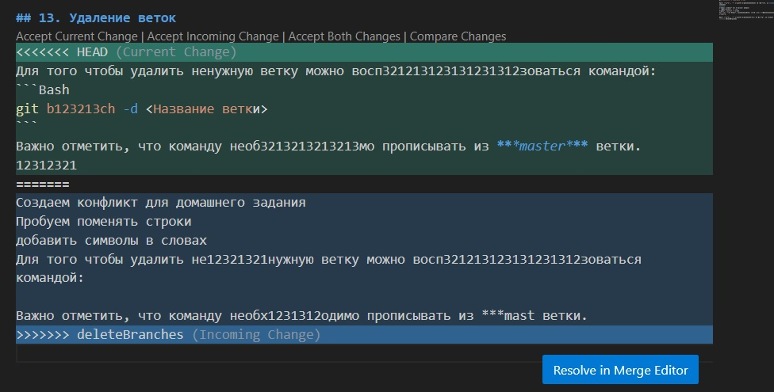

# Работа с Git
## 1. Проверка наличия установленного Git
В терминале выполнить команду `git --version` Если Git установлен, появится сообщение с информацией о версии программы, иначе будет сообщение об ошибке. 

## 2. Установка Git 
Загружаем последнюю версию с [сайта](https://git-scm.com/downloads)
Устанавливаем с настройками по умолчанию.

## 3. Настройка Git 
При первом использовании Git необходимо представиться. Для этого в терминале нужно внести две команды: 
```Bash
git config --global user.name "Ваше имя английскими буквами"
git config --global user.name "Ваша почта@example.com"
```

## 4. Инициализация репозитория
В терминале переходим к папке, в которой хотим создать репозиторий. Выполняем команду:
```Bash
git init
```
В исходной папке появится скрытая папка ***.git***

## 5. Создание коммитов
В терминале вводим команды на выбор:
```bash
gid add / giе .add -m "текст"
git commit -a -m "текст"
git commit -a ; затем в окне нашимаем английскую клавишу "i", на нужной раскладке вводим "текст", после чего используем клавишу Esc и вводим " :wq " (чем сохраняем команду и выходим из окна)
```
## 6. Просмотр состояния репозитория 
Вводим команду ***git status***, которая позволин нам увидеть уменения в файле. 

## 7. Переключение между коммитами
Для этого нам необходимо воспользоваться командами:
```Bash
git log ***Для просмотра всех коммитов и их обозначений***
git checkout "номер коммита" ***Для перехода к определенному комиту*** Также можно использовать git switch -"номер коммита"
git switch - / git checkout master / git switch master ***Для перехода к самой актуальной версии файла***
```
## 8. Просмотр истории коммитов
Для просмотра истории коммитов необходимо воспользоваться командой: 
```Bash
git log 
```
Также существуют команды упрощающие визуальное восприятие истории: 
```Bash
git log --graph 
git log --oneline 
```
Такие команды можно комбинировать: 
```Bash
git log --graph --oneline 
```
Для выхода из открывающегося в терминале меню нужно воспользоваться клавишей ***q*** на английской раскладке. 

## 9. Определение последних изменений в файле 
Для того определить изменения необходимо воспользоваться командой: 
```Bash
git diff 
```
## 10. Игнорирование файлов

Для того, чтобы исключить из отслеживания в репозитории определенные файлы или папки, необходимо создать там файл ***gitignore*** и записать в него их названия или шаблоны, соответствующие таким правилам или папкам. 

## 11. Создание веток 
По умолчанию имя основной ветки в Git - `master`  (Его можно изменить). 
Создать ветку можно командой 
```Bash
git branch <имя новой ветки> 
```
Список веток в репозитории можно посмотреть с помощью команды:
```Bash
git branch 
```
Текущая ветка будет отмечена звездочкой: **\*master***

Для переключения между ветками можно использовать команду:
```Bash
git checkout <имя ветки> 
git switch <имя ветки> 
```

## 12. Слияние веток и разрешение конфликтов
Для слияние выбранной ветки с текущей нужно выполнить команду 
```Bash
git merge <имя ветки>  
```
Если была изменена одна и та же часть файла в обеих ветках, то может возникнуть конфликт, который потребует участие пользователя. VSСode предлагает инструкцию разрешения. 
Чтобы разрешить конфликт нужно выбрать один из вариантов в диалоговом окне конфликта, а также добавить коммит слияния. 

Выглядеть это может так: 
```Bash
git commit -am <название коммита>  
```
## 13. Удаление веток 
Для того чтобы удалить ненужную ветку можно воспользоваться командой: 
```Bash
git branch -d <Название ветки>
```
Важно отметить, что команду необходимо прописывать из ***master*** ветки. 

## Работа с удаленными репозиториями

1. Создать аккаунт на GitHub
2. Создать локальный репозиторий
3. Создать удаленный репозиторий
4. Связать удаленный репозиторий с локальным

Добавить удаленный репозиторий к проекту: 

```Bash
git remote add <имя для репозитория> <url-адресс репозитория в сети>
``` 
Для получения и слияния изменений из удаленного репозитория используется команда: `git pull`

Для чтобы выполнить команду `git pull` в чужой репозиторий, необходимо создать в своем аккаунте на *GitHub* копию репозитория с помощью кнопки "Fork"

Затем нужно создать новую ветку (git switch -c <имя ветки> и воспользоваться командой:
```Bash
git clone <url-адресс репозитория в сети>
``` 
Затем нужно зафиксировать коммиты. И отправить изменения с помощью команды git pull. 

На сайте *Git Hub* нужно выполнить команду: `Pull request`. 
