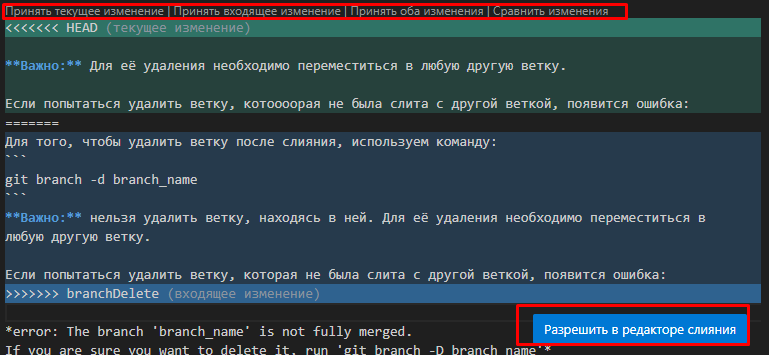

# Работа с Git/GitHub

## 1. Проверка наличия установленного Git
В терминале выполнить команду `git version`. Если Git установлен, появится сообщение с информацией о версии программы. Иначе будет сообщение об ошибке.

## 2. Установка Git
Загружаем последнюю версию Git с [сайта](https://git-scm.com/downloads). Устанавливаем с настройками по умолчанию. 

## 3. Настройка Git
При первом использовании Git необходимо представиться. Для этого нужно ввести в терминале `2 команды`:
```
git config --global user.name «Ваше имя английскими буквами»
git config --global user.email ваша почта@example.com
```
## 4. Инициализация репозитория
Для инииализации репозитория, создаём папку на компьютере, в которой будут содержаться файлы, с которыми будем работать в git и которая станет нашим репозиторием. Открываем эту папку в `Visual Studio` и переходим в Терминал, где вводим следующую команду:
```
git init
```
## 5. Запись изменений в репозиторий (git status, git add, git commit, git diff)
Для начала, нужно определить есть ли в репозитории файлы, изменения в которых не были зафиксированы, используя функцию ниже:
```
git status
```
После добавления нового файла в репозиторий, команда `git status` покажет следующий текст: _**"Untracked files:   (use "git add <file>..." to include in what will be committed)"**_ Это означает, что добавленный файл ещё не отслеживается. Для того чтобы начать отслеживать новый файл, используется команда 
```
git add file_name
```
Если вы снова выполните команду `git status`, то увидите, что добавленны   файл теперь отслеживаемый: **_Changes to be committed:
(use "git restore --staged <file>..." to unstage)
new file:   README_**

Чтобы вывести более детальную информацию об информации, изменённой в отслеживаемых файлах (после последнего сохранения - коммита), вместо `git status` можно использовать команду:
```
git diff
```

Когда есть новые данные, которые ещё не были зафиксированы, используется команда:
```
git commit -m "message"
```
Здесь вместо "message" нужно добавить комментарий к этому сохранению. Если его не добавить, будет открыт текстовый редактор, в котором нужно будет добавить комментарий в любом случае.

__Любые файлы, созданные или изменённые вами, и для которых вы не выполнили `git add` после редактирования — не войдут в этот коммит.__

Также можно использовать команду `git commit -a` для фиксации изменений во всех файлах репозитория (перед этим не нужно будет добавлять `git add`)

## 6. Просмотр истории коммитов (git log)
После внесения и сохранения изменений, чтобы просмотреть историю коммитов, используется следующая команда:
```
git log
```
Чтобы продолжить работу в терминале после проверки истории сохранений, используйте клавишу `"Q"`.

## 7. Перемещение между сохранениями
Для перемещения между сохранениям скопируйте идентификатор коммита из лога (например, длинное значение или первые четыре символа из выделенного фрагмента: commit `3251fdcb8c1759c85d2b4df982dbeeb93ff9d54d`). Используйте команду `git checkout` с добавлением этого значения для перемещения в нужное сохранение:
```
git checkout 3251fdcb8c1759c85d2b4df982dbeeb93ff9d54d
```
После этого **обязательно** нужно будет вернуться после `git chekout` в последнюю версию файла. Для этого используется команда:
```
git checkout master
```
## 8. Игнорирование файлов
Для того, чтобы исключить из отслеживания в репозитории определенные файлы или папки, необходимо создать там файл ***.gitignore*** и записать в него их названия или шаблоны, соответствующие таким файлам или папкам (например,`*.png`)
## 9. Создание веток Git
Создать ветку можно командой:
```
git branch branchName
```
Также чтобы создать ветку и сразу же в неё переместиться, можно использовать следующую команду:
```
git checkout -b branch_name
```
Или же:
```
git switch -c branch_name
```
По умолчанию имя основной ветки git - *master*. 
Список веток в репозитории можно посмотреть с помощью команды `git branch`.

## 10. Слияние веток и разрешение конфликтов
При слиянии выбранной ветки с текущей нужно выполнить команду:
```
git merge branch_name
```
Если была изменена одна и та же часть файла в обеих ветках, то может возникнуть конфликт, который потребует участия пользователя. VSCode предлагает варианты разрешения:



 Чтобы разрешить конфликт, нужно выбрать один из вариантов, либо объединить содержимое по-своему.
После разрешения конфликта, нужно выполнить коммит слияния.

## 11. Удаление веток
Для того, чтобы удалить ветку после слияния, используем команду:
```
git branch -d branch_name
```
**Важно:** нельзя удалить ветку, находясь в ней. Для её удаления необходимо переместиться в любую другую ветку.

Если попытаться удалить ветку, которая не была слита с другой веткой, появится ошибка:

*error: The branch 'branch_name' is not fully merged.
If you are sure you want to delete it, run 'git branch -D branch_name'*

Можно избежать этой ошибки, если предварительно выполнить слияние веток, либо выполнить принудительное удаление ветки (если добавленная в ней информация более не нужна):
```
git branch -D branch_name
```


# Работа с удалёнными репозиториями:
## 1. Создать аккаунт на `GitHub`: 
https://github.com/
## 2. Создать локальный репозиторий.
## 3. Создать удалённый репозиторий.
## 4. Связать удалённый репозиторий с локальным.

Добавить удалённый репозиторий к проекту:
```
git remote add <repository_name> <repository_url>
```
Для получения и слияния изменений из удалённого репозитория используется команда:
```
git pull
```
