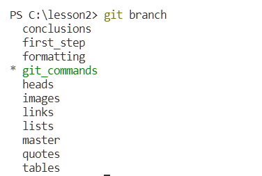

# Работа с Git и GitHub.
## 1. Проверка наличия установленного Git
В терминале выполнить комманду 
```
git version
```
Если Git установлен появится сообщение с информацией о версии программы. Иначе будет сообщение об ошибке.
## 2. Установка Git
Загружаем последнюю версию Git с [сайта](https://git-scm.com/downloads). Устанавливаем с настройками по умолчанию.
## 3. Настройка Git
При первом использовании Git необходимо представиться.
Для этого нужно ввести в терминале 2 команды:
```
git config --global user.name «Ваше имя английскими буквами»
git config --global user.email ваша почта@example.com
```

## 4. инициализаци репозитория
Для отслеживания изменений Git необходимо указать папку, в которой это необходимо делать. Для этого нажимаем "`File`" ("`Файл`") далее  "`Open folder`" ("`Открыть папку`") и выбираем нужную папку. После выбора подтверждаем нижатием кнопки "`Ok`".
После набираем команду: 
```
git init
```

## 5. Запись изменений в репозитории
1. Для начала записи изменений необходимо указать Git в каких файлах нужно отслеживать изменения: это производится командой `git add <имя файла>` например: 
```
git add Instruction.doc
```

2. Для просмотра информации о том, какой(ие) файл(ы) были изменений с последнего момента отслеживания используется команда: 
```
git status
```
3. Для сохранения изменений необходимо:
    * Сохранить изменения нажав на кнопку сохранить в меню "`File`" ("`Файл`") или нажать одновременно кнопки "`Ctrl + S`" 
    * Набрать команду: `git add <имя файла>` для указания Git изменения из какого файла нужно сохранять
    * Набрать команду: 
    ```
    git commit -m "комментарий о точке сохранения"
    ``` 
    для указания Git о записи информации и сохранения изменений
4. Для просмотра изменений в сохраняемом файле с последним сохранением используется команда:  (она отображает измененные строки) 
```
git diff
``` 


## 6. истории коммитов
* Для просмотра истории сохранений необходимо набрать команду: `git log` - отобразится детальная информация о всех сохранениях (когда использовали команду "`git commit`") с идентификатором сохранения (40-ка символьный код) например:(19d161900ad3fdf79a67e80622daff089e636f75)
* Можно вывести краткую информацию команду 
```
git log --oneline
```
## 7. Перемещение между сохранениями
1. Для перемещения между сохранениями используется команда "`git checkout`" с указанием последних семи символов идентификатора сохранения в формате 
```
git checkout e636f75
```
2. Для перехода на последнее сохранение (помеченное словом "master") в истории коммитов можно:
    * Набрать команду как и в предыдущем варианте с указанием идентификатора этого сохранения
    * Набрать команду 
    ```
    git checkout master
    ```

## 8. Игнорирование файлов
Для того, чтобы исключить из отслеживания в репозитории определенные файлы или папки необходимо создать файл ***`.gitignore`***, и записать в них наименования или шаблоны соответствующие таким папкам или файлам.

## 9. Создание веток в Git
Создать ветку можно командой: 
```
git branch <имя_новой_ветки>
```
По умолчанию имя основной ветки ***master***.
Список веток в репозитории можно посмотреть с помощью команды 
```
git branch
```

git checkout -b <Имя_новой ветки>
git switch -c <имя новой ветки>

## 10. Слияние веток и разрешение конфликтов
Для слияние выбранной ветки с текущей необходимо выполнить команду:
```
git marge <Имя_ветки которую надо слить>
```
Если была изменена одна и та же часть файла в обеих ветках, то может возникнуть конфликт, который потребует участия пользователя. VSCode предлагает варианты разрешения. Чтобы разрешить конфликт, нужно выбрать один из вариантов, либо объединить содержимое по-своему. 
После разрешения конфликта нужно выполнить "Коммит слияния"

## 11. Удаление веток
Перед удалением необходимо убедиться в слиянии веток (п. 10).
Проверить в какой ветке находитесь (п.9):
```
git branch
```


активная вкетка помечена звездочкой " * ", если находимся в удаляемой ветке то перейти на любую другую ветку, например "***master***"
```
git switch master
```
и набрать команду удаления: "`git branch -d <имя ветки>`" (вместо "-d" можно набрать "--delete")
```
git branch -d Remove_branch
```
При успешном удалении будет выдано сообщение об удалении ветки:


Если слияние удаляемой ветки не было произведено, будет выдано сообщение об ошибке : 
```
error: The branch '<Имя ветки>' is not fully merged.
If you are sure you want to delete it, run 'git branch -D <Имя ветки>'.
```

для принудительного удаления ветки без слияния вместо параметра "-d" необходимо использовать параметр "-D". 

## 12. Работа с удаленным репозиторием
Для работы с удаленным репозиторием необходимо зарегистрироваться на этом ресурсе, например на `github.com`.
### 12.1 Копирование (клонирование) удаленного репозитория на локальный ПК
Для создания копии репозитория нужно знать URL-адрес этого репозитория  используя команду `git clone <URL-адрес>` 
```
git clone https://github.com/<userName>/SCV_GitPR.git
```
### 12.2 Обновление локального репозитория данными с удаленного
Если Вы работаете с проектом не один или с одним проектом на разных ПК,  изменения могут происходить в любой момент времени. Чтобы эти изменения получить необходимо выполнить команду:
```
git pull
```
Команда `git pull` - составная команда, она скачивает данные с удаленного репозитория и объединяет информацию. Во время объединения могут происходить конфликты, описанные в п.10 
### 12.3 Отправка измененных данных в удаленный репозиторий
Для  отправки измененных данных необходимо сделать сохранение (п.5) и набрать команду 
```
git push
```  

## 13. Работа с чужими репозиториями
Для работы с чужими репозиториями необходимо знать название репозитория, автора или URL-адрес.
### 13.1  Создание копии чужого репозитория
В сервисе удаленного репозитрия находим нужный нам репозиторий и нажимаем кнопку ***Fork***
В следующем окне предлагается ввести имя копируемого репозитория, под которым он будет в Вашем профиле. Сразу производится проверка на уникальность имени.
После чего с этим репозиторием можно работать по описанию в п.12
