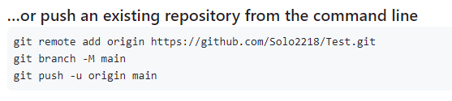
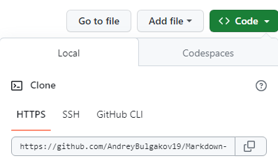

# Работа с Git

## 1. Проверка наличия установленного Git
В терминалы выполнить комманду `git --version`.
Если Git установлен, появиться сообщение с информация о версии программы, а иначе будет информация об ошибке.


## 2. Установка Git
Загружаем последнию версию Git с [сайта](https://git-scm.com/downloads).
Устанавливаем с настройками по умолчанию.

## 3. Настройка Git
При первом использовании Git необходимо представиться.
Для этого нужно ввести в терминале 2 команды:
```
git config --global user.name «Ваше имя английскими буквами»
git config --global user.email «Ваша почта@example.com»
```

## 4. Создание Git-репозитория
Для того, чтобы инициализировать Git-репозиторий в текущем каталоге необходимо ввести команду `git init`. После чего в текущем каталоге появится скрытая папка с именем [.git] где и будет храниться сам репозиторий

## 5. Запись изменений в репозиторий
Для того, чтобы проверить есть ли изменения не занесенные в репозиторий используем команду `git status`. После выполнения данной команды появится сообщение с информацией о файле в котором есть изменения или об отсутствии каких-либо изменений.


Для того чтобы начать отслеживать (добавить под версионный контроль) новый файл, используются команды:
```
git add .           # добавить в индекс все новые файлы в папке
git add file-name   # добавить в индекс указанный файл «Имя файла»
``` 
Для создания коммита в репозитории используем следующие команды:
```
git commit -m "Ваш комментарий"     # зафиксировать в коммите проиндексированные
                                      изменения (закоммитить), добавить сообщение
git commit -am "Ваш комментарий"    # проиндексировать отслеживаемые файлы и
                                      закоммитить, добавить сообщение
```
**Важно!** *Комада `git commit -am` закоммитит все отслеживаемые файлы, но не новые.*

Для того, чтобы посмотреть что именно было изменено необходимо ввести команду `git diff`. В результате будет выведено сообщение с тем, что именно было изменено.


## 6. Просмотр истории изменений
После того, как вы создали несколько коммитов, вероятно вам понадобится возможность посмотреть что было сделано — историю коммитов. Для просмотра истории коммитов используем команды:
```
git log                        # Показывает историю комитов
git log --oneline              # Показывает историю комитов в сокращенном виде
git log --graph                # Показывает ветки и историю комитов
git log --graph --oneline      # Показывает ветки и историю комитов в сокращенном
                                 виде
```

После выполнения команды мы увидим историю изменений.

**Важно!** *Если история достаточно велика и полностью не отображается на экране терминала, её можно пролистать вниз с помощью стрелки пока не появиться надпись END для выхода из режима просмотра необходимо нажать `q`.*

## 7. Перемещение между сохранениями
Для того чтобы перейти на какой-либо из сохраненных комитов используем команду `git checkout "хеш-код"`. Где хеш-код это уникальный номер коммита, который можно посмотреть с помощью команды `git log`.

**Важно!** *Не обязательно использовать весь хеш-код, достаточно использовать первые 3-7 символов*

## 8. Игнорирование файлов
Для того, чтобы исключить из отслеживания в репозитории определенные файлы или папки необходимо создать там файл ***.gitignore*** и записать в него их названия или шаблоны, соответствующие таким файлам или папкам.

## 9. Создание веток в Git
По умолчанию имя основной ветки в Git - **master**
Создать ветку можно одной из команд:
```
git branch <имя новой ветки>
git checkout -b <имя новой ветки>
git switch -c <имя новой ветки>
```
**Важно!** *При использовании команды `git checkout -b <имя новой ветки>` или `git switch -c <имя новой ветки>` кроме того, что создастся новая ветка, также  произойдет переключение на эту ветку.*

Список веток в репозитории можно посмотреть с помощью команды `git branch`.
Текущая ветка будет отмечена звёздочкой: **\* master**.


Для переключения между ветками используются команды:
```
git switch <имя ветки>
git checkout <имя ветки>
```

**Примечание:** *Команда `git switch` была добавлена в Git версии 2.23 для облегчения запоминания пользователями.*

## 10. Слияние веток и разрешение конфликтов
Для того, чтобы объединить две ветки сначало нужно переключиться на ту ветку в которую мы будем слиять коммит. Это можно сделать с помощью команды `git switch <имя ветки>`. 
Для объединения веток необходимо использовать команду:
```
git merge <имя ветки с которой берем изменения>
```

В результате увидим сообщение о слиянии двух веток. 


Иногда процесс не проходит гладко. Если вы изменили одну и ту же часть одного и того же файла по-разному в двух объединяемых ветках, Git не сможет их чисто объединить и тогда возникает конфликт. 


Для разрешения конфликта Git выдаст соответствующие сообщение с отображением строк в которых произошел конфликт. Например в IDE *Visual Studio Code* открывается интерфейс:


И предлогается 4 варианта действий:
* *Accept Current Change* - Принять изменения из основной ветви
* *Accept Incomimg Change* - Принять изменения из входящей ветви
* *Accept Both Changes* - Принять изменения из обеих ветвей
* *Compare Changes* - Сравнить изменения (Только просмотр)

После выбора одного из 3 вариантов разрешения конфликта произойдет слияние.

**Важно!** *После разрешения конфликта обязательно выполнить команду `git commit -am` для фиксации изменений либо `git merge --abort` если хотим отменить слияние*.

## 11. Удаление веток
После того как мы закончили работу с какой-либо веткой и слили с основной её необходимо удалить. Для удаления ветки используется команда:
```
git branch -d <имя ветки>
```
После чего увидим сообщение о удалении.


**Примечание:** *Если в удаляемой ветке есть коммиты не слитые с другой веткой будет выведено сообщение об ошибке и рекомендация для использования команды `git branch -D <имя ветки>` для принудительного удаления.*


**Важно!** *Нельзя удалить ветку в которой вы находитесь, необходимо переключиться на любую другую ветку и только потом удалять.*

## 12. Работа с внешним репозиторием

### *Подключение своего нового репозитория*

1. Для работы с внешним (удаленным) репозиторием нам понадобится создать аккаунт в этом репозитории.

2. Создаем локальный репозиторий у себя на компьютере.

3. Создаем удаленный репозиторий в своем аккаунте. Например в GitHub для создание нового репозитерия необходимо кликнуть на иконку с плюсиком (Create new.. -> New repository), заполнить поле с именем репозитория, выбрать репозиторий будет приватный (Private) или публичный (Public) и кликнуть на кнопку Create repository. 

4. Для того, чтобы связать локальный репозиторий и удаленный необходимо ввести команду:
```
git remote add <имя для репозитория> <Url-адресс репозитория в сети>
```
Если имя основной ветви в локальном репозитории и удаленном не совподают, необзодимо поменять имя ветви в локальном репозитории с помощью команды:
```
git branch -M <новое имя ветви>
```
**Примечание:** *Хорошей практикой считается использовать имя `main` для основной ветви.*

Необходимо первый экспорт из своего локального репозитория в удаленный с помощью команды:
```
git push -u <имя репозитория> <имя основной ветви>
```
**Важно!** *При первом связывании локального репозитория и удаленного потребуется пройти авторизацию в удаленном репозитории.*

**Примечание:** *При создании нового репозитория на GitHub будет выведена подсказка с перечнем команд которые необходимо ввести в терминале локальном репозитория.*



### *Подключение к чужому репозиторию*

1. Для работы с чужим удаленным репозиторием необходимо подключиться, создать его копию в свой удаленный репозиторий с помощью кнопки `Fork` на GitHub.

2. Проверить в рабочей папке на локальном комьпютере отсутствие локальных репозиториев. Проверить можно с помощью команды `git status`.

3. Создаем копию удаленного репозитория в локальный с помощью команды:
```
git clone <Url-адресс репозитория в сети>
```
**Примечание:** *Url-адресс можно посмотреть в GitHub с помощью кнопки `Code`.*


**Важно!** *Не производить никаких изменений в основной ветви. При работе с чужим репозиторием необходимо создать новую ветку и все работы производить в ней.*

### *Импорт и экспорт изменений*

Для того, чтобы импорта данных из удаленного репозитория в локальный используем команду:
```
git pull
git fetch <имя репозитория>
```
**Важно!** *Команда `git fetch` забирает данные в ваш локальный репозиторий, но не сливает их с какими-либо вашими наработками и не модифицирует то, над чем вы работаете в данный момент. Необходимо вручную слить эти данные с вашими, когда вы будете готовы.*

**Примечание:** *При ипорте данных из удаленного репозитория в локальный с помощью команды `git pull` может возникнуть конфлик. Конфликт разрешается как и при слиянии веток и делаем комит о разрешении кофликта."

Для того чтобы экспортировать данные из локального репозитория в удаленный используем команду:
```
git push -u <имя репозитория> <имя основной ветви>
git push --set-upstream <имя репозитория> <имя новой ветви>
```
**Важно!** *Если в локальном репозитории была создана новая ветка и вы хотите экспортировать её в удаленный репозиторий команда `git push -u` выдаст ошибку, а в подсказке будет предложена для использования команда `git push --set-upstream`.*

**Примечание:** *После первого экспорта в удаленный репозиторий дальнейший экспорт можно делать используя команду `git push`.*

### *Полезные команды при работе с удаленным репозиторие*

Для просмотра подключонных удаленных репозиториев и информации по ним используем команды:
```
git remote                          # Список удаленных репозиториев
git remote -v                       # Просмотр адресов для чтения и записи
git remote show <имя репозитория>   # Просмотр информации по удаленному         
                                      репозиторию
```
Для того, чтобы переименовать удаленный репозиторий используем команду:
```
git remote rename <старое имя> <новое имя>
```
Для того, чтобы удалить удаленный репозиторий используем команду:
```
git remote remove <имя репозитория>
```

### *Внесение изменений в чужой репозиторий*

Для того, что предложить внесение ваших изменений в чужой репозиторий их нужно сначала экспортировать в удаленный репозиторий. После чего в вашем аккаунте на GitHub появиться кнопка `Compare & pull request`, кликнув по которорой владельцу репозитория будет направлен запрос на применения ваших изменений. После чего владелец репозитория может принять или отклонить ваши изменения.