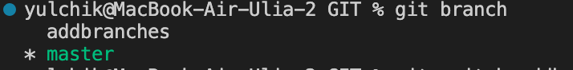

# Работа с Git
## 1. Проверка наличия установленного Git
В терминале выполнить команду:

```
git --version
```
Если Git утсановлен - появится сообщение с информацией о версии программы, иначе будет сообщение об ошибке.

## 2. Установка  Git
Загружаем последнюю версию программы с [сайта](https://git-scm.com/downloads).
Устанавливаем с настройками по умолчанию

## 3. Установка VisualCode
Загружаем последнюю версию программы с [данного сайта](https://code.visualstudio.com/Download) и устанавливаем на свой пк.

## 4. Настройка Git
Первое, что вам следует сделать после установки Git — указать ваше имя и адрес электронной почты, для этого используйте команды:

```
$ git config --global user.name "Ваше имя"
$ git config --global user.email "Ваша почта"
```
## 5. Инициализация репозитория

Для созадния репозитория Git в нужной папке - использовать команду:

```
git init 
```
Данная команда создаст скрытую папку репозитория версий для выбранного вами раздела с файлами.

## 6. Запись изменений в репозиторий

Чтобы добавить файл к следующему коммиту - использовать команду

```
git add
```

Далее, для создания самого коммита использовать команду - 

```
git commit -m “название коммита”
```

Так-же можно использовать краткую команду объединяющую обе команду выше - 

```
git commit -am "название коммита"
```
## 7. Просмотр истории коммитов

Для просмотра истории всех коммитов с их хеш-кодами применить команду - 

```
git log 
```
Можно так-же посмотреть более краткое значение хеш-кодов, для этого использовать команду -

```
git log --oneline
```
## 8. Перемещение между сохранениями (коммитами)

Переход от одного коммита к другому выполняется через команду -

```
git checkout (хэш-код)
```

Чтобы вернуться к актуальному состоянию и продолжить работу используйте команду - 

```
git checkout master
```

А для того чтобы увидеть разницу между текущим файлом и закоммиченным файлом примените команду - 

```
git diff 
```

## 9. Игнорирование файлов

Для того, чтобы исключить из отслеживания в репозитории определённые файлы или папки, необходимо создать файл **.gitignore** и записать в него названия, либо шаблоны соответствующие этим файлам или папкам.

## 10. Создание веток в Git

По умолчанию имя основной ветки в Git - это **master** или **main**

Создать ветку можно командой: 

```bash
git branch <имя новой ветки>
```

Для того чтобы узнать в какой ветке мы находимся сейчас, а заодно увидеть все имеющиеся ветки нужно воспользоваться командой:

```
git branch
```

На скриншоте ниже можно увидеть что ветка, в которой мы находимся в данный момент, подсвечена зелёным цветом, а все остальные серые.



Для переключения между ветками использовать команду:

 ```
git switch <имя ветки>
 ```

## 11. Слияние веток и разрешение конфликтов

Слияние веток нужно для того, чтобы в дальнейшем удалить черновики с записями и перевести готовый к релизу проект в одну ветку для лёгкого взаимодействия с ним в дальнейшем.

Слияние производится командой:

```
git merge <название ветки>
```

И делается из той ветки, ***информацию в которую*** мы желаем перенести.

Нельзя находясь в ветке, в которой мы делаем изменения удалить её, благо что Git у нас умненький и терминал выдаст такую ошибку:


Если попробовать назвать ветку таким же именем, которое уже имеется - то получится вот такая ошибка


В случае, если пользователь всё сделал правильно, воспользовался командой **merge** и конфликта не произошло, то мы увидим в терминале следующие строки:


После этого, применив команду 

```
git branch -d
```

Или же

```
git branch --delete
```

Пользователь увидит на терминале подтвержение удаления ветки, которое выглядит вот так:


Конфликт возникает в том случае, когда в **разных** ветках, но в одинаковых места были внесены изменения. В случае возникновения такой ситуации Git попросит нас разрешить этот конфликт несколькими способами.

Пример: допустим, во время написания у нас залипла клавиш и заголовки в разных ветках теперь выглядят так:


Когда мы решим слить ветки, у нас возникнет следующая ситуация:


Тут нам предоставляется выбор, как именно поступить и какую часть оставить, а какую всё-же стоит исправить.

Если мы решим слить ветки до того как разберёмся с ошибкой, то увидим следующую ситуацию:


Разрешить конфликт можно приняв любую опцию из раздела над подсвеченным зелёным заголовком.

## 12. Удалённые репозитории

Для того чтобы начать работу с удалённым  репозиторием, нужно создать аккаунт на платформе **GitHub**

Далее необходимо выбрать репозиторий с которым планируется дальнейшая работа. Здесь нам нужно выбрать автора и найти интересующий нас репозиторий, например:


Далее - делаем ответвление по кнопке `Fork` и тогда репозиторий появляется уже на нашей странице


Жмём на кнопку `Code` и копируем HTTPS адрес ссылки


После этого заходим в нашу программу, для примера, я использую **VisualCode** и используем команду

```
git clone <адрес ссылки>
```

Создаём новую ветку командой

```
git branch <имя новой ветки для наших коммитов>
```

Переключаемся на неё и вносим изменения которые хотим предожить. После чего добавляем наши изменения командой

```
git commit -am "название коммита"
```
P.S. данная команда является составной, одновременно создаёт файл и прилагает к нему наш коммит.

После чего отправляем наш файл пользователю, которому хотим предложить изменения.