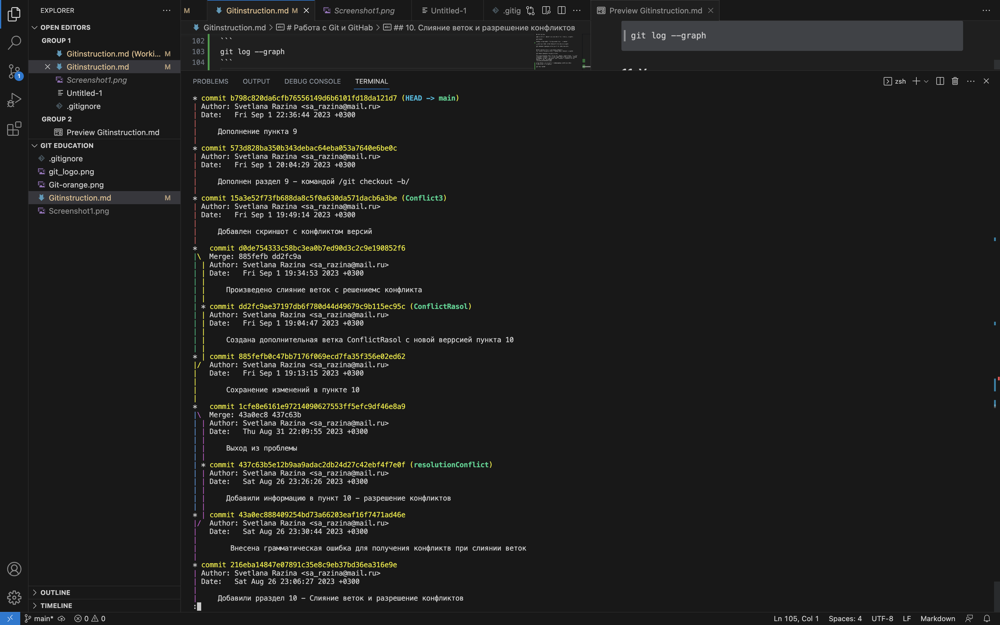

# Работа с Git и GitHab
## 1. Проверка наличия установленного Git
В террминале выполнить команду
``` 
git --version 
```
Если Git установлен, появится сообщение с информацией о версии программы . Иначе будет сообщение обошибке.
## 2. Установка Git
Загружаем последнюю версию Git с [сайта](htpps://git-scm/downloads).
Устанавливаем с настройками по умолчанию.
## 3. Настройка Git
При первом использовании Git необходимо представиться.
Для этого нужно ввести в терминале 2 команды:
```
git config --global user.name "Ваше имя английскими буквами"
git config --global user.email "Ваша электрронная почта"
````
## 4. Инициализация репозитория
Git хранит свои файлы и исторрию прямо в папке проекта. Чтобы создать новый репозиторий, нужно откррыть терминал, зайти в папку проекта и выполнить команду:
```
git init
``````
Затем нужно создать файл и сохрранить его в папке - репозитории.
## 5. Запись изменений в репозиторий
Добавление изменений в коммит, добавление файлов к отслеживанию изменений происходит командой
```
git add "название файла с расширением"

git add -A   или git add .   если нужно подготовить к коммиту несколько файлов в репозитории
``````
Для сохранения изменений их нужно закоммитить то есть создать коммит:
```
git commit -m "Комментарий"
```
Подготовить файл и закоммитить одновременно все изменения можно командой:
```
git commit --am "Комментарий"
``````
## 6. Просмотр истории коммитов
Для просмотра всех выполненных фиксаций можно воспользоваться  историей коммитов. Она содержит сведения о каждом прроведенном коммите проекта.Запросить ее можно при помощи команды:
```
git log
``````
В ней содержится вся  информация о каждом отдельном коммите с указанием его хеш-кода, автора , списка изменений и даты , когда они были сделаны.

Команда 
```
git log --oneline
```
позволяет увидеть список всех коммитов с комментариями но без данных об  авторе и времени внесения изменений и самих изменений.
## 7. Перемещение между сохранениями
Переход от одного коммита к другому выполняется командой
```
git checkout "хеш-код коммита"
```
Чтобы вернуться к актуальному состоянию и продолжить работу нужно выполнить команду
```
git checkout master
```
Увидеть рразницу между текущим файлом и закоммиченным файлом можно с помощью команды
```
git diff
```
Получить информацию о текущем состоянии Git можно при помощи команды
```
git status
```
## 8. Игнорирование файлов
Для того чтобы исключить из отслеживания в репозиторрии определенные файлы или папки необходимо создать тат файл ***.gitignore***  и записать в него их названия или шаблоны , соответствующие таким файлам или папкам.
## 9. Создание веток в Git
Создать ветку можно командой
```
git branch <имя для новой ветки>
```
Другой способ создания новой ветки - это использование конманды
```
git checkout -b <название новой ветки>
```
В этом случае сразу одновременно произойдет и создание новой ветки и переход на нее.

Список веток в репозитории можно посмотреть с помощью команды:
```
git branch
```
Текущая веткак будет отмечена звездочкой: ``* master``

Переход на другую ветку выполняется при помощи команды
```
git checkout <название ветки на которую нужно перейти>
```

## 10. Слияние веток и разрешение конфликтов
Для слияния выбранной ветки с текущей нужно выполнить команду:
```
git merge <название выбранной ветки>
```
Если была изменена одна и та же часть файла в обеих ветках , то может возникнуть конфликт , который потребует участия пользователя. VSCode предлагает варианты разрешения. Вид сообщения о конфликте версий зависит от настроек VSCode.


Чтобы увидеть лог коммитов с визуализацией между ними нужно воспользоваться коммандой:
```
git log --graph
```
На экране монитора это будет выглядеть так


После разрешения конфликта необходимо сделать коммит слияния чтобы закончить процесс используя ранее рассмотренные команды :
`git add -A`   и    `git commit -m`

## 11. Удаление ветки
В процессе работы ветки которые выполнили свои функции и больше не нужны необходимо удалять. Для удаления ветки применяется команда:
```
git branch -d <название ветки>
```
Удалить текущую ветку в которой вы в данный момент находитесь нельзя. Если попытаться это сделать, то система выдаст ошибку. Так что при удалении ветвей обязательно переключитесь на другой branch.

## 12. Работа с удаленными репозиториями
Удаленный репозиторий - это репозиторий, хранящийся в облаке на стороннем сервисе, специально созданном для работы с git. Это может быть GitHub, BitBucket или любой другой сервис В данном конкретном случае будем рассматривать GitHab. 
Рассмотрим вариант, когда нам нужно скопировать удаленный репозиторий на свой локальный компьютер. При этом переносятся все папки и файлы проекта, а также вся история с момента его создания. Чтобы склонировать проект, необходимо узнать, где он расположен, и скопировать ссылку на него из удаленного репозитория. Для клонирования используется команда
```
git clone <http://github.com/......>
```
При клонировании в текущий каталог там будет создана папка , в которую поместятся все проектные файлы и скрытая директория с репозиторием или с необходимой информацией о нем. Все изменения рекомендуется делать в отдельной новой ветке.

Чтобы загрузить что-нибудь в удаленный репозиторий, сначала нужно к нему подключиться. Необходимо пройти регистрацию на сервисе ,создать там свой аккаунт, в нашем случае на GitHub.
Чтобы связать наш локальный репозиторий с репозиторием на GitHub нужно выполнить в терминале команду:
```
git remote add origin <http://github.com/ .....>
```
Обратите внимание что нужно обязательно изменить URI репозитория на свой. 
Проект может иметь несколько удаленных репозиториев одновременно . Чтобы их различать , им дают разные имена, но главный обычно называется origin.

Чтобы отправить ваш локальный репозиторий в удаленный репозиторий на GitHub нужно авторизоваться на удаленном репозитории и выполнить команду:
```
git push <имя и ветка удаленного репозитория например origin master>
```
В большинстве случаев эту команду используют для опубликования локальных изменений в центральный репозиторий чтобы поделиться нововведениями с коллегами или другими участниками разработки проекта. После того как вы успешно запушили измененные данные их необходимо внедрить или интегрировать при помощи команды `git merge` которую мы рассматривали ранее.
Скачать изменения из удаленного репозитория, провести слияние локальной версии git и версии удаленного репозитория GitHub на локальном компьютере  можно с помощью команды:
```
git pull <имя и ветка удаленного репозитория например origin master>
```
## 13. Как сделать pull request
Запрос к управляющему каким-либо репозиторием на выполнение изменений из вашего репозитория (и указанной вами ветки) называется пул реквест - pull request.
Чтобы сделать `pull request` нужно сделать Fork репозитория в который хотим внести предложения по изменению.
Делаем clone своей версии репозиторрия на локальном компьютере. Создаем новую ветку и в нее вносим свои изменения, фиксируем их коммитами.
Отправляем свою веррсию в свой GitHub. На сайте GitHub  нажимаем конпку pull request и отправляем наши предложения управляющему удаленным репозиторием.
