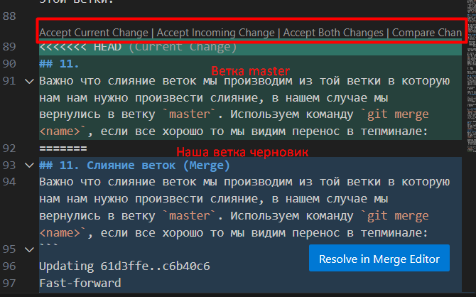

# Работа с Git

## 1. Проверка наличия установленного Git
В терминале выполнить команду `git --version`.
Если Git установлен, появится сообщение с информацией о версии программы, иначе будет сообщение об ошибке.

## 2. Установка Git
Загружаем последнюю версию Git с [сайта](https://git-scm.com/downloads)
Устанавливаем с настройками по умолчанию.

## 3. Настройка Git
При первом использовании Git необходимо представиться.
Для этого нужно ввести в терминале 2 команды:
```
git config --global user.name «Ваше имя английскими буквами»
git config --global user.email ваша почта@example.com
```
```C
while (n < 0)
{
    n++;
}

```

## 4. Инциализация репозитория
Для того чтобы создать репозиторий, для начала нужно будет его инициализировать с помощью команды `git init`.

## 5. Запись изменения в репозитории
После того как мы инициализировали репозиторий, мы можем проверить отслеживается ли он командой `git status`
Если название файла нашего будет подсвечено красным, а так же будет описано в терминале что Git не отслеживает изменения, то нам потребуется чтобы наш файл отслеживался. Для этого потребуется использовать команду `git add <name file>`. Затем мы должны убедиться что  изменения в нашем файле отслеживаютсяб мы снова вызываем `git status`  (рекомендуется вызывать каждый раз, чтобы убедиться что все в порядке) Имя нашего файла подсвечивается зеленым и также Git предложит сделать commit (зафиксировать изменения).

Чтобы это сделать вызываем команду `git commit`. Важно указать комментарий к фиксации(далее будем говорить commit), так вам и вашим коллегам будет понятно что именно добавили/изменили в этом commit. Делать это нужно каждый раз. Выглядеть это будет так: `git commit -m "Initial commit"`.
Когда будет выполнена команда, в терминале будет подробно описано какие и сколько изменений были зафиксированы в файле, будет указана ветка на которой вы находитесь и хэш номер коммита: `[master 5ffc26e]`. Еще одна полезная функция нужна для ситуации :
Допустим вы делали какие-то действия в вашем репозитории и в процессе вас отвлекли, а когда вернулись вы не помните, зафиксировали вы изменения или же нет, то можно воспользовать командой `git diff`. Она покажет разницу между последним коммитом и текущим состоянием :

"**-**" Будут показаны строки которые удалены при изменении

"**+**" Будут показаны строки которые добавлены 

Чтобы выйти из журнала (так же и журнала `git log`) используя клавишу "стрелка вниз" до слова `(END)` и затем нажать клаишу `q`--выход (должна быть английская раскладка на клавиатуре)

## 6. История изменений в репозитории
Для просмотра истории изменений мы можем воспользоваться командой `git log`. В итоге исполнения команды в терминале будет выведен весь журнал изменений с самого первого коммита до последнего. Будут выведены также хэш номер комита, кем и когда он добавлен. То есть все изменения можно отследить.
Еще очень удобно использовать возможности отображения журнала изменений используя команду `git log --online`


Или же с визуализацией наших веток и изменений
`git log --graph`


## 7. Перемещение между сохранениями (Commit)
Чтобы перейти на комит который нас интересует, использовав команду `git log`, в терминале мы выбираем хэш номер и переходим к версии с помощью команды `git checkout b7f12298 `. Мы можем допустим взять и зархивировать это сохранение и отправить заказчику на оценку или согласование. В это же время мы находимся именно в этой версии файла чтобы вернутся главной ветке и конечному варианту со всеми комитами сохраннеными мы снова используем команду, но указываем главную ветку(она может называться `master` или `main`) вот так: `git checkout master`.

## 8. Добавление изображения.
Для того чтобы добавить изображение нам необходимо будет добавить его в папку с нашим локальным репозиторием. После нужно будет указать путь к изображению и вставить таким образом используя функционал __Markdown__. Вот таким образом:
 ``
 В квадратных скобках будет указан текст, который будет показан вместо изображения, если допустим изображение уже не существует в папке. В круглых скобках указывается имя файла и его разрешение. В итоге все сделав верно вы видите изображение) :
 

 ## 9. Использование .gitignore
 После того как мы добавили изображение и сделали коммит, проверив статус (`git status`) вы увидите в терминале такое сообщение:
 ```
  Untracked files:
  (use "git add <file>..." to include in what will be committed)
        Git_logo.png

nothing added to commit but untracked files present (use "git add" to track)
 ```
Вы видите что файл нашего изображения не отслеживается, потому что Git в основном рабоатет с текстом и изменениями в нем. Его нужно будет добавить к отслеживанию с помощью `git add`. Чтобы в дальнейшем Git не выводил нам информацию об изображениях, нужно сделать файл `.gitignore` -- список исключений, в который мы можем указать все разрешения файлов, которые не хотим отслеживать. Создаем его в той же папке(репозитории). Затем добавляем туда списком все что нас не интересует:
```
1. .png
2. .jpeg
```
Затем добавляем файл `.gitignore` в отслеживание и фиксируем изменения (делаем commit).

## 10. Ветвление в Git.
А теперь поговорим про создание новых ветвей, нужны они нам для того чтобы делать черновые варианты наших работ (для согласования с коллегами, заказчиком и т.д.).
Для начала нам нужно понять на какой ветке мы находимся в данный момент, для этого используем команду `git branch`. В данный момент мы находимся на главной ветке: 
```
git branch
* master
```
Напротив ветки стоит символ (*), который указывает на какой ветке мы находимся.
* __Создание новой ветки__

Для того чтобы создать новую ветку, необходимо воспользоваться командой `git branch <name>`и написать название. После мы снова вызываем `git branch` и убеждаемся что создана новая ветвь:
``` 
create_new_branch (наша новая ветка)
* master
```
* __Перемещение между ветками__
Для того чтобы перейти на ветку используем команду `git chekout <name>` или же `git switch <name>`. Теперь мы можем работать в нашем "черновике". Сделав все что нам нужно,  комитим наши изменения. Мы его допустим согласовали и хотим "слить" его в основную ветку. Для этого нам нужно будет вернуться на ветку **master** только теперь мы указываем имя этой ветки. 

## 11. Слияние веток (Merge)
Важно что слияние веток мы производим из той ветки в которую нам нам нужно произвести слияние, в нашем случае мы вернулись в ветку `master`. Используем команду `git merge <name>`, если все хорошо то мы видим перенос в тепминале:
```
Updating 61d3ffe..c6b40c6
Fast-forward
 Gitinstructions.md | 2 +-
 1 file changed, 1 insertion(+), 1 deletion(-)
```
Но если кто-то в это же время выполняет правки на ветке `master` и строки отличаются, то при слиянии возникает конфликт:


Git предлагает нам решить конфликт, так как атоматически сделать ему это не удалось. В данном случае мы используем VSCode и он предлагает нам решить конфликт несколькими способами:

* Принять изменения на текущей ветке `master`
* Принять изменения из ветки черновика
* Принять оба измения и оставить оба варианта
* Сравнить изменения
После того как вы выбрали что делать для разрешения конфликта, необходимо зафиксировать изменения.

## 12. Удаление веток в GIt.
Для того чтобы удалить ветку, вам нужно находиться на любой другой ветке, потому как находясь на ней же Git не позволит вам этого сделать. Воспользоваться нужно командой `git branch -d <name>`. 
Затем переходим например на ветку `master` и удаляем.
Можно так же удалять принудительно для этого пишем капсом :
`git branch -D <name>`.
Если вы не слили ветку, то при попытке удаления увидите такую ошибку:
```
error: The branch 'delete' is not fully merged.
If you are sure you want to delete it, run 'git branch -D delete'.
```
Тоесть вам нужно сначала слить ветки, а только потом удалять.
Но если вы все же считаете что хотите удалить ее без слияния, Git предлагает вам удалить принудительно.

# Работа с удаленными репозиториями

## 1. Создать аккаунт на GitHub.
Для этого нам нужно будет зарегистрироваться [на сайте](https://github.com) GitHub.
Далее вас встречает домашняя страница


В правом верхнем углу будет ваш аватар.

## 2. Создаем удаленный репозиторий.

Чтобы создать удаленный репозиторий в правом верхнем углу вы увидите "**+**", нажав на него выбираете "New repository".
Далее вы выбираете название вашего репозитория и нажимаете "Create new repository"


Теперь он создан и GitHub предложит варианты:


* Создать новый репозиторий с помощью терминала на локальной машине.
```
echo "# testt" >> README.md
git init     
git add README.md
git commit -m "first commit"
git branch -M main
git remote add origin https://github.com/AntanasButvila/testt.git
git push -u origin main
```

* "запушить" уже существующий локальный репозиторий с помощью терминала
```
git remote add origin https://github.com/AntanasButvila/testt.git
git branch -M main
git push -u origin main
```

* Или импортировать из другого удаленного репозитория.

## 3. Создаем локальный репозиторий и связываем его с удаленным.
Так как мы уже создали локальный репозиторий, нам необходимо его связать с удаленным, в нашем случае мы выбираем пункт второй:
* `git remote add origin https://github.com/AntanasButvila/testt.git` -- Данной командой мы указываем путь к нашему удаленному репозиторию, после исполненения команды GitHub предложит нам пройти авторизацию для получения доступа к репозиторию.

`git branch -M main`-- Данная команда переименовывает нашу ветку **master** нашего локального репозитория в **main** как в удаленном.

`git push -u origin main` -- Данная команда "заливает" все ветки и изменения в удаленный репозиторий.

После того как мы проделали все эти команды, можно убедиться что связано все правильно с помощью команды `git remote`
```
$ git remote
origin
```
Или же `git remote -v`
```
$ git remote -v
origin  https://github.com/AntanasButvila/SCV_GitPR.git (fetch)
origin  https://github.com/AntanasButvila/SCV_GitPR.git (push)
```
Адрес совпадает все в порядке.  `git fetch` позволяет загрузить все изменения из удаленного репозитория.

## 4. Внесение изменений в удаленном репозитории.
Теперь мы видим наш репозиторий удаленный


Теперь попробуем запушить наши изменения в локальном репозитории на GitHub. `git push origin`. Но у нас ничего не вышло потому как мы работаем не в главной ветке и нам необходимо запушить ветку `Antanas_GitInstructs`. Git в терминале как раз выдаст ошибку и подскажет какю команду нам необходимо использовать:

```
git push origin
fatal: The current branch Antanas_GitInstructs has no upstream branch.
To push the current branch and set the remote as upstream, use

    git push --set-upstream origin Antanas_GitInstructs

To have this happen automatically for branches without a tracking
upstream, see 'push.autoSetupRemote' in 'git help config'.
```
используем ее `git push --set-upstream origin Antanas_GitInstructs`
Видим что все прошло успешно и теперь можем приступить к реадктированию. Так же переносятся все наши коммиты.


как только мы внесли изменения вверху можем нажать кнопку `"Commit changes..."`


Для того чтобы все изменения перенести с **GitHub**, нам нужно воспользоваться командой `git pull origin`

Важно понимать что при использовании **push** или **pull**, будут мерджится ветки и если что-то одновременно изменялось в локальном и удаленном репозитории, то тоже будет возникать конфликт, который вам нужно будет решить.