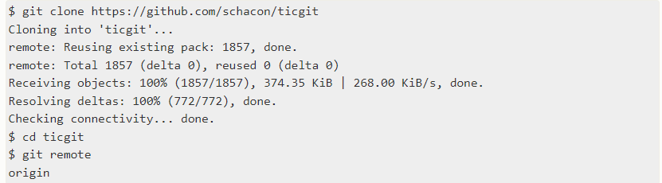
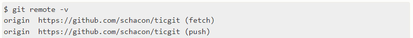

# Работа с Git
## 1. Проверка наличия установленного Git
 В терминали выполнить команду `Git --version`. Если Git установлен, появится сообщение о версии программы. 
 
Иначи будет сообщение о ошибке. 

## 2. Установка Git
Загружаем последнюю версию Git c [сайта](https://git-scm.com/downloads).
Устанавливаем настройками по умолчанию

## 3. Настройкa Git
При первом использовании Git необходими представится. Для этого в терминале нужно ввести две команды:
```
git config --global user.name «Ваше имя английскими буквами» git
config --global user.email ваша почта@example.com
```

## 4. Инициализация репозитория
В терминале переходим к папке в которой хотим создать репозиторий, выполняем команду:
```
git init
```
В исходной папке появится скрытая папка ***git***

## 5. Определение состояния файлов 
Для просмотра текущего состояния гита, есть ли изменения, которые нужно закоммитить (сохранить) требуется воспользоваться командой 
```
git status
```

*Чтобы вызвать ранее введённую команду,пользуемся стрелками на клавиатуре.Перебираем недавно введённые командынажатием стрелки «вверх».*   
Для просмотра сокрашенного статуса, что б увидить изменения в болеее компактном виде, можно воспользоваться командой 
```
git status -s
```

* новые неотслеживаемые файлы помечаны `??` слево от них;
* файлы добавленные в отслеживание помечены `A`
* отредактированные файлы помечаны `M`

## 6. Отслеживание новых файлов
Для того чтобы начать отслеживать (добавить под контроль) новый файл, используется команда 
```
git add (название файла)
```
Эта команда дается после добавления файлов.   Писать название целиком не обязательно: терминал дозаполнит данные автоматически при нажатие на кнопку **Tab**.
Если ошибки не выдает, то значит все прошло успешно.

## 7. Коммит изменений
Для сохраниния изменений, тредуется вызвать команду 
```
git commit - m "оставить свои коментарии по внесеным изменениям"
```
Использование данной команды без коментария недопускается.  
В случаии если файл один или изменения вносятся во все файлы можно воспользоваться комбинированно командой 
```
git commit -am "Коментарий"
```
Если забыли указать `m`, то окроется встроенный редактор
 
Для работы в нем тредуется нажать `i`, чтобы начать вводить текст, и сохранить, нажав `esc` и `:wq` и `enter`, это будет зафиксировано с введенным вами сообщение

## 8. Просмотр изменений 
Для просмотра журнала изменений, следует воспользоваться командой 
```
git log
```
 

По уполчанию `git log` перечисляет коммиты, сделанные в репозитории в обратном хронологическом порядке - последние коммиты находятся сверху.
В журнале изменений мы видим текстовый коментарий и видем имя коммита. Имя коммта тредуется для перехода между версиями.  
Для того чтобы увидеть сокращеный журнал изменений следует воспользоваться командой 
```
git log --oneline -p
```
   
При работае с ветками, когда требуется посмотреть  журнал изменений, где визиально видно слияние веток, можно воспользоваться командой:
```
git log --graph
```
  
`q` *возвращает в исходное окно терминала*

## Раздел 9. Переход между версиями 
Переключение между версиями, осуществляется через команду 
```
git checkout (*указать имя коммита*)
```
Имя коммита целеком можно не указывать, достаточно первых 4 символов.    
Для возврата в последний коммит можно при помощи команды 
```
git checkout master
```

## 10. Просмотр изменений 
Если команды `git status`
недостаточно информативен и требуется знать,что конкретно поменялось, а не только какие файлы были изменены, можно воспользоваться командой 
```
git diff
```
Показывает разницу между текущим файлом
и сохранённым (показывает добавленные и удаленные строки). 

## 11. Игнорирование файлов
Для того, чтобы исключить из отслеживания в репозитории определенные файлы или парки, неоходимо создать там файл `.gitignore` и записать из названия или шаблоны соответсвующие этим папкам или файлам. Например **\*.png**

## 12. Работа с ветками 
### 1. Создание ветки
По умолчанию имя основной ветки в Git - `master`. 
Создать ветку можно командой 
```
git checkout (имя новой ветки) или git switch (название ветки)
```
### 2. Просмотр веток
Список веток в репозитории можно посмотерть с помощью команды :
```
git branch
```

Текущая ветка выделена звездочкой и цветом
### 3. Переход между ветками
Команда `git branch` только *создает* новую ветку, но не переключает на нее. Для переключении ветки выполняется команда:
```
git checkout (название папки) или git switch (название папки)
```
Можно создать ветку и сразу переключится на нее, выполнив команду:
```
git checkout -b (название папки) или git switch -c (название папки)
```
### 4. Слияние веток и конфликты

Для начала слияния веток, следует вернутся в ветку `master` 
```
git merge (название ветки)
```
В случаии отсутсвия конфликтов, запись будет выглядеть 
  
Если имеется конфлик, то   
Конфликт возникает, когда была изменена одна и таже часть файла в обеих ветках, то для разрешения конфликта потребует участие пользователя. VSCode предлогает варианты разрешения данного конфликта.
   
Для разрешения конфликта, следует выбрать редакцию файла который нам требуется  
   
К VSCode относится функционал: 
* Принять текущее изменение; 
* Принять входящее изменение; 
* Принять оба изменения; 
* Сравнить  
К Git относятся метки: 
* <<<< HEAD; 
* =====; 
* \>>>>>>> (название папки).
После разрешения конфликта требуетмя выполнить коммит слияния.
### 5. Удаление ветки
Если работа с веткой закончана, то ее следует удалить командой:
```
git branch -d (название ветки)
```
   
_Нельзя удалить ветку в которой мы находимя то есть текущую_.      
Если ветки не слиты, то при удаление вышеуказанным способом не получится, следует воспользоваться той же командой, но заменить `d` на `D`.   
  


# Работа с GitHub
GitHub используется для работы с удаленными репозиториями. Удаленный репозиторой представляет собой версии нашего проекта, сохраненного в интернете или еще где то. 
## 1.  Клонирование удаленного репозитория 
Необходимость клонировать существующий удаленный репозиторий возникает в ситуациях, когда вы решаете поработать над уже существующим кодом. Для выполнения этой операции предусмотрена команда: 
```
git clone (ссылка на удаленный репозиторий)
```
Со ссылкой на удаленный репозиторий можно взять, нажав на большую зеленую кнопку `Code` на странице репозитория на [GitHub](https://github.com).  
Далее следует для работы в данном репозитории создать ветку, этаты создания ветки описаны выше.
После добавления информации, следует добавить новый файл в отслеживание, через команду `git add`
## 2. Отправка изменений в удаленный репозиторий 
Для отправке данный в удаленный репозиторий:
```
git push 
```
Эта команда срабатывает лищь в том случае, если вы клонировали с сервера, на котором у вас есть права на запись, и если не кто другой с тех пор не выполнял команду `push`.
Если вы и кто-то еще одновременно клонируете, затем он выполняет команду `push`, а после него выполнить команду `push` пытаетесь вы, то ваш `push` будет откланен. Вам придется сначало получить изменения и объеденить их с вашими и только после этого вам будет позволено выполнить `push`.
## 3. Отправка изменений в удаленный репозиторий
Для загрузки изменений из удалённого репозитория используется параметр `pull`. Он скачивает копию текущей ветки с указанного удалённого репозитория и объединяет её с локальной копией.
```
git pull 
```