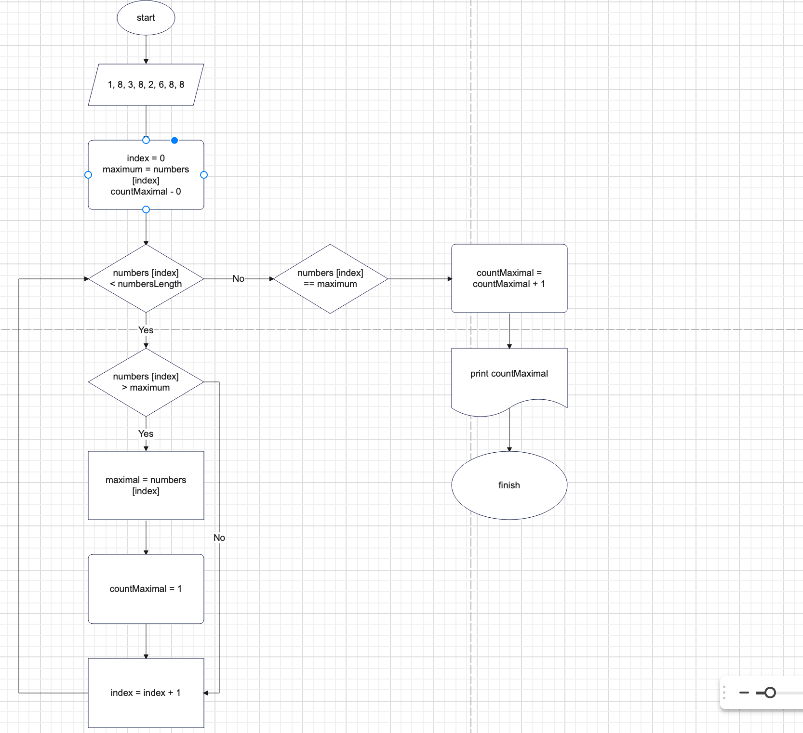
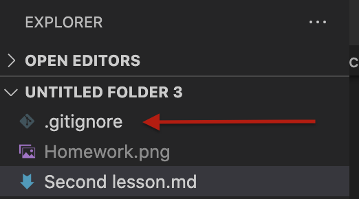
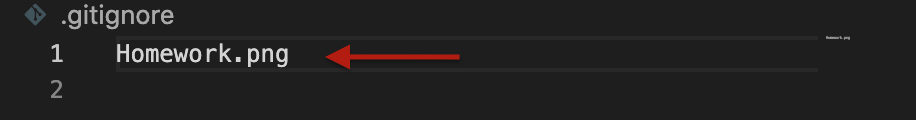
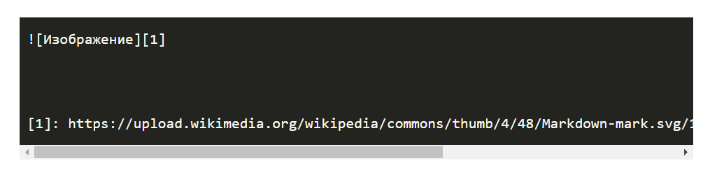
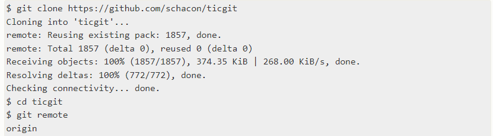
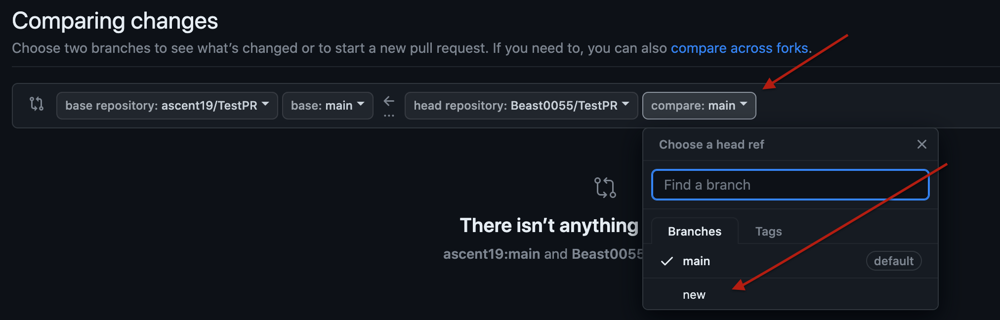
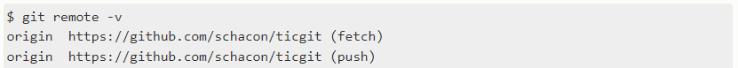

# MarkDown instruction

## Выделение текста

 Чтобы выделить текст отмеченным обрамите знаками `text`.

 Чтобы выделить текст курсивом обрамите звездочками *text*,или нижными подчеркиваниями _text_.
 
Чтобы выделить текст полужирным обрамите двумя звездочками **text**,или двойным знаком нжнего подчеркивания __text__.

Альтернативные версии нужны для того что совмещать и _курсив и **полужирный**_
## Списки
  Ненумерованные списки:
  * Элемент 1 
  
      Или:
   + Элемент 1 

Нумерованные:

   1. Элемент 1 
             
## Работа с изображениями
 Чтобы вставить изображения в текст надо сделать следующее:
 

 ## Работа с ссылками
Чтобы добавить ссылку в текст надо сделать следующее:
```
 [GeekBrains](https://gb.ru/education) 
 ```
   ***[GeekBrains](https://gb.ru/education)*** 


##    Игнорирование файлов
Для того,чтобы исключить из отслеживания в репозитории определенные файлы и папки, необходимо создать там файл ***.gitignore*** и написать в него их шаблоны или названия, соотвтствующие таким файлам или папкам.
После добавления фалйла __.getignore__ необходимо выполнить команду git add __.__ `или` __.getignore__.
Как выглядит добавление файла в .getignore:
##   Создание веток
Создать ветку можно командой:
```Bash
git branch <имя новой ветки> или командой которая создаст и сразу же переключится в ветку:
git switch -c <название>
```
 Список команд в репозитории можно посмотреть с командой:
 ```bash
 git branch
 ```
 Текущая ветка будет отмечена звездочкой: __*master__

## Слияние веток и разрешение конфликтов
Для слияния выбранной ветки с текущей нужно выполнить команду:
```Bash
git merge <название выббранной ветки>
```
Если была изменена одна и та же часть файла в обеих файлах то может возникнуть конфликт,который потребует участия пользователя.VSCode предлагает варианты рарзрешения. ...
После разрешения конфликта нужно выполнить коммит слияния:
```
git commit -am "название коммита"
```

## Удаление веток
Для того,чтобы удалить ненужную нам ветку необходимо выполнить следующую команду:
```
git branch -d "название ветки"
```
Удаление необходимо сделать с другой ветки.

# ***Работа с удалёнными репозиториями***
* Cоздать аккаунт на GitHub
* Создать локальный репозиторий
* Создать удалённый репозиторий
* Связать удалённый репозиторий с локальным

Добавить удалённый репозиторий к проекту
```Bash
git remote add <имя для репозитория> <url-адрес репозитория>,
git branch -M main,
git push -u origin main.
```

Для получения слияния изменений из удалённого репозитория используется команда `git pull`

Отправить изменения локального репозитория: `git push`

Чтобы работать с чужими репозиториями в GitHub:
1. Заходим на выбранную нами репозиторию,
2. Нажимаем на кнопку "Fork"
3. Выбираем имя и нажимаем на кнопку "Create fork"
4. Нажимаем на кнопку "<>Code" и копируем ссылку репозитория
5. Заходим в VSCode и клонируем репозиторию с помощю команды `git clone "адрес репозитория"`
6. Создаем новую ветку и работаем с репозиторием
7. После завершения работы отправляем уже измененную репозиторию в GitHub с помощю команды `git pull`
8. Нажимаем на команду `Compare and pull requests` и отправляем изменения
9. Если команда `Compare and pull requests` отсутствует,выполняем следующие шаги:
  




```C# 
Pargev
       Torosyan
                05.05.2003
```
