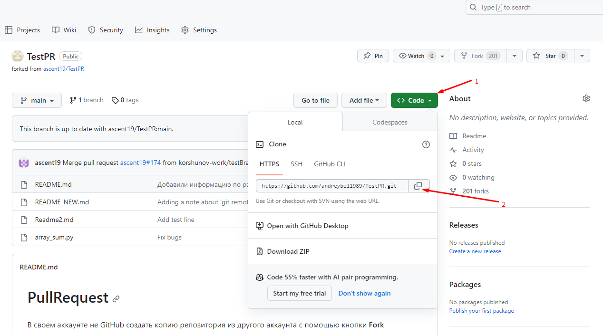

# Работа с Git

## 1. Проверка наличия установленного Git
В терминале выполнить команду `Git --version`. Если git установлен, появится сообщение с информацией о версии программы, иначе будет сообщение об ошибке.

## 2. Установка Git
Загружаем последнюю версию Git с [сайта](https://git-scm.com/downloads). Устанавливаем с настройками по умолчанию.
## 3. Настройка Git
При первом использовании git необходимо представиться. Для этого нужно ввести в терминале 2 команды:
```Bash
git config --global user.name "Ваше имя английскими буквами"
git config --global user.email "Ваша почта@example.com"
```
## 4. Инициализация репозитория
### Подготовка репозитория
 Для создания репозитория необходимо выполнить команду *__git init__* в папке с репозиторием и у вас создастся репозиторий (появится скрытая папка .git)

## 5. Запись изменений в репозиторий
### Добавление изменений
Для добавления изменений в коммит используется команда *__git add__*. Чтобы использовать команду, необходимо написать:
```
git add <имя файла.тип расширения>
```
### Просмотр состояния репозитория
Для того, чтобы посмотреть состояние репозитория используется команда *__git status__*. Для этого необходимо в папке с репозиторием написать *git status*, и вы увидите были ли изменения в файлах, или их не было.

### Создание коммитов
Для того, чтобы создать коммит(сохранение) необходимо выполнить команду *__git commit__*. Выполняется она так:
```
git commit -m "Сообщение об изменениях"
```

## 6. Просмотр истории коммитов
Для просмотра истории изменений с их хеш-кодами, необходимо использовать команду *__git log__*. 

## 7. Перемещения между сохранениями
Для того, чтобы перейти от одного коммита к другому используется команда *__git checkout__*. Используется она так:
```Bash
git checkout <первые 4-6 цифр хеш-кода коммита>
```
Для возвращения к актуальному состоянию и продолжения работы можно написать:
```Bash
git checkout master
```
Чтобы увидеть разницу между текущим файлом и закомиченным файлом, необходимо воспользоваться командой *__git diff__*

## 8. Игнорирование файлов
Для того, чтобы исключить из отслеживаемого репозитория определенные файлы, необходимо создать файл *__.gitignore__* и записать в него их названия или шаблоны, соответствующие таким файлам или папкам. 

## 9. Создание веток
По умолчанию имя основной ветки в Git - `master`. 
Для создания новой ветки используется команда:
```Bash
git branch <имя новой ветки>
```
Для создания новой ветки в репозитории и одновременного переключения в нее существует команда:
```
git checkout -b <название ветки>
```
Для просмотра списка веток можно воспользоваться командой ***git branch***. 

Чтобы переключаться между ветками, можно воспользоваться командой ***git checkout <название ветки>*** или ***git switch <название ветки>***.

## 10. Слияние веток и разрешение конфликтов
Для слияния выбранной ветки с текущей нужно выполнить команду:
```Bash
git merge <название ветки>
```
Если была изменена одна и та же часть файла в обеих ветках, то может возникнуть конфликт, который потребует участия пользователя. VS Code предлагает варианты решения этого конфликта: 
* Оставить все, как в текущей ветке
* Изменить все, как во внесенной ветке
* Сохранить оба варианта
* Посмотреть разницу между двумя ветками

После выбора варианта слияния обязательно нужно выполнить коммит слияния:
```
git commit -am "Разрешение конфликта слияния веток"
```
## 11. Удаление веток

Для того, чтобы удалить ветку, нужно обязательно перейти в какую-нибудь другую ветку с помощью команду ***git switch <название ветки>*** или ***git branch <название ветки>*** и выполнить команду:
```Bash
git branch -d <название ветки>
```
Если ветка не слита, то при ее удаление git выдаст ошибку, тогда эту ветку можно удалить с помощью команды:
```
git branch -D <название ветки>
```

## 12. Работа с удаленным репозиторием
1. Создать локальный репозиторий
2. "Подружить" локальный и удаленный репозиторий
3. Отправить (push) локальный репозиторий на удаленный
4. Провести изменения с другого компьютера
5. Скачать (pull) изменения с удаленного репозитория

# **Работа с удаленными репозиториями**

## Работа со своим удаленным репозиторием

1. Создать аккаунт на GitHub

Заходим на [сайт](https://github.com) и регистрируемся.

2. Создать локальный репозиторий

С помощью команды `git init` создаем локальный репозиторий на своем компьютере.

3. Создать удаленный репозиторий

На сайте GitHub создаем удаленный репозиторий.

4. Связать удаленный репозиторий с локальным

В терминале к локальному репозиторию привязываем удаленный репозиторий с помощью команд: 
```
git remote add <имя для репозитория> <url-адрес репозитория в сети>
git branch -M main
git push -u origin main
```

Для получения и сливания изменений на удаленном репозитории используется команда `git pull`

Добавить изменения локального репозитория в удаленный : `git push`


Посмотреть список удаленных репозиториев ***git remote***

Список удаленных репозиториев: 
```
git remote -v
```

## Работа с чужим удаленным репозиторием

1. Делаем fork репозитория

2. Делаем clone СВОЕЙ версии репозитория

С помощью команды `git clone <ссылка на репозиторий>`
3. Создаем новую ветку и в НЕЕ вносим свои изменения
4. Фиксируем изменения (делаем коммиты)
5. Отправляем свою версию в свой GitHub
6. На сайте GitHub нажимаем кнопку pull request 
