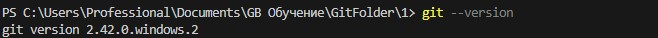
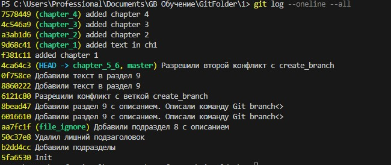
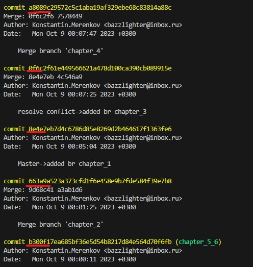

# Работа с Git

## 1. Проверка наличия установленного Git
В терминале необходимо выполнить команду `git --version`.
Если Git установлен появится сообщение с информацией о версии программы, иначе появится сообщение об ошибке.


Проверка коммита

## 2. Установка Git
Последнюю версию необходимо скачать с [сайта](https://git-scm.com/downloads).

При установке выбирать настройки по умолчанию.

> **Внимание**<br>
Экспериментальные галки не нужно ставить.

## 3. Настройка Git
При первом использовании Git необходимо представиться. Для этого необходимо нужно в терминале ввести две команды:
```
  git config --global user.email "you@example.com"
  git config --global user.name "Your Name"
```
## 4. Инициализация репозитория
Теперь необходимо настроить репозиторий. Для этого перейдите в папку Вашего проекта. Введите `cd <путь к вашему проекту>` - команда сменит директорию (change directory).

Далее необходимо выполнить инициализацию/создание репозитория - `git init`.

Необходимо добавить в проект файлы, с которыми будем работать:
```
#Добавим все файлы проекта в нам будующий commit
    git add .
#Или так
    git add --all
#Если хотим добавить конкретный файл то можно так
    git add <имя_файла> 
```

Теперь Git отслеживает изменения файлов проекта. Необходимо выполнить первую инициализацию. Обычно она сопровождается комментарием `Initial commit`:

```
    git commit -m 'Initial commit'
```

## 5. Запись изменения в репозиторий
Запомните, всё, что до сих пор не проиндексировано — любые файлы, созданные или изменённые вами, и для которых вы не выполнили git add после редактирования — не войдут в этот коммит. Они останутся изменёнными файлами на вашем диске. В нашем случае, когда вы в последний раз выполняли git status, вы видели что всё проиндексировано, и вот, вы готовы к коммиту. 
Простейший способ зафиксировать изменения — это набрать `git commit`:
```
    git commit
```
Фиксирование изменений может сопровождаться комментариями:
```
    git commit -m 'Текст комментария'
```

## 6. Просмотр коммитов
После того, как было создано несколько коммитов, вероятно может понадобится посмотреть что было сделано — историю коммитов. Одним из основных и наиболее мощных инструментов для этого является команда `git log`.
По умолчанию (без аргументов) `git log` перечисляет коммиты, сделанные в репозитории в обратном к хронологическому порядке — последние коммиты находятся вверху.
Опция `oneline` выводит каждый коммит в одну строку, что может быть очень удобным если вы просматриваете большое количество коммитов, а дополнительный параметр `all` веведет все коммиты проекта сразу, что удобно когда проект небольшой. 
```
    git log --oneline --all
```


## 7. Перемещение между коммитами
Чтобы перейти к определенному коммиту, используйте  команду git checkout c SHA коммита.

### Как найти SHA коммита
Один из способов найти SHA коммита — просмотреть лог Git. Делается это при помощи команды `git log`:


В первой строке каждого коммита после слова commit есть длинная строка букв и цифр: a8089c2957…

Вот она и называется SHA. Это уникальный идентификатор, генерируемый для каждого коммита.

Чтобы перейти к определенному коммиту, вам нужно лишь передать его SHA в качестве параметра команды git checkout:
```
    git checkout a8089c2957
```
> **Примечание**<br>
 Обычно можно использовать всего несколько первых символов SHA, потому что первые 4-5 символов скорее всего образуют уникальную комбинацию в рамках проекта.

## 8. Исключение файлов из отслеживаемых Git
Чтобы исключить файлы из отслеживаемых Git'ом в репозитории нужно создать файл *__.gitignore__* и добавить туда имена исключаемых файлов или шаблоны с необходымыми расширением, например: *1.jpg* или _\*.jpg_ 

## 9. Создание веток в Git
По-умолчание имя основной ветки в Git - **master**.
Cоздать новую ветку можно сл.командой:
```
git branch <new_branch_name>
```
Список веток можно получить с помощью команды 'git branch'.
Текущая ветка будет отмечена **\* master**.

## 10. Работа с удаленными репозиториями

### Просмотр удаленного репозитория
Для того чтобы просмотреть список названий удаленных репозиториев, которые были добавлены, используйте команду:
```
git remote
```
Указав ключ -v, можно просмотреть, какие адреса в добавленных удаленных репозиториях используются для чтения и записи.

Полный список удаленных ссылок можно получить с помощью команды:

```
git ls-remote <remote> 
```
Либо для получения удаленных веток и дополнительной информации используйте команду:

```
git remote show <remote> 
```
__< remote >__ — название удаленного репозитория, которое ему дали после подключения. Можно использовать и url интересующего удаленного репозитория.

### Изменение удаленного репозитория
Чтобы отправить изменения (имя ветки) __< branch-name  >__ на сервер __< remote-name >__, задействуйте команду:
```
git push <remote-name> <branch-name>
```
Если ветка, которую вы хотите отправить, не отслеживается, то добавьте флаг __—set-upstream__. На примере ветки develop это будет выглядеть вот так:
```
git push --set-upstream origin develop
```
В GitHub же есть кнопка (Add file) для загрузки или создания файлов прямо в удаленном репозитории.

Так же возможно переименование удаленного репозитория с прежнего имени __< old-name >__ на новое __< new-name >__.
```
git remote rename <old-name> <new-name>
```
### Получение изменений из удаленного репозитория
Для связи с указанным удаленным репозиторием используется следующая команда, которая подтянет новые изменения на локальный репозиторий:
```
git fetch [remote-name]
```

После выполнения команды появляются ссылки на все ветки из указанного удаленного репозитория. Данная команда забирает данные в наш локальный репозиторий, но не объединяет или перебазирует их с коммитами в локальном репозитории, связанного с удаленным. Поэтому используйте **merge** или **rebase**, когда закончите работать над изменениями.

Если ветка настроена на отслеживание удаленной ветки, то можно использовать более удобную команду:

```
git pull 
```
Данная команда заменяет прописывание двух команд:
```
git fetch; git merge
```

Есть и универсальнее способ: клонирование репозитория. Клонирование копирует все файлы и коммиты удаленного репозитория, после чего уже можно использовать предыдущую команду **— git fetch**, если понадобятся новые изменения из удаленного репозитория.
```
git clone [url]
```
