# Работа с git

## 1. Проверка наличия установленного Git
В терминале выполнить команду `git --version`. Если Git установлен, появится сообщение с информацией о версии программы, иначе будет сообщение об ошибке.

## 2. Установка Git

Загружаем последнюю версию Git с [сайта](https://git-scm.com/downloads)
Устанавливаем с настройками по умолчанию.

## 3. Настройка Git

При первом использовании Git необходимо представиться. Для этого нужно ввести в терминале две команды:
```
git config --global user.name «Ваше имя английскими буквами»
git config --global user.email ваша почта@example.com
git config --global color.ui auto -> Включает подсветку git при использовании терминала
git config --global core.editor '[program]' -> Установка редактора по умолчанию
```
Проверить, всё ли успешно записалось, можно с помощью команды:
`git config --list`

## 4. Инициализация репозитория

В терминале переходим к папке, в которой хотим создать репозиторий. Выполняем команду: 
```
git init
```
В исходной папке появится скрытая папка ***.git***

## 5. Проверка состояния репозитория

После создания репозитория, можно проверить его состояние с помощью команды: 
```
git status
```
Она показывает текущее состояние репозитория: какие файлы были добавлены, изменены или удалены.
Все файлы, которые попадают в коммит, должны быть отмечены зелёным цветом.

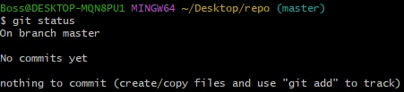

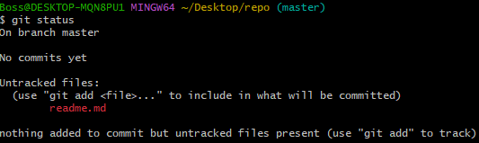

***Untracked files*** - файлы, которые были добавлены в репозиторий, но ещё не зарегистрированы в индексе изменений.

## 6. Добавление файлов в индекс

Для добавления **файлов** в индекс изменений, необходимо воспользоваться следующей командой: 
```
git add <File> - добавление конкретного файла
git add . - добавление всех файлов
```
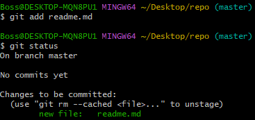

**Changes to be committed** - те изменения, которые будут записаны при создании коммита.

Если Вы ошиблись и случайно добавили не тот файл, его можно удалить из списка отслеживаемых файлов с помощью команды:
```
git rm --cached <file>
```
## 7. Создание коммита

Для того, чтобы создать коммит и записать текущее состояние файлов в историю изменений, необходимо воспользоваться следующей командой:
```
git commit -m "Message" - запись текущего состояния с описанием 
git commit -am "Message" - запись всех состояний с описанием
git commit --amend -am "Message" - изменение последнего коммита с комментарием
```
Вместо слова ***Message***, пишут описание коммита, что было сделано. Например, добавлен файл, исправлен баг, удален файл и так далее.

`-m` - позволяет далее указать описание изменения, если этого не сделать, то откроется стандартный редактор и необходимо будет ввести описание через него.

Если открылся редактор Vim, то порядок действий следующий:
```
1. Нажимаем i для записи(снизу появится слово INSERT)
2. Записываем своё описание
3. Нажимаем кнопку Esc, чтобы выйти из режима(снизу пропадёт слово INSERT)
4. Для выхода из Vim пишем: ":wq", где w == write, q == quit, иными словами - записать и выйти
```

`-a` - позволяет совершить коммит без команды `git add` из п.6, однако стоит помнить, что `git commit -a` - добавляет **изменения** к отслеживанию, но не сами файлы. То есть если файл не отслеживается через `git add`, то его коммит не будет сохранен. 

Для проверки, всё ли прошло успешно и зафиксировались ли изменения, можно снова воспользоваться командой `git status`.

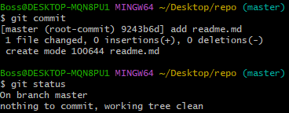

Стоит отметить, что при коммите в описании добавляется новая информация, в выделенной области находится хэш коммита для того, чтобы гит умел хранить историю, не пересекаясь с другими коммитами. На каждое сохранение гит генерирует уникальный хэш(набор символов из букв и цифр, генерирующийся так, чтобы пересечения появлялись крайне редко):

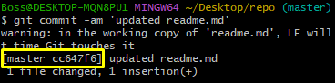

## 8. Игнорирование файлов

Для того, чтобы исключить из отслеживания в репозитории определнные файлы или папки, необходимо создать там файл `.gitignore`. И записать в него их названия или шаблоны, соответствующие таким файлам или папкам.

## 9. Получение истории репозитория

Для того, чтобы получить доступ к истории репозитория, необходимо выполнить следующую команду: 
```
git log
git log --oneline   - вывод истории, но в компактном виде
git log --oneline --all  - вывод истории на всех ветках, но в компактном виде
git log --graph     - вывод списка коммитов в виде дерева
git log --graph --oneline - вывод сокращенного списка коммитов в виде дерева
```
После выполнения Вы получите информацию о каждом коммите, который был создан в Вашем репозитории.
Напротив коммита написан хэш(его уникальный номер), автор и время создания. Также сюда записывается комментарий, который прописывается при создании коммита.

Стоит отметить, что напротив последнего коммита идёт фраза:
[HEAD -> master]. HEAD - это наша текущая точка, на которой мы остановлены, она - голова нашего репозитория. HEAD указывает на master, на ветку, на которой мы находимся.

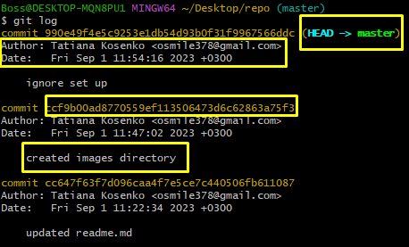

## 10. Сравнение версий коммитов

Если есть необходимость сравнивать версию текущего документа и последнюю закоммиченную, то можно воспользоваться операцией:
```
git diff
```
Она выведет Вам список того, что было добавлено/удалено из файла, с которым Вы работаете. 
Это хорошая операция для сравнения версий. 
Таким образом Вы можете найти, где совершили ошибку, сравнив рабочую версию(которую вы закоммитили ранее) и ту, которую дорабатываете.

PS. Если вывод получается слишком длинным(многострочным), то для выхода из него достаточно нажать `q`.

## 11. Сброс последнего коммита

Если мы понимаем, что последний коммит был сделан случайно, то эту процедуру можно отменить с помощью команды:
```
git reset <hash>
```

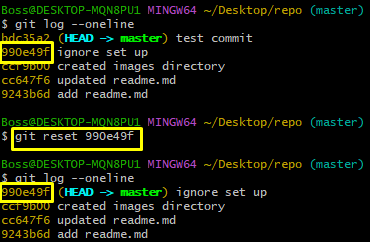

После этой команды, последний коммит пропадет из истории наших изменений, но это не значит, что коммит полностью и бесследно исчез из репозитория. На данный момент он всё ещё есть и есть возможность вернуться и к нему в том числе. Для того, чтобы это сделать необходимо воспользовать следующими операциями:
```
git reflog   - получает более подробные сведения о событиях репозитория
```
`git log` - пишет изменения об истории коммитов, а `git reflog` - пишет изменения не только коммитов, но и всех операций, которые были совершены во время работы в репозитории. Например, отмена коммитов, переход по истории, создание новых объектов в рамках репозитория и др.

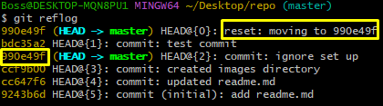

Для того, чтобы вернуться к коммиту, который был отменен, нужно снова вернуться, но уже к нему. После выполнения повторного `git reset`, видно, что коммит был восстановлен:

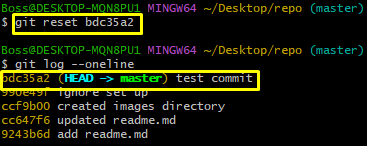

## 12. Отмена действия конкретного коммита

Бывают ситуации, когда необходимо не выполнить сброс, а именно отменить *последствия* того или иного коммита.
Для отмены действия необходимо воспользоваться командой, которая создаёт новый коммит, отменяющий действие выбранного:
```
git revert <hash>
```
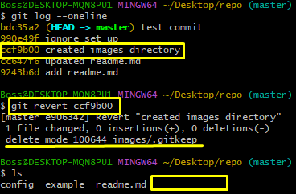

## 13. Сброс состояния файла

Для сброса состояния файла, с которым Вы сейчас работаете, на состояние последнего коммита, необходимо воспользоваться следующей операцией:
```
git restore <File>
```

## 14. Работа с ветками в git
Работа с ветками в git очень важна, она позволяет работать над проектам нескольким людям так, чтобы никто никому не мешал.
### 1. Просмотр всех доступных веток
Для просмотра всех веток, которые имеются сейчас в директории, имеется следующая команда:
```
git branch
```
Команда возвращает список всех доступных веток, а с помощью `*` отображает ветку, на которой Вы сейчас находитесь.
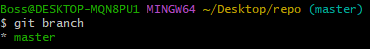

### 2. Добавление новой ветки и переключение на неё
Для того, чтобы добавить новую ветку для работы и перейти на неё, необходимо воспользоваться следующими операциями:
```
git branch <name_branch>    - создание новой ветки
git checkout <name_branch>  - переключение на новую ветку
git switch <name_branch>    - переключение на новую ветку
```
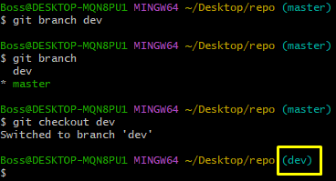

Работа с новой веткой аналогична, как и основной. Если добавить в неё новые файлы, то можно спокойно коммитить изменения и потом посмотреть историю всех коммитов. Тут стоит отметить, что последний коммит на ветке `master` был сделан ранее и что новый созданный файл находится на ветке, которая сейчас отслеживается, `dev`. О переходе обратно и объединении веток речь пойдет ниже.

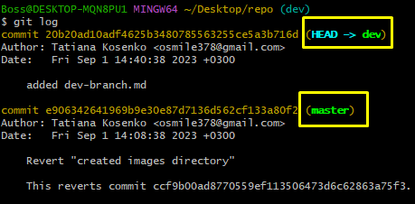

Если сейчас переключиться обратно на ветку `master`, то видно, что информации о создании файла на другой ветке нет. В этом вся прелесть работы с ветками. Таким образом мы изолируем нашу временную работу на отдельную копию нашего репозитория. Также, добавив файл на ветку `master`, мы не увидим эти изменения на ветке `dev`. Иными словами, все коммиты, сделанные на `dev`, останутся только на ветке `dev`, а коммиты с `master` на `master`.

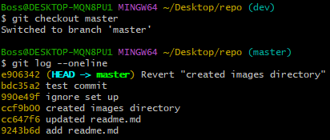

Помимо создания ветки из текущей, можно создать ветку с корнем из любой другой. Это можно сделать немного дополнив основное создание ветки. В большинстве случаев ветки создаются из `master`, очень редко из каких-то других:
```
git branch <name_branch> <main_branch>
```

Таким образом можно из ветки `dev`, создать ветку `dev-master`, которая возьмёт своё начало из ветки `master`. И, соответственно, она скопирует всё состояние ветки `master`, но не будет знать о том, что происходит на ветке `dev`.

`HEAD` в этом случае смотрит на обе ветки, потому что на данный момент времени они идентичны:

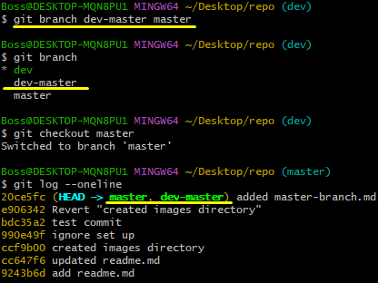

Стоит отметить, что имеется операция для одновременного переключения и создания ветки, для этого необходимо дописать следующее:
```
git checkout -b <name_branch>
git switch -c <name_branch>
```

### 3. Слияние веток
Для того, чтобы слить ветки воедино, необходимо перейти на главную ветку и совершить следующее действие:
```
git checkout master  - возврат на ветку master
git switch master    - возврат на ветку master
git merge dev        - объединение ветки с dev  
```

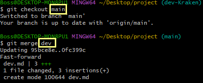

Слияние ещё не говорит о том, что ветка перестает работать. 
Слияние - это объединение изменений с текущей веткой, на которой Вы находитесь.

Если была изменена одна и та же часть файла в обеих ветках, то может возникнуть конфликт, который потребует участия пользователя. VS Code предлагает вариант разрешения.

После разрешения конфликта, нужны выполнить _коммит слияние_.

### 4. Удаление веток
Если мы понимаем, что какие-то из веток потеряли свою актуальность, их можно удалить с помощью следующей операции:
```
git branch -d <branch_name>
```
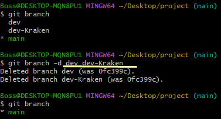

Если происходит удаление при работе с удаленными репозиториями, то эта процедура удалит ветки только с локального. Для удаления с удаленного, нужно воспользоваться следующей операцией:
```
git push --delete origin <branch_name>
```

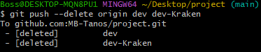

### 5. Перенос изменений ветки
Есть возможность изменения старта ветки, эта процедура перемещает Ваши изменения в тот или иной момент времени. Например, можно обновить точку старта на ту, которую внес уже другой разработчик. То есть без добавления коммитов смещаем начало ветки:

```
git rebase <branch_name>  - хотим сейчас сместить текущую ветку на последний коммит с ветки <branch_name>
```

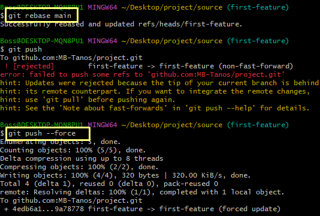

PS. Если возникла ситуация, что github не захочет принимать изменения после всех манипуляций, можно принудительно обновить с прекращением поддержки старой истории изменений. Для этого необходимо воспользоваться операцией:

```
git push --force  - данная операция ПРИНУДИТЕЛЬНО перезаписывает удаленную ветку на текущую
```

## 15. Управление версиями
Для того, чтобы пометить свой коммит, как версию своего приложения, необходимо воспользоваться следующей операцией:
```
git tag <version>  - добавляет тэг с номером версии
git tag            - выводит тэг, записанный на коммит
git tag --list     - выводит список всех тэгов 
```

Для того, чтобы загрузить тэги и версии проектов в удаленный репозиторий, необходимо расширить операцию `git push`:
```
git push --tags
```

Если произошла ситуация, что тэг был прикреплен к ошибочному коммиту, то для его "перемещения" на новый коммит, необходимо сначала удалить тэг с помощью операции, а потом снова добавить:
```
git tag -d <version>   - удаляет тэг с номером версии
```

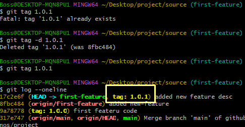

Есть возможность удалить существующий тэг в удаленном репозитории, для этого необходимо выполнить следующую операцию:
```
git push --delete origin <version>
```
## 16. Разбор особых случаев
### 1. Помещение будущего коммита во временное хранилище
Если имеется ситуация, когда был изменен файл, но нет необходимости сразу добавлять его к индексу для отслеживания версий(до `git add`), а при этом нужно сменить ветку, можно воспользовать следующей операцией:
```
git stash       - операция выгружает все изменения во временное хранилище stash
git stash list  - выводит список всех stash
git stash push <file>  - добавление <file> к уже существующему stash на текущей ветке
```
При успешном выполнении появится сообщение: ***Saved working directory and index state WIP(work in progress) on master***

Для того, чтобы вернуть обратно изменения, нужно указать имя stash, которые получается при выполнении команды `git stash list`, в следующей операции: 
```
git stash pop <stash_name>  - применяет изменения из <stash_name>
```
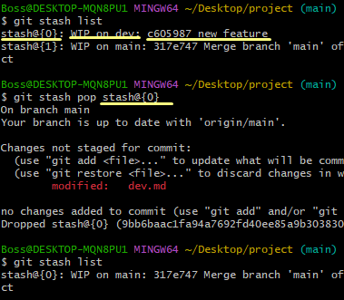

### 2. Склеивание коммитов
Если необходимо, чтобы работа была в более чистом виде, чем куча разнообразных коммитов, то можно воспользоваться операцией ниже. Она позволит объединить большое количество коммитов в один. Это позволит отказывать изменения только одного коммита, а не большого количества с поиском коммита, в каком была допущена ошибка.

```
git merge <branch_name> --squash     - подтягивает изменения с указанной ветки, но не создает коммит объединения. Для того, чтобы можно было зафиксировать все изменения в рамках одного коммита
```
Чтобы объединить все коммиты в один, необходимо воспользоваться следующей командой, которая позволит переместиться обратно с сохранением всех текущих изменений: 
```
git rebase -i HEAD~3   - где HEAD - текущее состояние репозитория, 3 - количество коммитов, на которое необходимо вернуться, -i - запуск интерактивного режима, который более подробно позволит настроить поведение rebase
```

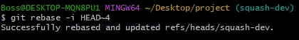

Стоит ответить, что позже можно частично перезаписать историю, если уже была загрузка изменений в удаленную ветку на текущем репозитории:
```
git push --force
```

### 3. Перенос отдельных коммитов
Бывают ситуации, что Вы начинаете разработку, а в процессе - другой разработчик уже сделал параллельно какую-то часть задачи и вместо того, чтобы перехватывать все его изменения, достаточно захватить только один коммит. Для этого отлично подойдет следующая операция, которая позволяет скопировать изменения коммита и записать новый коммит на Вашей текущей ветке:
```
git cherry-pick <hash_commit> - перенести коммит на текущую ветку
git cherry-pick <branch>      - перенести последний коммит ветки
git cherry-pick ..<branch>    - перенести все коммиты с ветки
```

### 4. Перезапись коммита
Если возникла такая ситуация, что коммит был создан некорректно или с файлом что-то было не так, то можно перезаписать коммит, не создавая новый, используя специальное добавление:
```
git commit --amend -am  - сообщает гиту, что последний коммит должен быть перезаписан
```
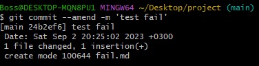

### 5. Решение конфликтов
Конфликт - это когда два разработчика изменили один и тот же файл и попытались объединить его с *master*.
Решение конфликта чаще всего решается вручную.
Для этого через cmd, можно написать: `vi <file>`, открыть файл и посмотреть, кто и что внёс и отредактировать то, что не является нужным.

### Полезные документы для изучения Git:
1. С.Чакон, Б.Штрауб - Git для профессионального программиста (2016)
2. [Книга](https://git-scm.com/book/ru/v2) для изучения Git

# Дополнительные операции по работе с git bash на основе курса по Git

## Основные команды терминала

`ls` - показывает все директории, которые имеются

`ls -a` - показывает все директории, включая скрытые папки, которые имеются

`cd Downloads/` - переход в папку загрузок

`cd ~` - переход в корневую папку пользователя:

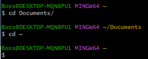

`cd ..` - переход в папку на уровень выше

`cd ../..` - переход в папку на два уровеня выше

`mkdir TestDir` - создание новой папки(директории) с названием TestDir

`touch test.txt` - создание файла test.txt

`cp test.txt test_copy.txt` - копирование файла: cp [какой файл] [в какой файл].

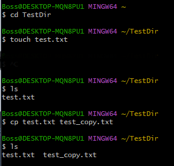

`mv test.txt test_original.txt` - переименование файла: cp [какой файл] [в какой файл].

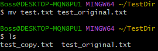

`echo "Text"` - выводит текст в командной строке, чтобы вывести текст в документ, необходимо использовать следующую конструкцию: `echo "Text" > <File>`.

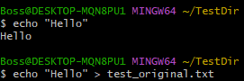

Теперь, для того, чтобы посмотреть на текст внутри файла, его можно открыть с помощью следующей команды: `cat <File>`.

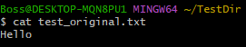

`rm <File>` - полностью удаляет файл из текущей папки без возможности восстановления.

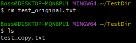

С помощью этой команды можно удалить и всю директорию, однако платформа предупредит Вас о том, что Вы собираетесь удалить всю папку, а в ней могут быть какие-то важные файлы. 
Если Вы уверены в том, что удаление необходимо, то необходимо добавить `-R`,  что означает рекурсивное удаление(удалить директорию и всё, что в ней находится).

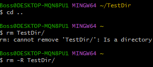

## Работа с репозиториями Git

Для создания синхронизации между локальными файлами и сервисами GitHub, необходимо выполнить следующую команду в локальном репозитории: 
```
git remote add origin https://github.com/MB-Tanos/repo-github.git
```
Где *`git remote add`* - добавляет удаленный источник, *`origin`* - название удаленного источника, в большинстве случаем *ВСЕ* удаленные источники называются именного так по умолчанию, и далее идёт ссылка на источник.

Для того, чтобы убедиться, что команда прошла успешно, необходимо выполнить следующее: 
```
git remote -v
```
Это покажет список всех подключенных к remote соединений и если их в списке 2, то всё прошло успешно.

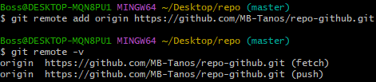

## Синхронизация и работа с github
Для синхронизации гита и гитхаба, необходимо выполнить несколько действий.
1. Сгенерировать SSH-ключ, который внесем в настройки гитхаб. И это ключ будет автоматически передаваться при каждой загрузки или скачивании данных с репозитория. Для этого необходимо выполнить команду: `ssh-keygen`. При выполнении можно пропустить все настройки с помощью `Enter`. По окончании создания ключа в тексте будет указан путь в файлу, необходимо скопировать путь.
2. С помощью команды `cat <file>` необходимо посмотреть содержимое скопированного файла и вставить его на гитхаб в SSH-ключи
3. После того, как ssh-ключ добавлен в гитхаб. В нем необходимо перейти в репозитории и попробовать склонировать репозиторий к себе на компьютер. Для этого необходимо скопировать следующую строку:

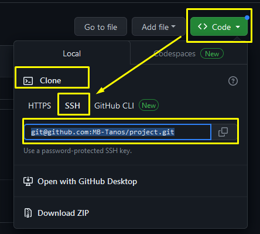

После чего необходимо перейти в gitbash и ввести следующую команду:
```
git clone <PathFromGitHub> <NewDirectoryOnComputer>

Пример:
git clone git@github.com:MB-Tanos/project.git project

```
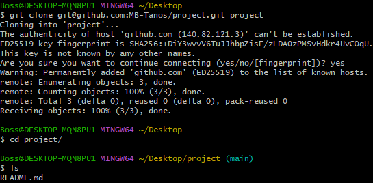

4. Создадим пример, где добавили новую ветку и файл

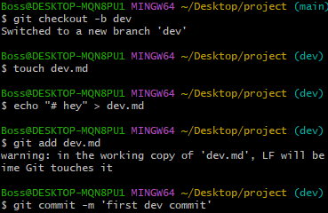

При просмотре истории важно обратить внимание на ветки и на то, как они называются.

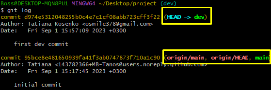

5. Для того, чтобы отправить версию с ПК на гитхаб, нужно воспользоваться следующей командой:
```
git push
```

Однако стоит отметить, что если ветки с изменением нет на гитхаб, то он не позволит это сделать. Для этого нужно зайти на гитхаб, создать ветку там, или воспользоваться расширенным вариантом `push`: `git push --set-upstream origin dev`, где `--set-upstream` - источник в удаленном репозитории, `origin` - под названием *origin*(remote репозиторий), `dev` - название ветки, которую необходимо создать.

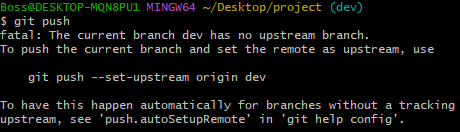

Или более сокращенным вариантом расширенного режима: `git push -u origin dev`

Если репозиторий был получен через кнопку `fork`(которая копирует чужой репозиторий на свой аккаунт), то после отправки изменений на гитхаб, необходимо создать `pull request`, который позволит автору репозитория оценить изменения, которые мы ему предлагаем. Там может развернуться целая дискуссия, пока изменения будут применены.

6. После успешной отправки данных на гитхаб, можно перейти на сайт и изменить файл, который был только что добавлен. После чего, попробуем скачать обновление через gitbash. Для этого необходимо воспользоваться операцией: 
```
git pull
```

7. Стоит отметить ещё одну функцию, которая полезна при работе с гитхаб, она нужна для того, чтобы обновить текущую синхронизацию по данным об удаленном репозитории. Например, если кто-то создал новую ветку, а Вы с ней не работали, эта операция загрузит эти данные Вам в локальный репозиторий и в последствии можно будет переключаться на ветки, которые создавались другими пользователями:
```
git fetch
```

Note! При такой синхронизации, добавленная ветка может не отобразиться в списке веток, потому что там выходят ветки, на которые Вы переключались локально. Для успешного отбражения нужно хотя бы один раз переключиться на добавленную ветку.

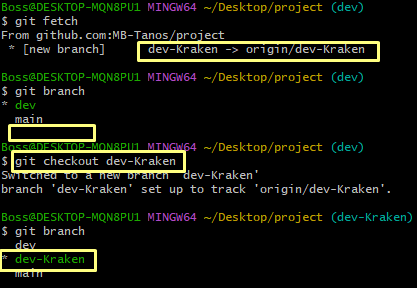

## Управление файлами репозитория

Git специфически относится к пустым папкам и не заносит их в индекс в целях экономии пространства, поэтому в git существует два специальных системных файла.

1. `.gitkeep` - служит для того, чтобы сохранять пустые директории в общем репозитории
2. `.gitignore` - используется для того, чтобы игнорировать некоторые файлы от попадания в общий индекс репозитория

Начнем с первого, с применения *gitkeep*:

Для начала, необходимо создать новую директорую *images* и посмотреть, как поведёт себя git. Как видно из изображения ниже, git не определяет пустую директорию, как шаг для записи в коммит.

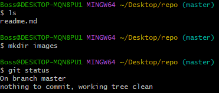

А это значит, что нам нужно указать в этой директории специальный файл:
```
touch images/.gitkeep
```

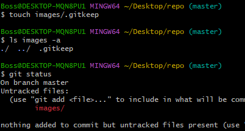

Готово, папка добавлена к отслеживаемым, после чего можно добавить её через `git add` и закоммитить через `git commit`:

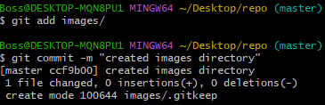

Теперь рассмотрим другую ситуацию, где необходимо наоборот скрыть какие-то файлы из репозитория. Для этого необходимо создать правило игнорирования файлов. Это можно сделать как в корне репозитория, так и в поддиректориях, для того, чтобы указать правила игнорирования внутри них:

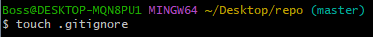

После чего добавляем файл к отслеживанию и записываем в него слово *"config"*. После чего фиксируем изменения.

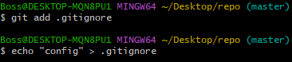

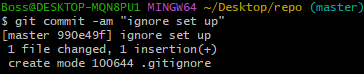

После чего создаем документ, который называется именно так, как мы записали в gitignore - *"config"*, проверяем, что он создался, и проверяем, что он игнорируется нашим репозиторием:

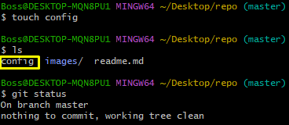

## Сброс состояния репозитория
Иногда требуется сбросить состояние репозитория на последний коммит, для этого необходимо воспользоваться операцией: 
```
git reset --hard
```