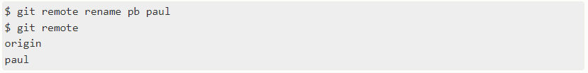

# Репозиторий для **pull request**
* В своём аккаунте на GitHub создать копию репозитория **"AndreyBulgakov19/SCV_GitPR"** с помощью кнопки **"Fork"**.
---
* Клонировать копию репозитория на локальный компьютер.
---
* Создать новую ветку.
---
* Добавить файл с инструкцией в новую ветку.
---
* Дополнить инструкцию разделами по работе с удалёнными репозиториями, pull request.
---
* Зафиксировать изменения (коммиты).
---
* Отправить изменения на GitHub.
---
* На сайте GitHub выполнить **Pull request**.
---
# *Инструкция по работе с GIT*


## **Что такое GIT**

Git — распределённая система управления версиями. Git поддерживает быстрое разделение и слияние версий, включает инструменты для визуализации и навигации по нелинейной истории разработки. Проект был создан Линусом Торвальдсом для управления разработкой ядра Linux

## **Основные понятия**

* ***Версия***  — это состояние файла (или нескольких файлов) в какой-то конкретный момент времени. Например, пустой файл (1), тот же файл с каким-то текстом (2) и этот же файл, в котором была исправлена опечатка (3) — три разные версии одного файла, которые были получены последовательной модификацией (изменением) файла.

* ***Система управления версиями*** — программа, позволяющая сохранять состояние файлов (те самые версии), возвращаться к ранее сохраненному состоянию, сохранять последовательность изменений внесенных в файлы, отменять или заново применять эти изменения, отслеживать авторство изменений.

* ***Слияние версий*** — объединение двух и более независимых версий.

* ***Репозиторий (repository)*** — совокупность файлов, состояние которых отслеживается, и история их изменений. По факту, репозиторий — это проект, над которым ведется работа, и все изменения в этом проекте. Для отслеживания состояния файла его необходимо добавить в репозиторий.

* ***Ветка (branch)*** — последовательность коммитов (история изменения состояния репозитория). Каждый коммит в ветке имеет «родителя» (parent commit) — коммит, на основе которого был получен текущий. В репозитории может быть несколько веток (в случаях, когда к одной версии репозитория применяется несколько независимых изменений).

* ***HEAD*** — указатель на текущий коммит (указатель на состояние, в котором репозиторий находится на данный момент).

* ***Мастер (master, main)*** — основная ветка репозитория, создается автоматически при создании репозитория.

* ***Мердж (слияние, merge)*** — объединение двух или более веток. В процессе мерджа изменения с указанной ветки переносятся (копируются) в текущую.

* ***Целевая ветка мерджа*** — ветка, изменения с которой объединяются с текущей веткой.

## **Основные команды**

1. ```git config``` - задать или изменить имя пользователя,  изменить адрес электронной почты, привязанный к коммитам Git.

2. ```git init``` - cоздать пустой репозиторий Git или вновь инициализировать существующий.

3. ```git add``` - добавить отдельный файл в область подготовленных файлов (с указанием имени файла).

4. ```git status``` - просмотреть статус нужного репозитория.

5. ```git commit -m "..."``` - при создании коммита в репозитории можно добавить однострочное сообщение с помощью параметра commit с флагом -m. Само сообщение вводится непосредственно после флага, в кавычках.

6. ```git log``` - просмотр изменений, внесённых в репозиторий.

7. ```git diff``` - просмотреть список изменений, внесённых в репозиторий. По умолчанию отображаются только изменения, не подготовленные для фиксации.

8. ```git checkout``` - Восстановить файлы рабочего дерева, не подготовленные к коммиту. Для проведения операции требуется указать путь к файлу. Если путь не указан, параметр git checkout изменит указатель HEAD, чтобы задать указанную ветку как текущую.

## *Работа с GIT*

```sh
1. git config — global user.name “<ваше_имя>”- задать одно имя пользователя для всех репозиториев на компьютере" 
```

```sh
2. git config — global user.email “<адрес_почты@email.com>”- указать адресс своей электронной почты 
```

```sh
3. git init - инициализировать проект со всеми файлами из директории проекта 
```

```sh
4. cd new_project - в вашем проекте есть папка new_project. 
   git init         вы можете перейти в нее из окна 
                    терминала и добавить 
                    локальный репозиторий 
```

```sh
5. git add <имя_первого_файла> - В вашем проекте появилась
                                 новая скрытая директория с 
                                 названием.git. Именно здесь
                                 Git хранит все, что ему
                                 нужно для отслеживания 
                                 проекта. Теперь вы можете
                                 последовательно добавлять
                                 файлы в область подготовки

   git add                     - или добавьте сразу все
                                 файлы через
```

```sh
6. git commit -m “<сообщение_коммита>” - создать коммит с этими изменениями
```

```sh
7. git status - проверить, есть ли изменения для отправки
```

```sh
8. git add <имя_файла> - при внесении изменений следует обновить и сами файлы
```

## Работа с ветками в GIT

```Ветка в Git``` — это набор коммитов, расположенных в хронологическом порядке. У каждой ветки есть свое название. Основная ветка чаще всего называется master, она появляется при инициализации репозитория и считается главной веткой проекта. Другим веткам вы даете имена самостоятельно. Дополнительные ветки используются для создания нового функционала и исправления ошибок. То есть все изменения в проекте создаются в отдельной ветке, а затем эта ветка сливается с основной

### *Команды применяемые при работе с ветками*

```sh
1. git branch new-branch - создать новую ветку, где new-branch — имя новой ветки
```

```sh
2. git checkout your-branch - переключиться на новую ветку, где your-branch — имя ветки, к которой необходимо перейти
```

```sh
3. git checkout branch new-branch или git checkout -b new-branch - создание новой ветки с одновременным переходом в нее, где new-branch — имя новой ветки
```

```sh
5. git branch -d your-branch - удаление локальной ветки, где your-branch — имя ветки, которую необходимо удалить
```

### *Управление ветками с помощью git branch*

```sh
1. git branch - вывод списка существующих веток
```

```sh
2. git branch -v - вывод последнего сохраненного коммита в каждой ветке
```

```sh
3. git merge - слив ветки с новым кодом с основной веткой
```

* git checkout master - переход к ветке master
* git merge merged-branch - слив кода в основную ветку, где ***merged-branch*** — имя сливаемой ветки. Сливаемой веткой считается та, из которой берутся изменения

```sh
3. git branch --merged (git branch --no-merged)  - вывод веток, которые были (не были) слиты с текущей
```

```sh
3. git add
   git commit -m "<комментарий>" - после внесения изменений в новой ветке необходимо сделать коммит, чтобы сохранить код
```

### *Конфилкты при слиянии ветвей*

В процессе слияния ветвей могут возникнуть конфликты. Чаще всего конфликты появляются, когда два человека вносят изменения в одну и ту же строку файла или один пользователь удаляет файл, который в это время редактирует другой пользователь. В таких случаях Git прерывает процесс выполнения команды, чтобы вы могли разрешить конфликт.

Для работы с конфликтами используются опции:

--continue — позволяет продолжить слияние после разрешения конфликта

--abort — прерывает процесс слияния и возвращает ветку к начальному состоянию

Чтобы решить конфликт слияния при изменении строк, необходимо отредактировать файл, в котором возник конфликт. В нем нужно удалить маркеры конфликта и оставить те изменения, которые должны быть в итоговой версии. Чтобы решить конфликт с удалением файлов, нужно решить, вернуть ли удаленный файл в репозиторий или окончательно удалить его.

### *Типы конфликтов слияния*

Конфликт во время слияния может произойти в двух отдельных точках — при запуске и во время процесса слияния.

<u>Git прерывает работу в самом начале слияния</u>

Выполнение команды слияния прерывается в самом начале, если Git обнаруживает изменения в рабочем каталоге или разделе проиндексированных файлов текущего проекта. Git не может выполнить слияние, поскольку иначе эти ожидающие изменения будут перезаписаны новыми коммитами. Такое случается из-за конфликтов не с другими разработчиками, а с ожидающими локальными изменениями. Локальное состояние необходимо стабилизировать с помощью команд git stash, git checkout, git commit или git reset. Если команда слияния прерывается в самом начале, выдается следующее сообщение об ошибке:

**error: Entry '<fileName>' not uptodate. Cannot merge. (Changes in working directory)**

<u> Git прерывает работу во время слияния </u>

Сбой В ПРОЦЕССЕ слияния говорит о наличии конфликта между текущей локальной веткой и веткой, с которой выполняется слияние. Это свидетельствует о конфликте с кодом другого разработчика. Git сделает все возможное, чтобы объединить файлы, но оставит конфликтующие участки, чтобы вы разрешили их вручную. При сбое во время выполнения слияния выдается следующее сообщение об ошибке:

**error: Entry '<fileName>' would be overwritten by merge. Cannot merge. (Changes in staging area)**

<u>Выявление конфликтов слияния</u>

 после выполнения команды git status система Git выводит небольшое описательное сообщение о возникновении КОНФЛИКТА.

После этого в соновной ветке видно, что в файле появились новые странные дополнения:

<<<<<<< HEAD
=======
>>>>>>> new_branch_to_merge_later

Эти новые строки можно рассматривать как «разделители конфликта».

 Строка ======= является «центром» конфликта.
  Все содержимое между этим центром и строкой <<<<<<< HEAD находится в текущей ветке main, на которую ссылается указатель HEAD.
  А все содержимое между центром и строкой >>>>>>> new_branch_to_merge_later является содержимым ветки для слияния.

<u>Разрешение конфликтов слияния с помощью командной строки</u>

Самый простой способ разрешить конфликт — отредактировать конфликтующий файл. Откройте файл в привычном редакторе и просто удалите все разделители конфликта.

После редактирования файла выполните команду git add <имя файла>, чтобы добавить новое объединенное содержимое в раздел проиндексированных файлов. Для завершения слияния создайте новый коммит, выполнив следующую команду:

**git commit -m "merged and resolved the conflict in <имя файла>"**

Git обнаружит, что конфликт разрешен, и создаст новый коммит слияния для завершения процедуры слияния.

## Картинки (images)

Изображения в Markdown оформляются по принципу, схожему с принципом оформления ссылкок, только перед квадратными скобками нужно поставить восклицательный знак:

**.**


 Здесь также можно сделать всплывающую подсказку.


Можно использовать и справочный метод: 

**![текст][имя сноски]**


 Сноски оформляются так же, как и в ссылках: [имя сноски]: путь к изображению, — в них тоже можно добавлять подсказки.

## Работа с удаленными репозиториями

Для того, чтобы внести вклад в какой-либо Git-проект,  необходимо уметь работать с удалёнными репозиториями.

Удалённые репозитории представляют собой версии вашего проекта, сохранённые в интернете или ещё где-то в сети. У вас может быть несколько удалённых репозиториев, каждый из которых может быть доступен для чтения или для чтения-записи. Взаимодействие с другими пользователями предполагает управление удалёнными репозиториями, а также отправку и получение данных из них. Управление репозиториями включает в себя как умение добавлять новые, так и умение удалять устаревшие репозитории, а также умение управлять различными удалёнными ветками, объявлять их отслеживаемыми или нет и так далее.

### Просмотр удалённых репозиториев

Для того, чтобы просмотреть список настроенных удалённых репозиториев, можно запустить команду git remote. Она выведет названия доступных удалённых репозиториев. Если был клонирован репозиторий, то увидите как минимум origin — имя по умолчанию, которое Git даёт серверу, с которого производилось клонирование:


Вы можете также указать ключ -v, чтобы просмотреть адреса для чтения и записи, привязанные к репозиторию:


Если у вас больше одного удалённого репозитория, команда выведет их все. Например, для репозитория с несколькими настроенными удалёнными репозиториями в случае совместной работы нескольких пользователей, вывод команды может выглядеть примерно так:


Это означает, что мы можем легко получить изменения от любого из этих пользователей. Возможно, что некоторые из репозиториев доступны для записи и в них можно отправлять свои изменения, хотя вывод команды не даёт никакой информации о правах доступа.

### Добавление удалённых репозиториев

Для того, чтобы добавить удалённый репозиторий и присвоить ему имя (shortname), просто выполните команду git remote add < shortname > < url >


Теперь вместо указания полного пути вы можете использовать pb. Например, если вы хотите получить изменения, которые есть у Пола, но нету у вас, вы можете выполнить команду git fetch pb:


Ветка master из репозитория Пола сейчас доступна вам под именем pb/master. Вы можете слить её с одной из ваших веток или переключить на неё локальную ветку, чтобы просмотреть содержимое ветки Пола.

### Получение изменений из удалённого репозитория — Fetch и Pull

Как вы только что узнали, для получения данных из удалённых проектов, следует выполнить:


Данная команда связывается с указанным удалённым проектом и забирает все те данные проекта, которых у вас ещё нет. После того как вы выполнили команду, у вас должны появиться ссылки на все ветки из этого удалённого проекта, которые вы можете просмотреть или слить в любой момент.

Когда вы клонируете репозиторий, команда clone автоматически добавляет этот удалённый репозиторий под именем «origin». Таким образом, git fetch origin извлекает все наработки, отправленные на этот сервер после того, как вы его клонировали (или получили изменения с помощью fetch).

Важно отметить, что команда git fetch забирает данные в ваш локальный репозиторий, но не сливает их с какими-либо вашими наработками и не модифицирует то, над чем вы работаете в данный момент. Вам необходимо вручную слить эти данные с вашими, когда вы будете готовы.

Если ветка настроена на отслеживание удалённой ветки , то вы можете использовать команду git pull чтобы автоматически получить изменения из удалённой ветки и слить их со своей текущей. Этот способ может для вас оказаться более простым или более удобным. К тому же, по умолчанию команда git clone автоматически настраивает вашу локальную ветку master на отслеживание удалённой ветки master на сервере, с которого вы клонировали репозиторий.

Название веток может быть другим и зависит от ветки по умолчанию на сервере. Выполнение git pull, как правило, извлекает (fetch) данные с сервера, с которого вы изначально клонировали, и автоматически пытается слить (merge) их с кодом, над которым вы в данный момент работаете.

### Отправка изменений в удалённый репозиторий (Push)

Когда вы хотите поделиться своими наработками, вам необходимо отправить их в удалённый репозиторий. Команда для этого действия простая: git push < remote-name > < branch-name >. Чтобы отправить вашу ветку master на сервер origin (повторимся, что клонирование обычно настраивает оба этих имени автоматически), вы можете выполнить следующую команду для отправки ваших коммитов:


Эта команда срабатывает только в случае, если вы клонировали с сервера, на котором у вас есть права на запись, и если никто другой с тех пор не выполнял команду push. Если вы и кто-то ещё одновременно клонируете, затем он выполняет команду push, а после него выполнить команду push попытаетесь вы, то ваш push точно будет отклонён. Вам придётся сначала получить изменения и объединить их с вашими и только после этого вам будет позволено выполнить push.

### Просмотр удалённого репозитория

Если хотите получить побольше информации об одном из удалённых репозиториев, вы можете использовать команду git remote show < remote >. Выполнив эту команду с некоторым именем, например, origin, вы получите следующий результат:


Она выдаёт URL удалённого репозитория, а также информацию об отслеживаемых ветках. Эта команда любезно сообщает вам, что если вы, находясь на ветке master, выполните git pull, ветка master с удалённого сервера будет автоматически влита в вашу сразу после получения всех необходимых данных. Она также выдаёт список всех полученных ею ссылок.

Это был пример для простой ситуации и вы наверняка встречались с чем-то подобным. Однако, если вы используете Git более интенсивно, вы можете увидеть гораздо большее количество информации от git remote show:


Данная команда показывает какая именно локальная ветка будет отправлена на удалённый сервер по умолчанию при выполнении git push. Она также показывает, каких веток с удалённого сервера у вас ещё нет, какие ветки всё ещё есть у вас, но уже удалены на сервере, и для нескольких веток показано, какие удалённые ветки будут в них влиты при выполнении git pull.

### Удаление и переименование удалённых репозиториев

Для переименования удалённого репозитория можно выполнить git remote rename. Например, если вы хотите переименовать pb в paul, вы можете это сделать при помощи git remote rename:



Стоит упомянуть, что это также изменит имена удалённых веток в вашем репозитории. То, к чему вы обращались как pb/master, теперь стало paul/master.

Если по какой-то причине вы хотите удалить удалённый репозиторий — вы сменили сервер или больше не используете определённое зеркало, или кто-то перестал вносить изменения — вы можете использовать git remote rm:


При удалении ссылки на удалённый репозиторий все отслеживаемые ветки и настройки, связанные с этим репозиторием, так же будут удалены.
