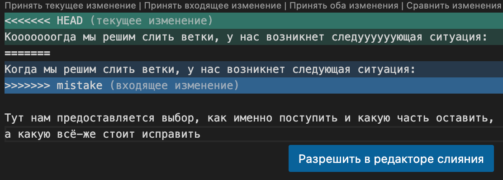

# Репозиторий для **pull request**
* В своём аккаунте на GitHub создать копию репозитория **"AndreyBulgakov19/SCV_GitPR"** с помощью кнопки **"Fork"**.
---
* Клонировать копию репозитория на локальный компьютер.
---
* Создать новую ветку.
---
* Добавить файл с инструкцией в новую ветку.
---
* Дополнить инструкцию разделами по работе с удалёнными репозиториями, pull request.
---
* Зафиксировать изменения (коммиты).
---
* Отправить изменения на GitHub.
---
* На сайте GitHub выполнить **Pull request**.
---


# Работа с  Git 
## 1. Проверка наличия установленного GIT 
 В терминале выполнить команду 
 
 `git -- version`

Если GIT установлен, то появится сообщение с информацией о версии программы, иначе будет сообщение об ошибке/

## 2. Установка GIT
 Загружаем последнюю версию программы с 
  [сайта](https://git-scm.com/download/)
 Устанавливаем с настройками по умолчанию.

## 3. Настройка GIT
Открываем программу и проходим регистрацию.
Для того, чтобы зарегистрироваться необходимо:

1. Открыть терминал
2. Вводим данные вашего имени 

`git config --global user.name "<ваше имя>"`

3. Вводим данные вашей электронной почты

`git config --global user.email "<адрес_почты>"`

## 4. Инициализация репозитория

Теперь необходимо создать/инициализировать репозиторий.
Для этого выполним команду:

`git init`

Теперь GIT может отслеживать изменения файлов вашего проекта.

## 5. Запись изменений в репозитории

Для сохранения файла в созданный репозиторий, необходимо выполнить команду:

`
 git add <имя файла>
`
Если необходимо сохранить несколько или все файлы сразу, выолним команду 

`
 git add .
`

Далее необходимо создать сам коммит.

`
git commit -m "<комментария>"
`

 **ВАЖНО:** 

* Обязательно указывать комментарий/описание действия
* Комментарий вносим в кавычки

## 6. Просмотр истории коммитов
Для просмотра истории всех предшествующих коммитов, выполним команду:

 `
git log
 `

Для просмотра истории всех коммитов в виде графа/дерева, выполним команду:
 
 `
git log --graph
 `
## 7. Перемещение между сохранениями (коммитами)

Для перемещения между коммитами используем команду:

`
git checkout
 `

 Для пермещения в основное/ актуальное состояние используем команду:

 `
git checkout master
 `  или  `
git checkout main
 `

 ## 8. Игнорирование файлов
Для того, чтобы исключить из отслеживания в репозитории определенные файлы или папки, необходимо создать файл ***.gitignore*** и записать в него их названия или шаблоны, соответствующие таким файлам и папкам.

## 9. Создание веток в GIT
По умолчанию имя основной ветки в GIT - ***master \ main***.
 Создать ветку можно командой:
  ```
git branch <имя новой ветки>
  ```

## 10. Слияние веток в GIT

Слияние веток проводится командой 
```
git merge < название ветки >
  ```
 **ВАЖНО!**
 Для слияния веток необходимо сперва перейти на ту ветку  **К** которой мы хотим добавить текущую. 
 Переход на другую ветку выполняется командой:

 ```
git checkout < название ветки >
  ```
  
  ## 11. Разрешение конфликтов

  В процессе слияния веток может произойти конфликт.
  В таком случае необходимо вручную его разрешить т
  .е выбрать вариант, который мы хотим оставить.

  **ПРИМЕР:**
  
  

## 12. Удаление веток

 Для того, чтобы удалить ранее слитую ветку необходимо выполнить команду:

   ```
git branch -d <имя ветки>
  ```

**ВАЖНО:**

Нельзя удалить ветку находясь в ней- необходимо перейти на ветку  master/ main!

# ***Работа с удаленными репозиториями***

1. Создать аккаунт на GitHub
2. Создать локальный репозиторий
3. Создать удаленный репозиторий
4. Связать локальный репозиторий с удаленным
5. Копировать внешний репозиторий на свой ПК можно командой 
```
git clone
```
6. Получить изменения из удаленного репозитория и выполнить слияние с локальной версией
```bash
git pull
```

```C#
while (n < 0)
{
n++;
}
```

7. Отправить локальную версию репозитория на внешний  
```
git push
```

8. Получить список связанных репозиториев 
```
git remote
```

9. Отправить запрос на вливание изменений в удаленный репозиторий 
```
 pull request
```
