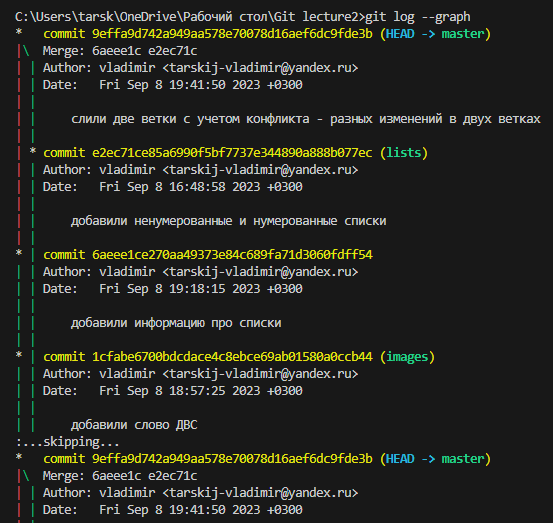

## 1.	Проверка наличия установленного Git: 
В терминале выполнить команду Git –version
Если git установлен, появится сообщение с информацией о версии программы, иначе будет сообщение об ошибке.
## 2.	Установка Git – загружаем последнюю версию программы с сайта https://git-scm.com/ 
Устанавливаем с настройками по умолчанию
## 3.	Настройка Git:
- необходимо представится
Git config –global user.email tarskij-vladimir@yandex.ru
Git config –global user.name “Vladimir”
Проверяем командой:   
git config --global --list
## 4.	Инициализация репозитория - папки, создает локальный репозиторий (хранилище файлов поддерживающее версионность)
Создаем файл с расширением   .md
В терминале переходим к папке в которой хотим создать репозиторий и выполняем команду   git init  
- в исходной папке появится скрытая папка 
## 5.   Проверяем командой – git status
## 6.  Запись изменений в репозиторий
Подготавливаем файл к фиксации  - отслеживанию   git add «файл – tab»
## 7.	Git commit –m “создали новый файл”      -   комментарий, - фиксирует изменения и сообщает о появлении новых версий файлов
## 8.	Проверяем – git status
## 9.	Git log  - выводит список всех коммитов (сохранений) в хронологическом порядке
- выходим в терминал     q
## 10.	Git checkout “хеш код”      - выбор сохраненной версии – позволяет перемещаться между сохранениями
## 11.	Git checkout master   или   git switch   - переходим в актуальную версию
 Или     git switch master
## 12.	Git diff    -  gоказывает разницу между текущей и уже зафиксированной версией файла
- выходим в терминал     q
## 13.  Игнорирование файлов:
	- для того, чтобы исключить из отслеживания в репозитории определенные файлы или папки, необходимо создать там файл ***.gitignore*** и записать в него их названия или шаблоны, соответствующие таким файлам или папкам.
## 14.  Создание веток:
По умолчанию имя основной ветки в Git – ‘master’
Создать ветку можно командой:
```
Dash
Git branch <имя новой ветки>
```
Список веток в репозитории можно посмотреть с помощью команды:
```
Bash
Git branch
```

Текущая ветка будет отмечена звездочкой: **\*master**
## 15. Создание ветки и переключение на нее
Можно используя команды:
```Bash 
git checkout –b «название новой ветки» ,   или git switch –c «название ветки»  
```
## 16. Слияние веток и разрешение конфликтов
Для слияния выбранной ветки с текущей нужно выполнить команду:
```Bash
Git merge <название ветки>
```
Если была изменена одна и таже часть файла в обеих ветках, то может возникнуть конфликт, который потребует участия пользователя. VSCode предлагает варианты разрешения.
Чтобы разрешить конфликт нужно выбрать один из вариантов

У нас в этом блоке со списками есть два варианта:
1 сделаный из HEAD     - текущие изменения
2 сделанный из lists     -   входящие изменения
Можно принять оба варианта, сравнить и вручную удалить ненужное.
Можно принять разные версии 
Проверяем статус:
- напишет, что у нас есть не слитые пути.  
## 17. 	После разрешения конфликта необходимо выполнить коммит слияния
## 18. Удаление веток
Для удаления выбранной ветки нужно перейти в ветку master и выполнить команду:
```Bash
Git branch –d <название ветки>
```
Или
 ```Bash
Git branch –d <название ветки>
```
## 19. Смотрим логи:
Можно посмотреть в ином виде c командой:    
```Bash
git log –graph 
```

 
Можно посмотреть в укороченном варианте:
git log --oneline --graph



# Работа со своим репозиторием
20. Создаём локальный репозиторий в VSCode
- Создаем папку на рабочем столе / открываем в VisualCode
- Инициализируем папку – git init
- Создаем файл с расширением .md
21 . Создаем репозиторий на Github
22. Коннектим локальный репозиторий с репозиторием на github
выбираем : …..уже существующий репозиторий привязать к этому удаленному репозиторию
Копируем команды по отдельности и вставляем в терминал VSCode и выполняем 
a.    git remote add origin https://github.com/tarskijvladimir/Test.git   
-   программа git должна понять, что у нас появляется новый удаленный репозиторий, и указываем ссылку на него,  т.е связываем наш локальный репозиторий с удаленным
b.         git branch -M main    - указываем что основной веткой является main (Переименовываем ветку master в main )
c.    git push -u origin main    -  отправляем наши изменения с локального репозитория на удаленный
 (-u   - связывает две ветки удаленную с локальной и делает текущую ветку активной;     в orgin   - у нас спрятаны адреса из первой команды;   main   - в какую ветку отправляем )
Обновляем страницу на github:
23. Вносим изменения на нашей странице на Github (кнопкой Commit changes)
24. Получаем эти изменения в нашем локальном репозитории на нашем компьютере:
-  Стягиваем с репозитория на Github изменения командой: git pull   (эта команда – она составная – она не только подгрузит изменения , но попытается смерджить наши ветки – слить состояния которые были на github с состояниями в VSCode)
25. Конфликт:
Если сделаны изменения в репозитории на Github (с коммитом), а также сделаны изменения в VSCode и также сделан коммит,   -   и сделано стягивание (командой git pull)
Разрешение конфликта:
- Делаем слияние
- Добавляем и коммитим (одной командой): git commit –am <>
- И отправляем эти изменения в удаленный репозиторий командой git push
На gihub обновляем и смотрим изменения:
26. Делаем изменения в VSCode: 
Добавляем коммитим
Нужно отправить локальный репозиторий в удаленный (на github):
Чтобы изменения были на Github – надо дать команду: git push
И наша локальная копия перейдет в инет на Github
27. Ошибка!
Если сделаны изменения в репозитории на Github (с коммитом), а также сделаны изменения в VSCode (сделано добавление и коммит)   - НО не сделано стягивание (командой git pull), а сделано отправление (командой git push),  возникнет ошибка – что не все изменения получены – у нас не актуальная версия
VSCode подскажет что надо сделать команду git pull – обновить наш локальный репозиторий
=> слияние может произойти с конфликтом и без

Работа с чужим репозиторием
28. Заходим на Github
В строке поиска вбиваем чей то аккаунт
делаем копию этого репозитория кнопкой Fork 
– и у нас появится точно такой же репозиторий у нас на аккаунте, и мы можем этот репозиторий забрать:
Копируем код
29. Заходим в VSCode
Смотрим где мы находимся (в нашей папке в нашем локальном репозитории)
Открываем новую папку и клонируем сюда репозиторийй командой git clone <адрес репозитория>
Если проверим статус , то выйдет ошибка что это не репозиторий, т.к мы в папке которая не является репозиторием
Перейти в папку которая является репозиторием – т.е поменять директорию можно сделать 2 способами:
-  Можно через команду    cd <название папки>       (change direrectory)
-  Или открыть новый терминал в этой папке
Перходим в эту папку
 внутри этой папки есть скопированный нами проект, теперь сюда мы можем внести изменения, предложить доработки автору проекта
30. Создаем ветку и там создаем файл с описанием этого проекта:
Переходим на нее командой git checkout <название ветки>
Или составной командой git switch –c <название ветки>
Создаем новый файл внутри нашей папки
Делаем изменения 
Смотрим статус, проверяем ветку:
Добавляем и коммитим
Допустим Эти изменения с этой веткой мы хотим предложить человеку у которого мы взяли этот проект
31. Отправляем эти изменения на свой аккаунт:
Если сделаем просто команду git push – то ничего не получится,т.к мы на ветке new, которой нет на github
Программа подскажет, что надо ввести: git push –set u origin <название новой ветки> :
На Git hub – обновляем. Появляется новая ветка и кнопка для отправки в репозиторий с которого мы взяли
Если появилась кнопка Compare&pull request, то просто
32. Отправляем человеку на его репозиторий - Жмем кнопку
А если кнопки не появилось:
33. Идем во вкладку Pull requestrs / New pull request
Во вкладке compare main – выбираем новую ветку
Жмем – Create pull request
Если галочка появилась – значит все норм
34. Мы как авторы пул реквеста можем написать только комментарий, и больше ничего:


