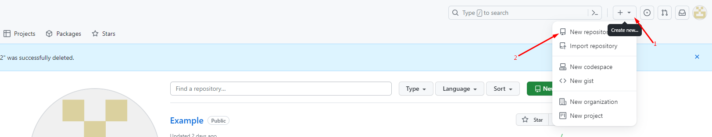

# _**Работа с Git**_

## *1. Проверка наличи установленного Git*
В терминале выполнить команду 
```
git version
```
Если `Git` установлен появиться сообщение с информацией о версий программы, иначе будет сообщение об ошибке. 

* Пример как должно быть (для windows 11):


## *2. Установка Git*
Загружаем последнюю версию программы с [сайта ](https://git-scm.com/download/win): Устанавливаем с настройками по умолчанию.

## *3. Настройка Git*
После установки необходимо **"представиться"** системе контроля версий. Это нужно сделать всего один раз, и `Git` запомнит вас. Для этого нужно ввести в терминале 2 команды:
```
git config --global user.name "Ваше имя английскими буквами"
```
* Например, `git config user.name "Jhon Li"`
```
git config --global user.email ваша почта@example.com
```
* Например, `git config user.email jhonli@gmail.com`

## *4. Инициализация репозитория*
Для создания нового репозитория используется команда 
```
git init
```
 Команду `git init` выполняют только один раз для первоначальной настройки нового репозитория. Выполнение команды приведет к созданию нового подкаталога `.git` в вашем рабочем каталоге. Кроме того, будет создана новая главная ветка.

*  Пример:


## *5. Запись изменений в репозиторий*
```
git status
```
Команда `git status` отображает состояние рабочего каталога и раздела проиндексированных файлов. С ее помощью можно проверить индексацию изменений и увидеть файлы, которые не отслеживаются Git. При этом статус __«Закоммичен»__ не отобразится.

 * Пример:


```
git add
```
Команда `git add` используется для добавления изменений в индекс Git. Индекс - это промежуточный слой между рабочей директорией (где находятся ваши файлы) и репозиторием Git (где сохраняются изменения). Когда вы делаете изменения в файлах в рабочей директории, они не автоматически добавляются в индекс. Для того, чтобы добавить изменения в индекс, необходимо использовать команду `git add`.
* Например, `git add Git_instruction.md`, где **Git_instruction.md** название вашего файла.

```
git commit
```
Команда `git commit` используется для сохранения изменений, сделанных в вашем локальном репозитории, в истории коммитов. Каждый коммит в `Git` имеет уникальный идентификатор, дату и время коммита, имя автора, электронную почту и сообщение, описывающее изменения. Важно отметить, что каждый коммит должен иметь уникальное сообщение в ковычках *(" ")*, которое описывает изменения в нем. Это помогает вам и другим членам команды понимать, что было изменено и почему. Также эта команда принимает несколько аргументов:

* `-m` означает "message" (сообщение) и <сообщение коммита> - это краткое описание изменений, сделанных в коммите. Например `git commit -m "Добавили заголовок"`;

* `-a` переносит все отслеживаемые файлы в область подготовленных файлов и включает их в коммит (позволяет пропустить **`git add`** перед коммитом) Например `git commit -а "Добавили заголовок"`;;

* `--amend` заменяет последний коммит новым изменённым коммитом, что бывает полезно, если вы неправильно набрали сообщение последнего коммита или забыли включить в него какие-то файлы.

```
git diff
```
Команда `git diff` используется для просмотра различий между версиями файлов в репозитории. Она показывает, какие изменения были сделаны в файлах с момента последнего коммита.
 * Пример:


## 6. Синтаксис языка Markdown
Чтобы выделить текст курсивом необходимо обрамить его звездочками (*) или знаками нижнего подчеркивания(_). Например, *вот так* или _вот так_.

Чтобы выделить текст полужирным, необходимо обрамить его двойными звездочками (**) или двойным знаком нижнего подчеркивания (__). Например, **вот так** или __вот так__

Альтернативные способы выделения текста жирным или курсивом нужны для того, чтобы мы могли совмещать оба этих способов. Например, _текст может быть выделен курсивом и при этом быть **полужирным**_

Чтобы зачеркнуть текст, необходимо обрамить его двойными волнистыми линиями (~~). Например, ~~вот так вот~~

Чтобы добавить ненумерованные списки, необходимо пункты выделить звездочкой (*) или знаком +. Например, вот так:
* Злемент 1
+ Элемент 2

Чтобы добавить нумерованные списки, необходимо пункты просто пронумеровать. Например, вот так:
1. Первый пункт
2. Второй пункт

Чтобы вставить изображение в текст, достаточно написать следующее:
``, где `[]` описание картинки(если вдруг картинка не загрузиться) а `()` где название картинки с форматом. Например: 
```

```
Чтобы вставить ссылку надо в текст, достаточно написать следующее:
`[]()`, где `[]` описание и название ссылки, а `()` где URL адрес ссылки. Например: 
```
[Google](https://www.google.kz/)
```
## *7. Просмотр истории коммитов*
```
git log
```
Выводит список всех коммитов. Каждый коммит включает SHA-1 хеш, автора коммита, дату и время коммита, и комментарий.  У этой команды есть разные опции, самая используемая из них — `--oneline`. Она показывает хеш в укороченном формате, ветку, в которой сделан коммит, а также текст коммита. Чтобы использовать эту опцию (как и любую другую), нужно добавить её после команды: `git log--oneline`. 
* Например `git log`: 


* Например `git log --oneline`


Параметр `--graph` используется для построения диаграммы из символов ASCII, отражающей структуру веток в истории коммитов. Обычно его используют в сочетании с командами --oneline
* Например `git log --graph --oneline`


## *8. Перемещение между сохранениями(коммитами)*
Команда `git checkout` в `Git` используется для переключения между ветками, проверки коммитов и отката изменений. Она позволяет переключаться между различными состояниями вашего репозитория. Примеры использования:
* Переключение на ветку `master` или `main`:
```
git checkout master
или
git checkout main
```
* Переключение на определенный коммит:
```
git checkout b5bcb04
Эта команда переключает вас на коммит с указанным идентификатором.
```

## *9. Игнорирование файлов*
```
.gitignore
```
Для того, чтобы исключить из отслеживания в репозитории определённые файлы или папки необходимо создать файл `.gitignore` *(обязательно названия файла начинается с точки)* и записать в него их названия или шаблоны, соответствующие таким файлам или папкам. Это файлы и каталоги, которые были недавно размещены (добавлены с помощью `git add`) и зафиксированы (закоммичены с помощью `git commit`) в главном репозитории.

## *9. Создание веток в Git*
По умолчанию имя основной ветки в Git - **master**.
Создать ветку можно командой:
```bash
git branch <имя новой ветки>
```
```bash
git switch <имя новой ветки>
```
После данной операции ветка уже была создана, но вы по-прежнему находитесь в прежней ветке. Если вы планируете переместиться на другую ветку, в том числе только что созданную, необходимо написать `git checkout` или `git switch`:
```bash
git checkout <имя ветки>
```
```bash
git switch <имя ветки>
```
Чаще всего при создании новой ветки git пользователю необходимо сразу же переключиться на нее. В таком случае стоит использовать `git checkout с ключом -b`:
```bash
git checkout -b <имя новой ветки>
```
Список веток в репозитори можно посмотреть с помощью команды:
```bash
git branch
```
## *10. Слияние веток и разрешение конфликтов*
```bash
git merge
```
Слияние используется в `Git`, чтобы собрать воедино разветвленную историю. Команда `git merge` выполняет слияние отдельных направлений разработки, созданных с помощью команды `git branch`, в единую ветку. Обратите внимание: все приведенные ниже команды выполняют слияние в текущую ветку, в то время как целевая ветка остается без изменений. Поэтому команда `git merge` часто используется в сочетании с командами `git checkout` (для выбора текущей ветки).Перед слиянием следует предпринять несколько подготовительных действий, чтобы операция прошла без проблем.
* Выполните команду `git status`. Это позволит убедиться, что **HEAD** указывает на ветку, принимающую результаты слияния. При необходимости выполните команду `git checkout <принимающая-ветка>`, чтобы переключиться на принимающую ветку. Для примера выполним команду `git checkout master`.
* После указанных выше действий по подготовке можете приступать к слиянию. Для этого выполните команду `git merge <название ветки>`, где `<название ветки>` — название ветки, которая будет объединена с принимающей.

Помимо сценария, описанного в предыдущем пункте, конфликты регулярно возникают при слиянии ветвей или при отправке чужого кода. Иногда конфликты исправляются автоматически, но обычно с этим приходится разбираться вручную — решать, какой код остается, а какой нужно удалить. Пример конфликта при слиянии ветки:

где, `<<<<<<< HEAD` это текущая ветка(принимающая), а `>>>>>>> merge` это входящая ветка. Тут у нас есть выбор решение конфликта: _принять текущее изменение_,  _принять входящее изменение_, _принять оба изменения_ или _сравнить изменения_. После выбора решение можно коммитить.

## *11. Удаление веток*
Удаление веток не такой простой процесс, как может показаться. Можно случайно удалить несохраненные изменения в исходном коде, что приведет к нежелательным последствиям. Поэтому здесь нужно действовать осторожно. С операцией удаления над ветками справляется уже привычная команда`git branch с параметром -d`:
```bash
git branch -d <имя ветки которую удаляем>
```
Для корректного удаления нужно помнить несколько правил, чтобы не получить ошибки:
* Нельзя удалить ветку, в которой вы находитесь. `Git` выкинет ошибку и не произведет удаление. Следовательно, нужно перейти на другую ветку.
* `Git` не позволит удалить ветку, у которой есть несохраненные изменения. Так мы избегаем ситуации, когда часть написанного кода будет безвозвратно утеряна. Если же мы уверены, что изменения в этой версии не нужны и их можно смело удалять, то вместо флага `-d` используем `-D`:
```bash
git branch -D <имя ветки которую удаляем>
```
## *12. Создание удалённого репозиторий*
*Удаленный репозиторий* – это репозиторий, размещенный в локальной или интернет сети. Удаленный репозиторий используется для того, чтобы делиться и обмениваться кодом между разработчиками в рамках сети. Его также можно использовать, если вы разрабатываете проект на нескольких устройствах. Чтобы с ними работать, надо сделать следующие действий:

**1.** Перейти на сайт [Github.com](https://github.com/) и там создать аккаунт.После этого создадим новый репозиторий на `GitHub`. Для этого на сайте `GitHub` кликните на значок плюса справа сверху и появиться такое окно:

- Owner (владелец) – выбрать персональный аккаунт, который будет иметь полный доступ к данному репозиторию.
- Repository name (название репозитория) – при названии репозитория принято использовать PascalCase (составные слова с заглавной буквы) и kebab-case (составные слова через дефис).
- Description (описание) – описание проекта.
- Public – кто угодно может просматривать репозиторий, но коммитить смогут только те аккаунты, которым вы предоставите доступ.
- Private – никто, кроме вас, не сможет коммитить или просматривать данный репозиторий без права доступа.
- Add a README file – создает readme.md файл, который нужен для добавления длинного описания(галочку лучше не ставить, так как мы файл README сами создадим).

Как все заполнили нажимаем **Create repository** нас перекинет на страницу нашего нового репозитория. Тут `GitHub` предлогает все далнейшие инструкции.
```bash
git remote add origin https://github.com/Имя вашего аккаунта/название репозитория.git
git branch -M main
git push -u origin main
```
**2.** Открываем репозиторию, которую хотим отправить на **GitHub**. В терминале пишем:
- для начала смотрим `git status`, если все нормально, то переходим дальше

- теперь добавляем удаленный репозиторий командой `git remote add origin: https://github.com/имя вашего аккаунта/название репозитория.git`

- `git branch -M main` тут меняем название ветки на **main**, так требует **GitHub**. Как проверить, поменялось ли название, можно через команду `git branch`

- `git push -u origin main` после этой команды наш локальный репозиторий отправили на **GitHub**. При первом её использовании нужно пройти авторизацию, переходя по ссылке, которая выдаст **git** в терминале.

- при последующем изминении в локальной репозиторий, отправляем на **GitHub** через простую кманду: `git push`

## *13. Работа с удалёнными репозиториями*
Первое, что нужно сделать в работе с удаленным репозиторием — клонировать проект себе в локальный. Для этого дела мы экспортируем нужный нам проект c сайта GitHub, который мы делали локально, и теперь каждый его может себе клонировать. 
1. Как нашли проект проваливаемся на него и там нажав на большую зеленую кнопку `<> Code` на странице репозитория на GitHub. 

2. Заходим на компютере в программу **VScode** открываем новую папку куда будем клонировать и терминале пишем:
```bash
git clone https://github.com/Yernur-Mukashev/git_instruction.git
```


После этого вводим команду `cd git_instruction/`, где **git_instruction** название вашего репозиторий. Это команда нужна для того что бы мы могли редактировать файл.

Чтобы отправить изминение вводим команду: 
```bash
git push
```  
 
 3. Еще можно вводить изминения на самом сайте **GitHub**. Для этого на сайте находими наш проект и проваливаемся в `.md` файл. Там находим пункт **Edit this file** (иконка ввиде карандаша). После этого можно вводит свои изминение. Закоммитить надо через **Commit changes**. 

Если хотим выгрузить последние изминение с удаленного репозиторий выполняем команду в программе **VScode**: 
```bash
git pull
```

4. Для того, чтобы просмотреть список настроенных удалённых репозиториев, вы можете запустить команду `git remote`. Она выведет названия доступных удалённых репозиториев. Если вы клонировали репозиторий, то увидите как минимум *origin* — имя по умолчанию, которое **Git** даёт серверу, с которого производилось клонирование
```bash
git remote
```
5. Еще можно работать с чужими репозиториями и пооучаствовать в проекте. Для этого на **GitHub** находим чужой проект например: 

Надо скоприровать проект на свой аккаунт через `Fork`. Как нажали на иконку `Fork`, появиться новое окно там надо будет дать названия проекту(поумолчанию будет название чужого проекта) или можете оставить как есть. Дальше по пункту 1 и 2.

После этого можем отправить этот проект автору(хозяйну чужого репозиторий) через кнопку `pull requests` на проверку. 


### Все закончили...