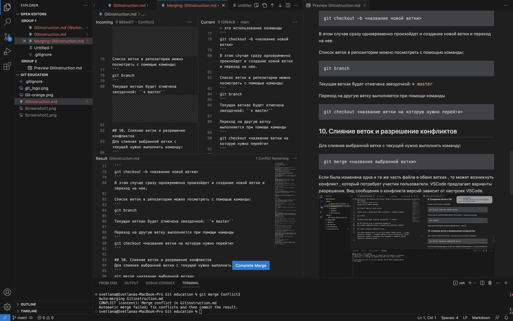

# Работа с Git

## 1. Проверка наличия установленного Git
В терминале выполнить команду `git --version`. Если файл установлен, появится сообщение с информацией о версии программы, иначе будет сообщение об ошибке.

## 2. Установка Git
Загружаем последнюю версия Git с [сайта](https://git-scm.com/downloads). Устанавливаем с настройками по умолчанию.

## 3. Настройка Git
При первом использовании Git необходимо представиться. Для этого нужно ввести в терминале 2 команды: 

* `git config --global user.name` «Ваше имя английскими буквами»
* `git config --global user.email` ваша почта@example.com 

С помощу команды `git config --global --list` можно потом проверить имя и электроную почту.

## 4. Создание репозитория
 ### Что такое репозиторий Git?
 Репозиторий Git — это виртуальное хранилище проекта. В нем можно хранить версии кода для доступа по мере необходимости.
 ### Инициализация нового репозитория: *git init*
 Для создания нового репозитория используется команда `git init`. Команду `git init` выполняют только один раз для первоначальной настройки нового репозитория. Выполнение команды приведет к созданию нового подкаталога **.git** в вашем рабочем каталоге. 

 ## 5. Основные команды Git
 ### Команда *git status*
 Показывает текущее состояние гита, есть ли изменения, которые нужно закоммитить/сохранить.
 ```
 Чтобы вызвать ранее введённую команду, пользуемся стрелками на клавиатуре. Перебираем недавно введённые команды нажатием стрелки «вверх».
 ```
  ### Команда *git add*
  Добавляет содержимое рабочего каталога в индекс (staging area) для последующего коммита. Эта команда дается после добавления файлов. Писать название файла целиком не обязательно: терминал дозаполнит данные автоматически с помощу клавиши **Tab**.
  * Если хотим добавить конкретный файл то можно написать так: `git add <имя_файла>`
  * Если хотим добавить все файлы проекта в наш будующий commit: `git add .`

  ### Команда *git commit*
 *зафиксировать или сохранить*
 
 Команда **git commit** берёт все данные, добавленные в индекс с помощью **git add**, и сохраняет их слепок во внутренней базе данных, а затем сдвигает указатель текущей ветки на этот слепок.

 Теперь создаем commit. *Обязательно указываем комментарий и не забываем про кавычки.*

`git commit -m "<комментарий>"`

```
Можно написать эти две команды (git add и git commit) в одной команде:
```
* `git commit -аm "<комментарий>"`  *или*
* `git commit -а -m "<комментарий>"`

Если вдруг вы забыли или ошибочно запустили git commit без параметра `-m` открывается встроенный редактор, где что-то сделать мышкой невозможно. Нужно повторять вот такую последовательность шагов:

1. Сначало нужно нажать английскую клавишу `i`, и появится возможность в верхней строке (там где показано на скриншоте) напечатать комментарий к данному коммиту, которую мы пропустили. 
2. Затем после добавления комментария нужно нажать клавишу `Esc` и появится возможность напечатать в нижней части экрана (как показано на скриншоте) `:wq` и нажать Enter.

После этих шагов мы снова выходим в командную строку.


### Команда *git log*
 После того как вы создадите несколько коммитов, вы вероятно захотите оглянуться назад и узнать, что же происходило с этим репозиторием. Наиболее простой и в то же время мощный инструмент для этого — команда `git log`.

 По умолчанию, без аргументов, `git log` выводит список коммитов созданных в данном репозитории в обратном хронологическом порядке. То есть самые последние коммиты показываются первыми. Эта команда отображает каждый коммит вместе с именем и электронной почтой автора, датой создания и комментарием. Это будет длинный список, чтобы после этой комманды вернуться в командную строку нужно нажать клавишу `q`.

 Существует превеликое множество параметров команды `git log` и их комбинаций, для того чтобы показать вам именно то, что вы ищете. Здесь мы покажем вам несколько наиболее часто применяемых.

 * Один из наиболее полезных параметров — это -p, который показывает дельту (разницу/diff), привнесенную каждым коммитом. Вы также можете использовать -2, что ограничит вывод до 2-х последних записей: `git log -p -2`
 * Параметр *oneline* выводит каждый коммит в одну строку, что удобно если вы просматриваете большое количество коммитов: `git log --oneline` таким образом мы увидим на экране только первые 7 символов коммита и комментарий к ним (как показано ниже на скриншоте).

 

### Команда *git diff*
Показывает разницу между текущим файлом и сохранённым:

```
git diff
```

### Команда *git checkout*/*git switch*

Позволяет сделать переход от одного коммита к другому. Это можно сделать например предварительно выполнив команду `git log --oneline` и скопировав первые 4-5 символы нужного нам коммита. 

Например: `git checkout c4e65` 

Потом нужно обязательно вернуться в тот, где работаем, при помощи команды `git checkout master`.

```
git switch делает ту же функцию, только эта команда относительно новая, появилась в последних версиях Git-а и рекомендуется использовать именно ее.
```
*Переключение между ветками с помощу **`git checkout`** будет описано ниже.*

 ## 6. Игнорирование файлов
 Для того чтобы исключить из отслеживания в репозитории определенные файлы или папки, необходимо создать там файл ***.gitignore*** и записать в него их названия или шаблоны, соответствующие таким файлам или папкам.

 
 * Например, если мы хотим игнорировать все файлы с форматом `png`, нужно в созданном файле ***.gitignore*** написать `*.png`.

 ## 7. Создание веток в Git
Ветка в Git — это простой перемещаемый указатель на один из таких коммитов. 
По умолчанию, имя основной ветки в Git — ***master***. Как только вы начнёте создавать коммиты, ветка *master* будет всегда указывать на последний коммит. Каждый раз при создании коммита указатель ветки master будет передвигаться на следующий коммит автоматически.
 
 Создать ветку можно командой: 
 ``` 
 git branch <имя новой ветки>
 ```

Переключиться на новую ветку можно с помощью команды: 
```
git checkout <имя новой ветки>
``` 

Чтобы создать ветку и переключиться на нее за одно действие, можно воспользоваться командами: 
```
— git checkout -b <название ветки>
— git switch -c <название ветки>
```
 Список веток в репозитории можно посмотреть при помощи команды `git branch`.

## 8. Слияние веток и разрешение конфликтов
Для слияния выбранной ветки с текущей нужно выполнить команду:
``` 
git merge <Название выбранной ветки>
```

*`
Если была изменена одна и та же часть файла в обеих ветках, то может возникнуть конфликт, который потребует участия пользователя.
`*

**Visual Studio Code** предлагает вариант с разрешением конфликтов. 


После разрешения конфликтов обязательно нужно сделать коммит слияния и разрешения конфликтов.

 

 Тут нам может понадобится команда `git log --graph`, которая выводит коммиты в виде дерева, в командной строке псевдографикой. Плюс выводит список измененных файлов.

## 9. Удаление веток


Чтобы удалить ветку в **Git** можно воспользоваться командами:
``` 
- git branch -d <Название выбранной ветки>
- git branch --delete <Название выбранной ветки>
```
*`Нельзя удалить ветку находясь в этой ветке.`*

Будет ошибка при попытке удалить неслитую ветку.

 

 ## 10. Работа с удоленными репозиториями
 ### Работа со своими репозиториями
 #### *Создать удаленный репозиторий*
 Для того, чтобы создать удаленный репозиторий нужно сначала создать аккаунт на GitHub-е. После этого на страничке GitHub-а в правом верхнем углу будет виден плюсик, нажав на которого на первой строчке будет написано **"New repository"**. 

 

 Нажимаем на **"New repository"** и открывается такое окно, в котором мы должны написать имя нового репозитория. Если на нашем аккаунте нет репозитория с тем же именем то при создании не будет никаких проблем.

  

  #### *Связать удаленный репозиторий с локальным*

  Для того, чтобы связать удаленный репозиторий с локальным нужно выполнить следующую команду:

 ```
 git remote add <имя для репозитория> <url-адрес репозитория в сети>
 ```
Например: git remote add origin https://github.com/margaritamihranyan/Homework.git

  * *где **origin** это название этого репозитория, краткий псевдоним, чтобы нам каждый раз не использовать длинный адрес.*

  С помощу команды `git remote` можно проверить добавился ли удаленный репозиторий к локальному.
  
  Следующая команда это переименование текущей ветки в `main`.

 ```
 git branch -M main
 ```

 И чтобы отправить изменения в удаленный репозиторий выполняем команду: 
  ```
 git push -u origin main
 ```
* *Если вы отправляете в первый раз, тогда Git предложит сначала выполнить авторизацию в вашем аккаунте на GitHub-е.*

После этого у нас на GitHub-е появляется возможность работать с этим файлом удаленно. Нажав на иконку которая показана на скриншоте можно отредактировать файл.


После того как мы внесли изменения у нас появляется возможность сохранить изменения и закомитить это. 


Записываем имя коммита и сохраняем изменения.


После этого, чтобы эти изменения перенести в локальный репозиторий мы выполняем команду: 
```
git pull
```
Это команда не только переносит изменения с удаленного репозитория в локальную а еще и делает `git merge` функцию.

Если отправляем изменения из локального репозитория в удаленный не в первый раз можем выполнять команду без параметров: 
```
git push
```
* *Но если наши коллеги ( или мы сами ) внесли изменения в удаленном репозитории, которые не перевели в локальный ( сделали *pull* ) и попытаемся выполнить команду `git push` то Git не выполнет эту команду и подскажет нам, что сначала нужно сделать `git pull`.*

Если при команды `git pull` появляются конфликты, нужно так же как было показано в предедущих параграфах разрешить конфликт и закоммитить разрешение конфликта.

### Работа с чужимы репозиториями

Для того чтобы работать с чужим репозиторием, находим любой интересующий нас репозиторий нажимаем на Code и копируем HTTPS ссылку как показано на скриншоте.


Локально на компьютере создаем или открываем существующую папку, **которая не является репозиторием** и там в терминале выполняем команду:
```
git clone <HTTPS ссылка>
```
В результате у нас появляется папка с названием репозитория который был в сети. При желании можно в конце команды написать желаемое название новой папки и при создании название будет изменено.

Чтобы посмотреть историю репозитория щелчком правой кнопки мыши на новой созданной папке выбираем "Открыть во встроенном терминале".

Чтобы внести изменения в чужой репозиторий нужно сделать Fork. Fork - это копия чужого репозитория на нашем аккаунте.


Так же как было описано выше выполняем git clone в папке который не является репозиторием. 
Так как наши изменения будут считаться черновиком мы должны создать новую ветку и внести изменения на этой новой ветке. 

Когда после изменений на этой ветке мы попытаемся сделать `git push`, Git подскажет нам, что так-как мы работали на новой ветке мы должны выполнить команду:
```
 git push -u origin <название новой ветки>
```
После того, как мы успешно отправили свои изменения на свой аккаунт нам нужно предложить свои изменения автору этого репозитория. Для этого нам надо выбрать вкладку Pull requests как показано на скриншоте


 
* нажимаем на `New pull request` 
* во время Comparing changes меняем свою ветку из main в ту которой мы работали
* и после этого выполняем pull request
