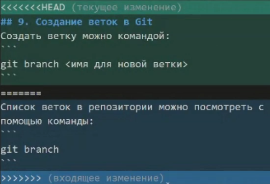

# Работа с Git и GitHub

## 1. Проверка наличия установленного Git
Для проверки наличия установленного Git выполните команду `git --version` в терминале.

Если Git установлен, то появится сообщение с информацией о версии программы. В противном случае будет выведено сообщение об ошибке.

## 2. Установка Git
Чтобы установить Git, загрузите последнюю версию с [официального сайта](https://git-scm.com/downloads).

## 3. Настройка Git
При первом использовании Git необходимо представиться. Для этого введите в терминале две команды:
```powershell
git config --global user.name "Ваше имя английскими буквами"
git config --global user.email "Ваша_почта@example.com"
```
## 4. Инициализация репозитория
Прежде чем начать работу с Git, необходимо инициализировать репозиторий. Перейдите в папку вашего проекта в терминале и выполните следующую команду:
```powershell
git init
```
Это создаст новый репозиторий в текущей папке, готовый к отслеживанию изменений.

## 5. Запись изменений в репозиторий

Чтобы сохранить изменения в репозитории, выполните следующие шаги:

1. Используйте команду для добавления файла или файлов к следующему коммиту:

    ```bash
    git add <имя_файла>
    ```

2. Затем выполните команду для создания коммита с сохраненными изменениями:

    ```bash
    git commit -m "Описание ваших изменений"
    ```

   *Коммит — это способ фиксации изменений в репозитории с указанием краткого описания того, что было сделано.*

3. Также вы можете использовать вариант команды `git commit -am`, который объединяет этап добавления в индекс и создание коммита в одну команду:

    ```bash
    git commit -am "Описание ваших изменений"
    ```

   Этот вариант подходит, если вы хотите фиксировать все измененные файлы. Команда не включает новые файлы, которые не были ранее отслеживаемыми Git.


## 6. Просмотр истории коммитов
Чтобы просмотреть историю коммитов и изменений в репозитории, используйте команду:

```powershell
git log
```
Вы увидите список коммитов с их идентификаторами, датами и описаниями.

## 7. Перемещение между сохранениями
Для переключения между различными коммитами или версиями вашего проекта, используйте команду 
```powershell
git checkout <идентификатор-коммита> 
```
или
```powershell
git checkout <название-ветки>.
```

## 8. Игнорирование файлов
Для того, чтобы исключить из отслеживания в репозитории определенные файлы или папки, необходимо создать там файл ***.gitignore*** и записать в него их названия или шаблоны, соответствующие таким файлам или папкам.

Примеры шаблонов для файлов, которые можно указать в файле .gitignore:

Примеры шаблонов для .gitignore:

1. Игнорирование всех файлов с расширением .log, .tmp и .bak:
    ```
    *.log
    *.tmp
    *.bak
    ```

2. Игнорирование всех файлов в папке temp/ и её подпапках:
    ```
    temp/
    ```

3. Игнорирование конкретного файла "config.ini":
    ```
    config.ini
    ```

4. Игнорирование всех файлов и папок в корне проекта, кроме файла "README.md":
    ```
    !README.md
    ```


## 9. Создание веток в Git
Создать векту можно командой:
```powershell
git branch <имя-для-новой-ветки>
```
Список всех веток в репозитории можно просмотреть с помощью команды:
```powershell
git branch
```
Текущая ветка будет отмечена звездочкой: **\*master**

Создать новую ветку и сразу переключиться на нее можно командой:
```powershell 
git checkout -b <имя-для-новой-ветки>
```

## 10. Слияние веток и разрешение конфликтов
Для слияния выбранной ветки с текущей активной веткой используйте команду:
```powershell
git merge <название-выбранной-ветки>
```
Если была изменена одна и та же часть файла в обоих ветках, то может возникнуть конфликт, который потребует участия пользователя. VSCode предлагает варианты разрешения.

***Пример конфликта:***


## 11. Удаление веток

Для удаления веток в Git существуют две основные команды: `git branch -d` и `git branch -D`.

### 11.1. git branch -d

Флаг `-d` означает "delete" (удаление).
* Эта команда используется для безопасного удаления веток.
* Если ветка, которую вы пытаетесь удалить, была уже слита (merge) в текущей ветке, то Git позволит вам ее удалить. 
* Если же ветка не была слита, Git выдаст предупреждение и не позволит удалить ее с флагом `-d`, чтобы не потерять изменения.
* Пример:
    ```powershell
    git branch -d <название-ветки>
    ```
### 11.2. git branch -D:

* Флаг `-D` означает (принудительное удаление).
* Эта команда используется для принудительного удаления веток, даже если они не были слиты в текущей ветке и есть несохраненные изменения.
* Она полезна, если вы уверены, что ветка больше не нужна и не хотите тратить время на ее слияние или сохранение изменений.
* Пример: 
    ```powershell
    git branch -D <название-ветки>
    ```

## 12. Работа с удалёнными репозиториями
Git позволяет сотрудничать с другими разработчиками и хранить свой код на удалённых серверах, таких как GitHub, GitLab и другие.

### 12.1.  Регистрация на GitHub и создание нового репозитория

Прежде чем начать работу с удалённым репозиторием на GitHub, вам необходимо зарегистрироваться на сайте [GitHub](https://github.com/) и создать новый репозиторий. Для этого выполните следующие действия:

1. Зарегистрируйтесь на сайте GitHub, если у вас еще нет аккаунта.

2. После успешной регистрации, нажмите кнопку "New" (или "Создать новый репозиторий") на вашей домашней странице GitHub и укажите имя репозитория, описание и другие настройки по вашему усмотрению. Затем нажмите "Create repository" (или "Создать репозиторий").

### 12.2. Добавление удалённого репозитория
Чтобы добавить ссылку на удалённый репозиторий, используйте команду:
```powershell
git remote add <имя-удаленного-репозитория> <URL-удаленного-репозитория>
```
Пример:
```powershell
git remote add origin https://github.com/ваш-пользователь/ваш-репозиторий.git
```
### 12.3. Просмотр удалённых репозиториев
Для просмотра списка удалённых репозиториев, связанных с вашим локальным репозиторием, используйте команду:
```powershell
git remote -v
```
### 12.4. Синхронизация с удалённым репозиторием
Для получения изменений из удалённого репозитория в ваш локальный репозиторий используйте команду:
```powershell
git pull <удаленный-репозиторий> <ветка>
```
Пример:
```powershell
git pull origin master
```

### 12.5. Отправка изменений на удалённый репозиторий
Чтобы отправить свои изменения на удалённый репозиторий, используйте команду git push:
```powershell
git push <удаленный-репозиторий> <ветка>
```
Пример:
```powershell
git push origin master
```

Однако, важно учитывать, что если между вашим локальным репозиторием и удаленным репозиторием существуют различия (например, кто-то другой уже отправил изменения), git не позволит вам просто отправить изменения на удаленный репозиторий. В этом случае, будет конфликт, и git не позволит выполнить **push** до тех пор, пока вы не получите актуальные изменения из удаленного репозитория.

Чтобы решить конфликт и получить актуальные изменения из удаленного репозитория, выполните команду `git pull`

## 13. Pull Request (Запрос на включение изменений)
Pull Request - это механизм для интеграции изменений из одной ветки в другую. Он часто используется для предложения изменений в основную ветку проекта на хостинг-платформах, таких как GitHub.
### 13.1. Создание Pull Request
Чтобы создать Pull Request и предложить внести изменения в основную ветку проекта, следуйте этим шагам:

**1.	Создание копии (fork) репозитория:**
* Перейдите на веб-сайт хостинг-платформы (например, GitHub).
* Откройте репозиторий, в котором вы хотите предложить изменения.
* Нажмите кнопку `Fork`. Это создаст копию репозитория на вашем аккаунте.

**2.	Клонирование репозитория:**
* Склонируйте свою копию репозитория на свой компьютер с помощью команды `git clone`.*

**3.	Создание новой ветки:**
* Создайте новую ветку, в которой будут внесены изменения. Это можно сделать с помощью команды `git checkout -b <имя-ветки>`.

**4.	Внесение изменений:**
* Внесите необходимые изменения в файлы в вашей локальной ветке. Затем сделайте коммит и отправьте изменения на вашу удаленную копию репозитория с помощью `git push`.

**5.	Создание Pull Request:**
* Перейдите на веб-сайт хостинг-платформы в вашей копии репозитория.
* В меню навигации выберите вкладку `Pull Request`.
* Нажмите на кнопку `New Pull Request` (или аналогичную кнопку на вашей платформе).
* Здесь вы увидите выбор ветки исходного репозитория и ветки вашего репозитория. Выберите соответствующие ветки.
* После того как всё настроено, нажмите кнопку `Create Pull Request`.

