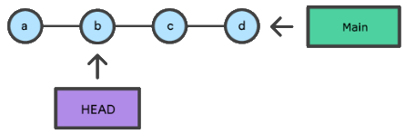
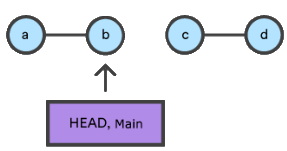
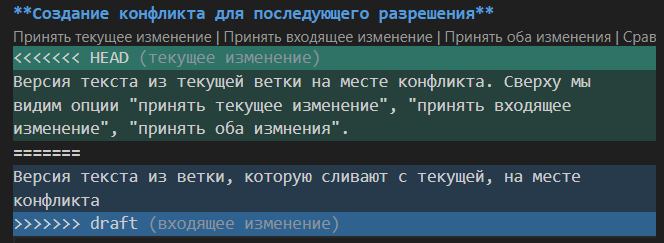

# Работа с Git и GitHub

## 1. Установка программного обеспечения
* **Контроль версий - Git**<br>
Загружаем последнюю версию программы c [официального сайта Git](https://git-scm.com/downloads). Устанавливаем с настройками по умолчанию.

* **Редактор кода - Visual Studio Code**<br>
Загружаем последнюю версию программы с [официального сайта Microsoft](https://code.visualstudio.com/Download). Устанавливаем с настройками по умолчанию. Изменить язык среды можно следующим образом: 
    
    CTRL+SHIFT+P - откроется строка поиска → Ввести `Configure Display Language` → Выбрать русский язык.

## 2. Проверка наличия установленного Git
1. Вызвать терминал с помощью комбинации "*Вид*" → "*Терминал*" или "*Терминал*" → "*Создать терминал*";
2. В терминале выполнить команду: 
```
git version
```
Если git установлен, появится сообщение с информацией о версии программы. Иначе будет сообщение об ошибке.

**Примечание**: если терминал "залип" и не дает ввести какие-либо значения, можно применить комбинацию **Ctrl+C**, актуально для bash.

## 3. Настройка Git
При первом использовании Git необходимо представиться.

Для этого нужно ввести в терминале 2 команды:
```
git config --global user.name "Ваше имя английскими буквами"
git config --global user.email ваша_почта@example.com
```
## 4. Инициализация репозитория
Для инициализация репозитория в открытой папке необходимо выполнить команду: 
```
git init
```
В результате будет создана ветка с именем `master`, а в текущей директории появится скрытая папка с названием .git .

## 5. Запись изменений в репозиторий
Не забываем сохранять изменения в файле **CTRL+S**. Для фиксации изменений в git следует выполнить следующие команды: 
```
git add + [параметры]
``` 
1. `git add [filename]` или `git add .`<br> 
    * В первом случае указанный файл проиндексируется и будет включен в следующую фиксацию.<br> 
    * Во втором случае индексируются сразу все изменённые файлы и папки в текущей директории.
```
git commit + [параметры]
```
2. `git commit -m "message"` - фиксация изменений (создается коммит).

Альтернативой  может стать модификация второй команды: `git commit -a -m "message"` или  `git commit -am "message"`. Она автоматически проиндексирует все файлы, которые были изменены или удалены в текущем каталоге, однако *новые файлы, ранее не сообщенные git*, добавлены не будут.

**Полезные команды**

```
git status
```
Отобразит состояние рабочего каталога и раздела проиндексированных файлов. С ее помощью можно проверить индексацию изменений и увидеть файлы, которые не отслеживаются Git;
```
git diff
```
Позволяет увидеть разницу между текущим файлом *(не забываем сохранить)* и закоммиченным файлом.

## 6 Просмотр истории коммитов
Для просмотра истории коммитов можно использовать модификации следующей команды:
```
git log + [параметры]
```

* `git log` - вывод на экран истории всех коммитов с подробной информацией (автор, дата, хеш-код, сообщение);
* `git log --oneline` - упрощенная версия, отображаются только первые 7 символов хеш-кода и комментарий;
* `git log --graph` - позволяет увидеть историю с визуализацией веток.

## 7 Перемещение между коммитами
Для перемещения из одного коммита в другой применяется команда
```
git checkout [хеш-код коммита]
```
**Пример работы команды**


1. Есть коммиты *A→B→C→D*;
2. Использование команды `git checkout B` вернет нас в состояние файла при сохранении *B*.
3. Вернуться к последнему актуальному коммиту можно с помощью команды `git checkout D` или специальной командой `git checkout master`.


*Замечание*: Если сделать новый коммит, находясь в состоянии *B*, коммиты *C* и *D* будут отрезаны, к ним невозможно будет вернуться.

## 8. Отмена коммита
Для отмены используется команда 
```
git reset [хеш-код коммита]
```

**Пример работы команды**


1. Есть коммиты *A→B→C→D*;
2. Использование команды `git reset B` переместит нас в коммит B и зафиксирует его как актуальный.  В результате коммиты *C* и *D* будут отрезаны, к ним невозможно будет вернуться. Из истории данные коммиты также пропадут.

## 9. Прекращение отслеживание файлов

Если нужно удалить файл из отслеживания, который был добавлен по ошибке, следует выполнить команду
```
git rm --cached <назване файла>
```
Далее файлы или папки можно добавить в специальный список, для этого необходимо создать в репозитории файл `.gitignore` и записать в него их названия или шаблоны соответствующим таким файлам или папкам. В таком случае Git не будет уведомлять о наличии данных неотслеживаемых фалов.

## 10. Создание веток в Git
**Создать ветку** можно с помощью различных команд:
```
git branch <имя новой ветки>
git checkout -b <имя новой ветки>
git swich -c <имя новой ветки>
```
Во втором и третьем случае произойдет сразу переключение на новую ветку. По-умолчанию имя основной ветки в git - `master`

**Cписок веток** в репозитории можно посмотреть с помощью команды: 
```
git branch
```
Напротив ветки, в которой мы находимся, будет установлена звездочка (*)

Если в названии ветки допущена ошибка, ее можно **переименовать** с помощью любой из указанных ниже команд. Первая команда применима только для текущей ветки.
```
git branch -m <новое имя>
git branch -m <текущее имя> <новое имя>
```
Для **перемещения между ветками** используются команды:
```
git checkout <название ветки>
git switch <название ветки>
```
## 11. Слияние веток и разрешение конфликтов

Для слияния веток используется команда 
```
git merge <название ветки>
```
При выполнении данной команды в текущую ветку добавится информация из указанной.

Если была изменена одна и та же часть файла в обеих ветках, то может возникнуть **конфликт**, который потребует участие пользователя.
VS Code предлагает варианты разрешения. Чтобы разрешить конфликт нужно выбрать один из вариантов, либо объединить содержимое по-своему.

*Пример конфликта на изображении*



## 12. Удаление веток
Для удаление слитой ветки используется команда:
```
git branch -d <название ветки>
```
Если ветка не слита ни с какой другой, Git уведомит об этом и предложит использовать команду для принудительного удаления ветки:
```
git branch -D <название ветки>
```
## 13. Клонирование удаленного репозитория на локальный ПК

```
git clone <url-адрес репозитория> 
```
Данная команда является составной: она не только загружает все изменения, но и пытается слить все ветки на локальном компьютере и в удаленном репозитории.

## 14. Работа с удаленным репозиторием
Для того, чтобы делать коммиты с разных компьютеров в удаленный репозиторий, требуется:

1. Создать аккаунт на [GitHub](https://github.com/);
2. Создать на своем компьютере локальный репозиторий;
3. Создать репозиторий на GitHub;
4. Связать локальный репозитория с созданным репозиторием на GitHub, сам сервис предложит различные варианты реализации, например.
    * `git remote add <name> <URL>` - создание подключения с удаленным репозиторием
    * `git branch -M main` - сделать ветку *main* основной
    * `git push -u origin main` - отправит локальные изменения в удаленный репозиторий.

**Для работы с удаленным репозиторием**

1. Создание нового подключения к удаленному репозиторию.
    ```
    git remote add <наименование> <URL-адрес репо в сети>
    ```
    Для просмотра сведений о указанном удаленном репозитории используется команда
    ```
    git remote show <наименование>
    ```
2. **Получение изменений** из удаленного репозитория и объединение их с текущей веткой.
    ```
    git pull
    ```
    Можно применить команду с параметрами `git pull  <имя репо> <название ветки>`. Тогда получим изменения из конкретной ветки и объединим их с текущей.
3. **Отправка локальных изменений в удаленный** репозиторий. При первом использовании потребует авторизацию.
    ```
    git push
    ```

    Если требуется отправить изменение в новую ветку, используется вариант команды `git push -u <наименование> <название ветки>`

## 14. Предложить изменения в чужом репозитории
Для этого необходимо осуществить pull-request. Это делается следующим образом:
1. В GitHub сделать форк (`fork`) интересующего нас репозитория;
2. Склонировать (`git clone`) нашу версию этого репозитория на локальный компьютер.
3. Создать новую ветку, в которой будем осуществлять изменения;
4. Произвести изменения только в этой ветке;
5. Отправить эти изменения на свой аккаунт (`push`);
6. В окне на GitHub появляется возможность отправить `pull request` 