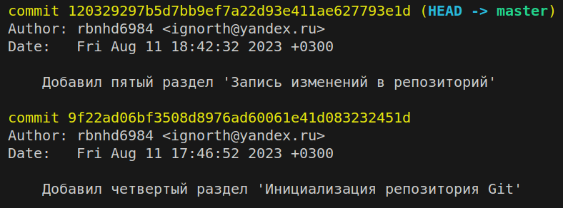

# Работа с Git и GitHub
## 1. Проверка наличия установленного Git
В терминале выполнить команду `git --version`.
Если Git установлен, появится сообщение о версии установленной программы, иначе появится сообщение об ошибке.

## 2. Установка Git
Загружаем последнюю версию Git с [сайта](https://git-scm.com/downloads). Устанавливаем с настройками по умолчанию.

## 3. Настройка Git
При первом использовании Git необходимо представиться.
Для этого необходимо ввести две команды:
```
git config --global user.name "Ваше имя английскими буквами"
git config -- global user.email "mail@example.com"
```

## 4. Инициализация репозитория Git
Для того, чтобы Git начал отслеживать изменения в файлах, необходимо произвести инициализацию репозитория с файлами. Для этого необходимо:

* создать папку для проекта / будущего репозитория;
* выполнить команду `git init`.

## 5. Запись изменений в репозиторий
Чтобы записать внесённые изменения в файлы репозитория необходимо проверить статус репозитория командой `git status`, если имеются измененные файлы Git об этом уведомит цвет измененного файла будет красным. __*См. рисунок*__


и предложит несколько команд на выбор для индексации и фиксации изменений файлов в репозитории. Если у вас произошли изменения в несколькольких файлах, но вы хотите проиндексировать только конкретный, то перед сохранением нужно использовать команду `git add "file_name"`, после этого статус файла в репозитории поменяется, проиндексированные файлы будут отмечены зеленым цветом. __*См. рисунок*__


Теперь можно сохранять изменения в репозитории командой `git commit -m "message"`. Так же вы можете использовать команду `git commit -am "message"` флаг `-a` позволит избежать использование команды `git add "file_name"`, но проиндексирует и сохранит изменения в репозитории для всех измененных или вновь добавленных файлов.

## 6. Просмотр истории коммитов
Чтобы просмотреть историю изменений можно воспользоваться командой `git log` для вывода подробной информации о сохранениях или `git log --oneline` для сокращенной. __*См. рисунки*__

---



## 7. Перемещение между сохранениями
Чтобы переключиться на нужный коммит необходимо выполнить команду `git checkout "commit_hash_code"`, где достаточно первых 4-7 символов хэш кода коммита, при этом вы будете отсоединены от последних изменений до выбранного коммита и сможете посмотреть на версию файла в прошлом, внести изменения и зафиксировать их.

Для возврата к текущему состоянию файла нужно выполнить команду `git checkout master` или `git switch -`.

## 8. Игнорирование файлов
Для того, чтобы исключить из отслеживания в репозитории определенные файлы или папки, необходимо создать файл ***.gitignore***  и записать в него их название или шаблоны, соответствующие таким файлам или папкам.

## 9. Создание веток в Git
Создать новую ветку можно командой 
```
git branch <branch_name>
```
Список веток репозитория можно посмотреть командой
```
git branch
```
Текущая ветка будет отмечена символом звездочка:

**\* master**


## 10. Слияние веток и разрешение конфликтов
Для слияния выбранной ветки с текущей нужно выполнить команду 
```
git merge <название выбранной ветки>
```

Если была изменена одна и та же часть файла в обеих ветках, то может возникнуть конфликт, который потребует участия пользователя.
VScode предлагает варианты разрешения:

+ *принять текущее изменение;*
+ *принять входящее изменение;*
+ *принять оба изменения;*
+ *сравнить изменения*.

__*См. рисунок*__


После разрешения конфликта необходимо выполнить коммит слияния, знакомая команда:
```
git commit -am "Разрешили конфликт слияния"
``` 

## 11. Удаление веток
Для удаления ветки можно использовать команду:
```
git branch -d <имя удаляемой ветки>
```
*__Примечание__*: Чтобы ветка успешно удалилась она должна быть не активной и слитой с основной. Если ветка не слита, вы получите предупреждение. 

__*См. рисунок*__


Используйте следующую команду, для принудительного удаления ветки:
```
git branch -D <имя ветки>
```

## 12. Работа с удалёнными репозиториями, pull request

Чтобы начать работу с удалёнными репозиториями необходимо зарегистрироваться на _[github](https://github.com)_

__Загрузка локального репозитория на__ _github_:

1. Нажать на __+__ или открыть выпадающее меню рядом с __+__ и выбрать команду _New repository_ 


2. Обязательно дать имя репозиторию

 

и нажать кнопку 


3. В локальном терминале перейти в папку этого репозитория и последовательно выполнить команды:

```
git remote add origin https://github.com/your_account_name/repo_name.git
```

```
git branch -M main
```

```
git push -u origin main
```

*__Примечание__*: при первом выполнении команды `git push -u origin main` появится запрос на авторизацию в _github_. После успешного прохождения авторизации локальный репозиторий будет загружен по указанному адресу - `https://github.com/your_account_name/repo_name.git`. Последующие изменения в основной ветке репозитория потребуют лишь команды `git push`. Создание и загрузка новой ветки в удалённый репозиторий потребует выполнить команду `git push -u origin <new_branch_name>`

__Клонирование удалённого репозитория на ПК__:

Перейти через терминал в папку куда требуется клонировать удалённый репозиторий и выполнить команду:

```
git clone <ссылка на удалённый репозиторий>
```

__Синхронизация изменений в локальном и удаленном репозитории__:

Если изменения произошли в локальном репозитории их необходимо синхронизировать с удалённым репозиторием командой:

```
git push
```

Если изменения произошли в удалённом репозитории их необходимо синхронизировать с локальным репозиторием командой:

```
git pull
```

__Работа с удалённым репозиторием другого разработчика__:

1. Создать удалённую копию репозитория стороннего разработчика на своем аккаунте:
    - перейти на страницу этого репозитория в github;
    - нажать кнопку __Fork__.

2. Клонировать этот репозиторий на ПК:
    - перейти на страницу "форкнутого" репозитория в своем аккаунте;
    - скопировать ссылку на этот репо;
    - сделать клон через локальный терминал - `git clone <ссылка на репозиторий>`

3. Внесение изменений в сторонний репозиторий:
    - перейти в папку с репозиторием;
    - создать новую ветку и перейти в неё `git switch -c <new branch name>`;
    - произвести (*создать новые файлы / редактировать имеющиеся*) и зафиксировать предлагаемые изменения в проекте - `git add <file name>`, `git commit -m "Adding edits"`;
    - отправить изменения в удаленный репозиторий - `git push -u origin <new branch name>`.

4. Создание запроса на внесение предлагаемых изменений:
    - перейти на страницу "форкнутого" репозитория и нажать на кнопку __Create Pull Request__;
    - оставить коментарий к изменениям (*не обязательно*);
    - подтвердить запрос на внесение изменений кнопкой __Pull Request__.

*__Примечание__*: если кнопка __Create Pull Request__ не появилась, необходимо перейти в меню __Pull requests__ выбрать репозиторий и ветку стороннего разработчика, в которые предлагается внести изменения, выбрать "форкнутый репозиторий" и ветку с внесёнными изменениям, оставить коментарий к изменениям (*не обязательно*), нажать кнопку __Pull request__. 