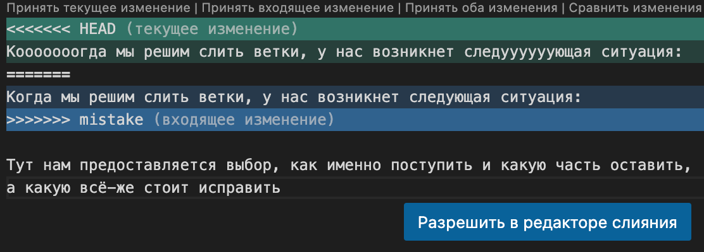

# Работа с Git

## 1. Проверка наличия установленного Git

В терменале VSCod выполнить команду: `git --version`.
Если Git установлен то появится сообщение с информацией о версии программы, иначе будет сообщение об ошибке.
## 2. Установка Git

Загружаем последнюю версию Git c [сайта](https://git-scm.com/downloads).
Устанавливаем с настройками по умолчанию.
## 3. Настройка Git

При первом использовании команды необходимо представиться.
Для этого нужно ввести в терминале 2 команды:

```
git config --global user.name "Ваше имя английскими буквами"
git config --global user.email "ваша почта@example.com"
```
## 4. Инициализация репозитория и работа с ним
1. Сначала, через меню файл VSCod открываем папку в которой будем создавать репозиторий.
2. Далее производим инициализауию репозитория в данной папке командой `git init`, наша папка к работе готова.
3. Добавляем файл (файлы) в данную папку. Их можно как создать (в проводнике VSCod есть кнопка создать файл) так и перенести из другого места.
4. Теперь эти файлы нужно добваить спомошью команды `git add имя файла.расширение` в индекс репозитория, чтобы гит начал отслеживать их изменения. Данную команду нужно использовать всякий раз когда мы изменили что либо в файле.
### Работа с файлами репозитория
Чтобы узнать какие файлы мы изменили и какие из них нужно снова добавить в индекс репозитория воспользуемся командой `git status`. В терминале красным цветом будут выделены файлы которые требуют добавления в индекс, а так же будут соответсвующие сообщения об этом от git.
Если мы не хотим чтобы git отслеживал некоротые файлы, и совершал сохранения состояния репозитория без каких либо проблем, нужно создать специальный файл (`.gitignore`). Информацию об этом смотри ниже в разделе 8. Игнорирование файлов.
Если мы добавили не тот файл в репозиторий и отслеживали его, а потом удалили или переименовали, то  git при команде статус будет показывать этот файл как удаленный, для того чтобы правильно удалить файл используем команду `git rm имя файла`
## 5. Запись изменений в репозитории. Работа с коммитами
Перед записью изменений необходимо чтобы все изменения в файлах были сохранены и сами файлы добавлены в индекс репозитория. Иначе записи состояния не получится. Перед коммитом мы проверяем состоряние репозитория командой `git status`.

Запись осуществляется командой `git commit -m "Краткий комментарий о сделанных изменениях"`. Лучше всегда делать комментарий о изменениях, так будет понятно что менялось в этой версии. 
Альтернативный вариант записи состояния репозитория: `git commit -am " комментарий"`. Данная команда отличается от предыдущей тем что не нужно делать добавление указанного файла в индекс репозитория (git add), это будет сделано в этом процессе. Однако если добавляемый файл новый и ни разу не добавлялся в индекс репоитория, то команда не сработает и нужно использовать команды (git add и git commit -m).

## 6. Просмотр истории коммитов
Для просмотра истории всех коммитов с самого начала работы мы используем команду `git log`
Данная команда выводит список всех коммитов, их хеш код, имя автора, его контактную информацию,дату сохранения.


## 7. Перемещение между коммитами
Для того чтобы мы могли посмотреть состояние какого либо  коммита, чтобы могли перемещаться между ними для этого нужно знать их хеш код. Данный код можно посмотреть применив команду `git log` или `git log --oneline`(построчный вывод краткой информации о коммите). 
Далее используем команду `git checkout хеш коммита` и файл приобретает вид на момент сохранения коммита.
```
 В процессе экспериментов с изменением файлов репозитория на различных ветках и различных коммитах было выявлено что перемещаясь между ветками или между коммитами состав файлов папки репозитория тоже изменяется. Таким образом можно сделать вывод что файлы хранятся в неком виртуальном хранилище, которое не отображается в стандартных файловых просмотрщиках операционной системы, и в процессе работы нужные файлы отображаются а которые не соответсвуют данной ветке или коммиту не отображаются.
 ```

Мы можем не только перемещаться между коммитами но и сравнивать их между собой.
Для сравнения используется команда `git diff`, у нее есть несколько вариаций:
- `git diff` сравнивает изменения в файлах которые еще не добавлены в индекс с последним коммитом.
- Если мы внесли некоторые изменения в файлы и добавили их в индекс репозитория то git diff не покажет эти изменения и нужно использовать команду `git diff --cached`
- А для сравнения коммитов между собой мы используем   `git diff хеш 1 коммита  хеш 2 коммита`.

## 8. Игнорирование файлов
Для того чтобы исключить отслеживание в репозитории определенного файла или папки нужно создать там файл `.gitignore` и записать в него их названия (_название указывать вместе с расширением_) или шаблоны соответсвующие таким файлам или папкам. Так же вместо названий можно указать только расшиерение (например `*.png`; `*.jpg`) и git будет игнорировать все файлы с такми расширением.
Например: мы добавим картинку в наш репозиторий, она является частью нашего проекта, но обычно изображения не отслеживают на изменения и их просто помещают в список игнора.

файл gitignor не отслеживается, об этом нам сообщает буква U напротив его. В квадрате левее наименования файлов которые игнорируются.
Далее нужно добавить файл gitignore в отслеживаемые. И каждый раз при изменении файла gitignor его нужно добавлять в в индекс репозитория.

## 9. Создание веток в Git
По умолчанию имя основной ветки Git *__master__*
Создавать ветки в Git можно несколькими командами:
1. `git branch имя новой ветки` - данная команда создает довую ветку с указанным именем вконце этой команды.
2. `git checkout -b имя новой ветки` - данная команда создаст новую ветку с указанным именем но в отличии от предыдущей она нас переключит на эту ветку, и мы сразу можем начать в ней работать.
3. `git switch -c имя новой ветки` - полный аналог предыдущей команды, используется в новых версиях программы.
Посмотреть список веток репозитория можно командой `git branch`, текущая ветка будет помечена (*). Например (**\*master**).
Для того чтобы мы могли перемещаться между ветками используется команда `git checout имя ветки на которую хотим переместиться`
## 10. Слияние веток и разрешение конфликтов
>💡 Перед слиянием ветки которые участвуют в слиянии должны быть закоммичены!!!

Слияние двух веток осуществляется командой `git merge <имя ветки которую мы хотим слить с текущей веткой>`
>💡Важно! Перед слиянием убедись что находишься в нужной ветке, так как вся ниформация будет добавляться именно туда.
### Разрешение конфликтов
При объединении двух веток могут возникунуть ситуации (конфликты) если в обоих ветках есть одинаковые разделы но отличающиеся по содержанию. в таком случае git предложит несколько вариантов решения конфликта:
* Принять текущее изменение - оставить все как есть в текущей ветке;
* Принять входящее изменение -  в этом случае информация текущей ветки будет заменена информацией из ветки которую мы присоединяем;
* Принять оба изменения - в тексте будут сохранены оба варианта;
* Сравнить изменения - в этом случае будут выведены два окна с вариантами текста блока в котором произошед конфликт.
Ниже на скриншоте мы можем увидеть такой конфликт. Обозначением <<<<<<<< Head (текущнее изменение) выделен блок из текущей ветки, в которой мы собственно и находимся. 
Обозначение >>>>>>>> create_branch (входящее изменение) показывает нам блок из присоединяемой ветки, данное обозначение располагается снизу.

Как видим на скриншоте, изображен конфликт объединения двух веток. Помимо того что git выделяет эти участки условными обозначениями нам помогает еще VSCod выделяя их зеленым и синим цветами.

После того как ветки были слиты нужно создать крммит, так сказать зафиксировать состояние веток после слияния.

### Дополнительная информация о методах слияния
Существует две основных стратегии слияния:
* Явное слияние
* Неявное слияние.
Их различие заключается в том, что при **явном** всегда создается новый коммит, а при **неявном** – используются существующие коммиты.
#### Явное слияние
Во время явного слияния создается так называемый **merge-коммит**. Основное предназначение этого коммита состоит в том, чтобы "соединить" изменения двух веток. У этого коммита есть одна особенность: два родительских коммита. Один родитель – последний коммит сливаемой ветки, второй – последний коммит целевой ветки.

То есть у нас есть две ветки: main – основная и develop – ветка для разработки новых функций. Давайте посмотрим, что будет происходить, если мы выполним команду:
`git checkout main`
`git merge --no-ff develop`
Флаг --no-ff в данной ситуации необходим, поскольку мы хотим выполнить именно явное слияние. 

Итак, git merge делает следующие шаги:
Проверяет, нет ли конфликтов, т.е. не удалят и не перепишут ли наши изменения какую-либо уже существующую информацию. Если возникает конфликт git merge останавливается, чтобы получить инструкции от пользователя, но этот случай мы рассмотрим ниже. А пока допустим, что конфликтов нет.
Добавляет все изменения из коммитов 3-5 в индекс ветки main
Делает коммит.

После git merge граф репозитория будет выглядеть следующим образом:

>💡Заметим, что в данном случае (то есть если не возникло конфликтов слияния), git merge эквивалентен командам git checkout develop * и git commit -a "Merge commit "– то есть копированию всех файлов с ветки develop в рабочую копию текущей ветки и последующему созданию коммита.

Кстати, коммит Merge commit действительно имеет двух родителей: Commit-5 с ветки develop и Commit-2 c ветки main. Это усложнит откат этого коммита, поэтому будьте предельно внимательны, выполняя git merge.
#### Неявное слияние
Во время неявного слияния не создается новых коммитов: используются только уже существующие. Суть этого слияния заключается в том, что из вливаемой ветки извлекаются несколько коммитов, а затем они применяются к последнему коммиту целевой ветки. Такое слияние называется **fast-forward**.

 Допустим, у нас есть все тот же граф репозитория:

Выполним:
`git checkout main`
`git merge develop`
Тогда git merge поступит так:
Проверит, что в ветке main нет коммитов, сделанных после ответвления develop.
Проверит, что не возникает конфликтов, если конфликты возникнут, Git попросит пользователя разрешить их.
Перенесет указатель main на Commit-5. Теперь ветка develop как бы стала веткой main.

Графически ситуация выглядит следующим образом:

Как видно из рисунка, новый коммит действительно не был создан. Вместо него, Git "подставил" в ветку main уже существующие коммиты из ветки develop.

## 11. Удаление веток
Те ветки которые нам не нужны мы можем удалить командой `git branch -d имя удаляемой ветки`.
>💡 _Эта команда работает только на слитых ветках!_

При попытке удалить не слитую ветку выйдет ошибка.

Для того чтобы удалить не слитую ветку воспользуемся тосно такой же командой только вместо маленькой d будет большая D. `git branch -D имя удаляемой ветки`, при таком варианте написания команды ветка будет удалена. Все параметры команд написанные с большой буквы являются принудительными.
>💡 Ветку нельзя удалить если вы находитесь в ней!!! 

Дополнительная информация об ошибках при удалении веток посмотри на [сайте](https://ru.anyquestion.info/a/vozmozhnye-prichiny-oshibki-pri-udalenii-vetki-git-i-kak-ih-ispravit)

# Работа с удаленным репозиторием
Удаленный репозиторий это репозиторий вне локального репозитория. Обычно это удаленный сервер на котором размещается данный репозиторий.
Наиболее используемый сервис для этого - __Git Hub__. [Нажми чтобы перейти на сайт](https://github.com/)

## Регистрация на GitHub
Для того чтобы иметь возможность использовать его в полной мере, а именно иметь возможность перемещать в него информацию, изменять ее, делиться файлами, скачивать, то нужно создать там свой аккаунт.

При переходе на сайт вам будет сразу же предложено войти в аккаунт если он есть или создать. Для того чтобы создать аккаунт нажимаем на __Sign up for GitHub__
Далее вводим свое имя (имя должно быть уникальным), email, пароль. 
Далее будет предолжено использовать Free или Pro аккаунт (Pro аккаунт платный). Их отличие в том что на аккаунте free можно работать только с 3 совместными приватными репозиториями, и Pro аккаунте есть некоторый более расширенный функционал. 
Далее проходим небольшой опрос, за тем подтверждаем наш адрес и готово.

## Копирование данных с удаленного репозитория в локальный. Git clone.
1. Перед скачиванием нужно определить место расположения где будет храниться скачанный репозиторий, и проверить командой `git status` что в этой папке не настроен git (команда должна выдать ошибку).
2. Чтобы скачать удаленный репозиторий нужно зайти в свой аккаунт на GitHub и найти интересующий нас репозиторий, нажать кнопку код чтобы отобразилась ссылка на этот репозиторий и командой `git clone ссылка на репозиторий` скопировать информацию с удаленного репозитория в локальный.


Если все было успешно то отобразится следующее:
 

3.  После клонирования в той папке которую мы подготовили (в нашем случае Git_Remore_Repo), появится папка с удаленным репозиторием (в нашем случае SCV_GitPR). Теперь нам нужно в нее перейти. Сделаем это командой `cd SCV_GitPR` где SCV_GitPR имя папки в которую нам нужно перейти.
Проверим командой `git status` что все получилось.
Как видим на скриншоте сейчас мы находимся нужной в папке(репозитории), на ветке `main`. Для удаленных репозиториев свойственно называть главную ветку __main__ а не __master__.

Теперь мы можем работать с данным репозиторием и производить изменения файлов.

## Создание удаленного репозитория
Чтобы создать удаленный репозиторий на GitHub нцжно зайти в свой аккаунт и нажать на кнопку __(+)__ в правой части экрана или по центру экрана, в блоке Start a new repository.

Откроется страница create a new repository где мы должны задать имя репозитория а также выбрать будет он публичным или приватным. Если еще поставить галку напротив Add a readme file то наш в репозиторий добавится readme файл. Так же можно выбрать шаблон файла gitignor, и шаблон лицензий. 

После нажимаем создать репозиторийВпринципе наш репозиторий создан. Но GitHun открывает окно где нам github предлагает готовый набор команд, которые мы можем скопировать и вставить в терминал для дальнейшей работы в зависимости от нашей ситуации.
* быстрая настройка;
* если у нас нет локального репозитория;
* если у нас есть локальный репозиторий;
* просто скопировать код из другого удаленного репозитория.

Как создать локальный репозиторий мы уже знаем, поэтому выберем вариант когда у нас есть локальный репозиторий.
* Первая команда (`git remote add origin https://github.com/Alexey-Ponamarev/remote_1_repo.git`) связывает удаленный репозиторий с локальным. В ней указывается адрес расположения удаленного репозитория. __origin__  - это псевдоним адреса удаленного репозитория, так принято его называть (но можно использовать любое другое), чтобы мы могли использовать его вместо длинного адреса. 
* Вторая команда (`git branch -M main`) - это переименование текущей ветки в локальном репозитории в __main__. Обычно на в локальном репозитории основная ветка называется __master__
* Третья команда (`git push -u origin main`) -  отправляет данные (изменения) из локального репозитория в удаленный.

## Настройка подключения локального репозитория и удаленного.
1. Для того чтобы законнектить наши репозитории нужно использовать команду `git remote add origin https://github.com/Alexey-Ponamarev/remote_1_repo.git` где указан адрес удаленного репозитория. Более подробно об этой команде смотри в пердыдушем подразделе.
2. Меняем, если нужно, название ветки в локальном репозитории на __main__ командой `git branch -M main`.
Чтобы проверить что у нас есть связь между локальным репозиторием и удаленным используем команду `git remote`  или для более подробной информации с отображением путей для получения или отпрвки используем `git remote -v`.
Должно отобразиться что-то подобное:

Кстати при использовании команды __git clone__ связь между репозиториями создается автоматически, я проверил:-)
Теперь мы можем производить изменения в локальном репозитории, делать коммиты, и др.
>💡 Примечание!       
Команды git remote и git clone схожи но есть отличие:       
`git remote add` просто создает запись в вашей конфигурации git, которая указывает имя для определенного URL. Для этого у вас должно быть существующий репозиторий git.         
`git clone` создает новый репозиторий git путем копирования существующего, расположенного по указанному вами URI.
### Отключение удаленного репозитория от локального
Отключение удаленного репозитория от локального происходит командой `git remote remove`.
Данная команда предельно проста в использовании. В качестве имени репозитория нужно передавать то имя, которое вы указывали в команде __git remote add__. Заметьте, данная команда не удаляет удаленный репозиторий с сервера, она удаляет только подключение вашего репозитория к удаленному.
### Отправка изменений в удаленный репозиторий. git push.
Чтобы отправить сделанные изменения в удаленный репозитория используем команду `git push -u origin main`.
Если вы отправляете данные первый раз, то __git__ попросит вас авторизоваться.
После отправки данных на __GitHub__ на нашей странице появятся новые файлы которые мы добавили в репозиторий.
### Редактирование файлов непосредственно в удаленном репозитории
 Изменения в удаленный репозиторий можно вносить и непосредственно в самом удаленном репозитории на __GitHub__, просто открыв файл и действуя как текстовом редакторе.
После изменения для того чтобы сохранить файл нужно нажать кнопку __commit changes__ , откроется окно для внесения коментария.

На этом все, изменения сохранены.

### Получение данных из удаленного репозитория в локальный. git fetch, git pull.
Для того чтобы скачать информацию из удаленного репозитория в локальный используем команды:     
 `git pull имя удаленного репозитория`;     
 `git fetch имя удаленного репозитория`.
> 💡 Эти команды имеют следующие особенности:   
`git fetch` только обновляет удаленные ссылки и ветки, но не производит слияния с локальной веткой.    
`git pull` является составной командой (git fetch и git merge) она подгрузит все изменения попытается объединить состояния на GitHub и в локальном репо. 

Более подробную информацию смотри о этих командах **[здесь](https://smartiqa.ru/courses/git/lesson-6)**


THE END