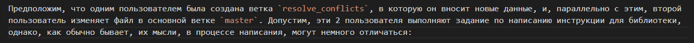
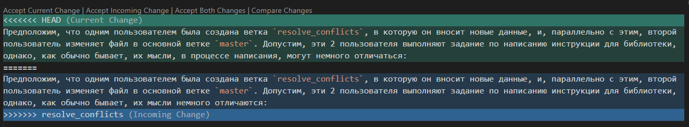

# Инструкция для работы с Git
## 1. Проверка установленного Git
В терминале выполнить команду `git --version`. 
Если Git установлен, появится сообщение с информацией о версии программы
```Bash
$ git --version
git version 2.42.0.windows.2
```
Иначе будет сообщение об ошибке.

## 2. Установка Git
Загружаем последнюю версию Git с  [официального сайта](https://git-scm.com/downloads).
Устанавливаем с настройками по умолчанию.

## 3. Настройка Git
При первом использовании Git необходимо представиться. Для этого нужно ввести в терминале 2 команды:
```Bash
git config --global user.name "ВВедите имя английскими буквами"
git config --global user.email ваша почта@example.com
```

## 4. Инициализация репозитория
Для того чтобы начать работать с Git, необходимо инициализировать локальный репозиторий в папке. Нужно выбрать рабочую папку и ввести следующую команду в терминале:
```Bash
git init
```


После этого терминал покажет сообщение об успешной инициализации нового репозитория, а в месте, где находится выбранная папка, появится новая:

  

`.git` — это папка, которая хранит всю информацию о репозитории.

## 5. Запись изменений в репозиторий
Для того, чтобы записать изменения в репозиторий и, в дальнейшем, работать с ними, необходимо создать или добавить в папку необходимые файлы. После этого нужно указать репозиторию, что были добавлены файлы, с помощью следующей команды:
```Bash
git add <Имя файла>
```
Все файлы можно добавлять по отдельности, как показано выше. Или же добавить сразу все:
```Bash
git add .
```
Может возникнуть ситуация, при которой необходимо добавить 99 файлов из 100 существующих в папке. Тогда можно воспользоваться командой `git add .` для добавления всех файлов и, чтобы убрать один ненужный, существует команда:
```Bash
git reset <Имя файла>
```
Для того чтобы сделать коммит, или, иначе говоря, создать *слепок нужного состояния* для добавленных файлов, выполним команду:
```Bash
git commit -m "Сообщение"
```
Флажок -m задает message - комментарий разработчика. Он необходим для описания закоммиченных изменений. Опытные разработчики используют комбинированные команды для записи изменений:
```Bash
git commit -am "Сообщение"
```
Эта команда позволяет одновременно выполнить добавление и фиксирование с комментарием.  
После фиксации изменений есть возможность увидеть информацию о текущем состоянии репозитория: актуальная ли информация на нем, нет ли чего-то нового, что поменялось. Следующая команда позволяет это сделать:
```Bash
git status
```
Если после инициализации репозитория никаких изменений не было произведено, то терминал выдаст сообщение:
```Bash
$ git status
On branch master
nothing to commit, working tree clean
```
В случае, если изменения были, то терминал уведомит об этом:
```Bash
$ git status
On branch master
Changes not staged for commit:
  (use "git add <file>..." to update what will be committed)
  (use "git restore <file>..." to discard changes in working directory)
        modified:   git_manual.md

no changes added to commit (use "git add" and/or "git commit -a")
```
`Changes not staged` означает, что изменения были произведены, но не зафиксированы. Так же терминал указывает, какой файл был подвержен изменениям (строка `modified: `), и что необходимо сделать для сохранения (`git add ...`) или отмены (`git restore ...`).  

В случае, если было произведено несколько изменений и фиксаций, разработчику необходимо посмотреть, что изменилось с момента последного сохранения. Для этого нужно ввести команду:
```Bash
git diff
```
Терминал покажет следующее:


Видно, какие изменения были произведены и в каком файле. Так же терминал показывает, что указанные изменения не были зафиксированы. В ином случае результат выполнения команды окажется пустым.

## 6. Прсмотр истории коммитов
Для того чтобы посмотреть весь процесс фиксированных изменений, необходимо выполнить команду:
```Bash
git log
```
Терминал покажет историю сохранения с самого начала существования файла в репозитории с указанием хеша (номер коммита), автора, даты, комментария к фиксации и имя ветки, в которой были проведены изменения:


Если необходимо просмотреть более краткую информацию, есть возможность вывести историю *в строчку*, где каждому коммиту будет выделена 1 строка. Команда:
```Bash
git log --oneline
```
```Bash
c0608ee (HEAD -> master) Дооформление раздела 5 - Запись изменений diff, доп. информация
67b98bb Дооформление раздела 5 - Запись изменений diff
08bf061 Дооформление раздела 5 - Запись изменений commit, status
5476fec Дооформление раздела 5 - Запись изменений add, reset, commit
```
## 7. Перемещение между сохранениями
Если разработчику необходимо *откатиться*, то есть перейти к более раннему коммиту, нужно использовать команду:
```Bash
git checkout <Номер коммита>
```
Терминал покажет:
```Bash
Note: switching to '2b6ff8ec781a53012517fc4a82d493e18e553b20'.

You are in 'detached HEAD' state. You can look around, make experimental
changes and commit them, and you can discard any commits you make in this
state without impacting any branches by switching back to a branch.

If you want to create a new branch to retain commits you create, you may
do so (now or later) by using -c with the switch command. Example:

  git switch -c <new-branch-name>

Or undo this operation with:

  git switch -

Turn off this advice by setting config variable advice.detachedHead to false

HEAD is now at 2b6ff8e Дооформление раздела 7 - Перемещение между сохранениями
M       git_manual.md
```
Тогда все последующие изменения после коммита, к которому был выполнен переход, не будут видны. Таким образом можно создавать ответвления от главной ветки `master`. Ранее не употреблялся термин **ветка**, поэтому для более лучшего понимания можно сослаться на фильм "Назад в будущее", когда Док и Мартин возвращались в настоящее, напортачив в прошлом. Таким образом они создавали новые ветки времени с иными исходами. Так же работает и ответвление в Git.  
Для того, чтобы вернуться обратно в *настоящее*, используется команда:
```Bash
git checkout master
```
Также можно вернуться с помощью еще одной команды `switch`:
```Bash
git switch master
```
## 8. Игнорирование файлов
Для того, чтобы исключить из отслеживания в репозитории определенные файлы или папки необходимо создать там файл `.gitignore` и записать в него их названия или шаблоны, соответствующие таким файлам или папкам. Имена файлов можно записывать последовательно:


Иначе, во избежание появления опечаток или ошибок в именах файлов, можно записать общее игнорирование для конкретного типа данных. Например для скриншотов формата *png* в файл `.gitignore` нужно сделать запись:
```Bash
*.png
```
Для других форматов записи делается аналогично.
## 9. Создание веток в Git
По умолчанию имя основной ветки в Git --> `master`  
Создание новых веток необходимо для написания дополнительного кода/информации/правок или добавления новых версий исходного файла. Эта функция бывает очень полезна для OpenSource проектов, т.е. для проектов с открытым исходным кодом. Посмотреть список существующих веток можно с помощью команды:
```Bash
git branch 
```
В случае, если еще не были созданы другие ветки, результат будет следующим:
```Bash
$ git branch
* master
```
Это означает, что на данный момент существует 1 основная ветка `master`, в которой находится пользователь.  
Создать новую ветку можно командой:
```Bash
git branch <Имя новой ветки>
```
Если после создания новой ветки просмотреть еще раз список существующих веток, то будет видно, что веток теперь две:
```Bash
$ git branch create_branch
$ git branch
create_branch
* master
```
Однако пользователь все также находится на основной ветке `master`. Сменить основную ветку можно с помощью команды:
```Bash
git checkout <Имя ветки>
```
После этого терминал покажет, что был совершен переход на новую ветку:
```Bash
$ git switch create_branch
Switched to branch 'create_branch'
```
Это базовый алгоритм создания и перехода на новую ветку. Также часто используемой командой для смены ветки является команда `git switch <Имя ветки>.`Однако, как обычно, опытные пользователи любят упрощать себе задачу и комбинировать различные команды:
```Bash
git checkout -b <Имя ветки>
git switch -c <Имя ветки>
```
Вышеуказанные команды позволяют пользователю одновременно создать ветку и сразу перейти на нее.  
После того, как пользователь поработал в отдельной ветке и зафиксировал резульаты, изменения сохранятся только в ней, а в основной `master` новой информации не будет:


Для того, чтобы зафиксированные изменения в новой ветке были также зафиксированы в основной, необходимо выполнить слияние веток. 
## 10. Слияние веток и разрешение конфликтов
Предположим, что пользователь добавил новую информацию в новой ветке, закоммитил её, и хочет, чтобы эта информация появилась в основной ветке. Если при этом основная ветка не была изменена, тогда конфликта не произойдет и можно выполнить слияние.  
Для слияния выбранной ветки с текущей нужно выполнить команду:
```Bash
git merge <Имя выбранной ветки>
```
После этого в логах будут видны все коммиты с двух веток. 


На скриншоте видна только одна существующая красная линия - это результат слияния 2-х веток. После создания параллельной ветки изменения происходили только в ней, а основная ветка `master` оставалась нетронутой. Если бы была изменена одна и та же часть файла в обеих ветках, то возникнул бы конфликт, разрешить который может только пользователь.

Предположим, что одним пользователем была создана ветка `resolve_conflicts`, в которую он вносит новые данные, и, параллельно с этим, второй пользователь изменяет файл в основной ветке `master`. Допустим, эти 2 пользователя выполняют задание по написанию инструкции для библиотеки, однако, как обычно бывает, их мысли, в процессе написания, могут немного отличаться. Допустим один пользователь такой текст в ветке `resolve_conflicts`:


А другой написал практически такой же, но с небольшими поправками в последнем предложении в ветке `master`:



Оба пользователя зафиксировали свои изменения. После этого пользователь на основной ветке решает слить 2 ветки, чтобы посмотреть конечный результат изменений:




В терминале появляется уведомление о появлении конфликта при слиянии, а в тексте появляется 2 варианта, которые были написаны двумя пользователями. Здесь пользователь, выполняющий слияние, должен выбрать, какой вариант лучше. Так же можно отредактировать слияние через специальный редактор (при использование Visual Studio Code):


Таким образом, пользователь пишет конечный вариант:


После нажатия на кнопку `Complete Merge` редактор закрывается, а в терминале появляется следующее:

```Bash
$ git status
On branch master
All conflicts fixed but you are still merging.
  (use "git commit" to conclude merge)
```

При этом ветка помечается как `(master|MERGING)`. После выполнения комита результат фиксируется и конфликт пропадает. При просмотре лога событий будет видно, как происходило параллельное изменений двух веток (ветвление): 


## 11. Удаление веток
Зачастую, в процессе разработки, второстепенные ветки теряют свой смысл и от них необходимо избавляться, чтобы не загромождать проект. Удалить ветку можно с помощью команды:
```Bash
git branch -d <Имя ветки>
```
Стоит обратить внимание на символ `-d`. Благодаря ему удаление ветки произойдет только в том случае, когда все изменения в ней были перенесены на основную ветку, то есть ветка была полностью влита в основную.

После удаление ветки, список существующих веток, очевидно, будет отображаться без неё:
```Bash
$ git branch
  delete_branch
* master
  resolve_conflicts
```
```Bash
$ git branch -d resolve_conflicts 
Deleted branch resolve_conflicts (was 70e6c00).
```
```Bash
$ git branch
  delete_branch
* master
```