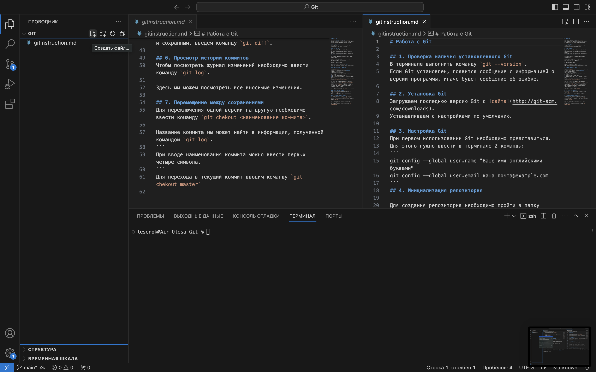

# Работа с Git

## 1. Проверка наличия установленного Git
В терминале выполнить команду `git --version`.
Если Git установлен, появится сообщение с информацией о версии программы, иначе будет сообщение об ошибке.

## 2. Установка Git
Загружаем последнюю версию Git с [сайта](http://git-scm.com/downloads).
Устанавливаем с настройками по умолчанию.

## 3. Настройка Git
При первом использовании Git необходимо представиться.
Для этого нужно ввести в терминале 2 команды:
```
git config --global user.name "Ваше имя английскими буквами"
git config --global user.email ваша почта@example.com
```
## 4. Инициализация репозитория

Для создания репозитория необходимо пройти в папку нашего проекта. 
```
#Для Linux и MacOS путь может выглядеть так /Users/UserName/Desktop/MyProject
#Для Windows например С://MyProject

cd <путь_к_вашему_проекту>
```
После вводим следующую команду `git init`.
В папке создается скрытая папка **.git**.
Теперь Git отслеживает изменения файлов нашего проекта. 

## 5. Запись изменения в репозиторий

Для того, чтобы проверить текущее состояние гита, вводим команду `git status`.
Мы видим, что мы находимся на ветке **main** (создается по умолчанию). 
Добавим файл для отслеживания.
Это мы можем сделать тремя способами:
1. Через иконку с подсказкой "Создать файл" в поле "Проводник".



2. Через меню "Файл - Создать файл..."


3. Через контексное меню в поле "Проводник" - "Создать файл...".


Для того, чтобы файл отслеживался, необходимо выполнить команду `git add <наименование файла>`.

Для того, чтобы сохранить/зафиксировать изменения, необходимо ввести команду `git commit -m "комментарий"`.

>Команда `git commit` берет все данные, добавленные в индекс с помощью `git add`, и сохраняет их слепок во внутренней базе данных, а затем сдвигает указатель текущей ветки на этот слепок.

Команду можно объединить и прописать следующим образом:

```
git commit -am "комментарий"
```

Для того, чтобы посмотреть разницу между текущим файлом и сохранным, введем команду `git diff`.

## 6. Просмотр историй коммитов
Чтобы посмотреть журнал изменений необходимо ввести команду `git log`.


Данная команда показывает изменения в обратном хронологическом порядке - последние коммиты находятся сверху.

Команда `git reflog` просматривает историю изменения голов веток на протяжении вашей работы для поиска коммитов, которые вы могли внезапно потерять, переписывая историю.


Так же историю коммитов можно посмотреть в виде дерева с помощью команды
```
git log --graph
```


## 7. Перемещение между сохранениями
Для переключения одной версии на другую необходимо ввести команду `git checkout <наименование коммита>`.

Название коммита мы может найти в информации, полученной командой `git log`.
```
При вводе наименования коммита можно ввести первых четыре символа.
```
Для перехода в текущий коммит вводим команду `git checkout main`

## 8. Игнорирование файлов

Для того, чтобы исключить из отслеживания в репозитории определенные файлы или папки, необходимо создать файл _**.gitignore**_ и записать в него их названия или шаблоны, соответствующие таким файлам или папкам.
(добавить доп информацию)

## 9. Создание веток в Git

По-умолчанию имя основной ветки `git main`. 
Создать ветку можно командой
```
git branch <имя новой ветки>
```
Список веток в репозитории можно посмотреть с помощью команды `git branch`.
Текущая ветка будет отмечена звездочкой (*).


## 10. Слияние веток и разрешение конфликтов

Для того, чтобы слить ветки, необходимо выполнить следующую команду:
```
git merge <имя ветки>
```
При этом необходимо находиться в "чистовике", т.е. в ветке, к которой мы будет присоединять.
В случае слияния может возникнуть конфликт.


Решить конфликт можно несколькими способами:

* Принять текущее изменение
* Принять входящее изменение
* Принять оба изменения

После слияния веток и разрешения конфликта, необходимо зафиксировать изменения с помощью уже ивестной команды `git commit -am "комментарий"`.

## 11. Удаление веток

Для того, чтобы удалить ветку, необходимо ввести следующую команду:
```
git branch -d <имя ветки>
```
Но эта команда работает не во всех случаях.
Если в ветке присутствуют несохраненные изменения, эта команда не позволит удалить ветку. Это связано с тем, что эти коммиты не отслеживаются, и Git защищает вас от случаной потери данных.
Можно воспользоваться командой 
```
git branch -D <имя ветки>
```
Эта команда принудительного удаления ветки вне зависимости от ее статуса.

>_**Используйте данную команду осторожно, так как после ее ввода у вас не будут просить подтвердить удаление!**_

Так же нельзя удалить ветку, в которой вы находитесь.


## 12. Работа с удаленными репозиториями


>**Удаленный репозиторий** - версия вашего проекта, сохраненная в интеренете или еще где-то в сети.

Для работы с удаленными репозиториями можно использовать сервис от Microsoft - `GitHub`. Этот сервис содержит много полезных функций и огромный архив различного кода.

### 12.1. Создание аккаунта на GitHub

Необходимо пройти по [ссылке](https://github.com) и авторизоваться/зарегистрироваться. 


Для создания аккаунта необходимо выбрать `"Create an account"` и следовать указаниям.

### 12.2. Создание удаленного репозитория

Мы научились создавать локальный репозиторий. Теперь нам необходимо добавить его на `GitHub`, тема самым создать удаленный репозиторий.

Для этого нам необходимо войти на [сайт](https://github.com), где мы уже создали аккаунт, и нажать кнопку `New repository` (Новый репозиторий). На открывшейся странице вводим имя репозитория (Repository name) и нажимаем кнопку `Create repository`.


### 12.3. Слияние удаленного репозитория с локальным

Для того, чтобы слить удаленный репозиторий с локальным, необходимо сделать следующее, в зависимости от наличия или отсутствия локального репозитория:

* __Если локальный репозиторий отсутствует__:

```
echo "# test" >> README.md
git init
git add README.md
git commit -m "first commit"
git branch -M main
git remote add <имя для репозитория> <url-адрес репозитория в сети>
git push -u <имя для репозитория> main
```

* __Если локальный репозиторий имеется__:

```
git remote add <имя для репозитория> <url-адрес репозитория в сети>
git branch -M main
git push -u <имя для репозитория> main
```
>`git remote add <имя для репозитория> <url-адрес репозитория в сети>` - команда привязки удаленного репозитория с локальным.

>`<url-адрес репозитория в сети>` - ссылка удаленного репозитория. Ее можно скопировать на странице `GitHub`.


>`git branch -M main` - переименование текущей ветки **master** в **main**.

>`git push` - отправляет изменения локального репозитория в удаленный.

### 12.4. Работа в удаленном репозитории

После слияния удаленного и локального репозитория, мы можем вносить изменения в удаленном репозитории на `GitHub`. Для этого выбираем команду `Edit`.

Для получения и слияния изменений из удаленного репозитория используется команда:
```
git pull
```
