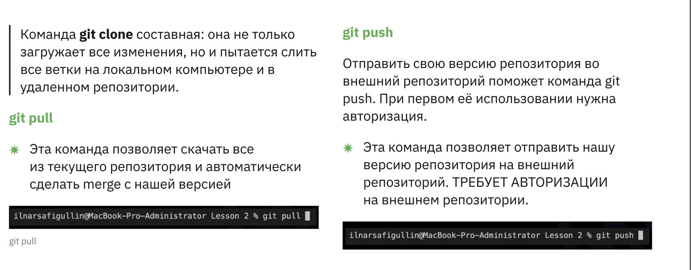
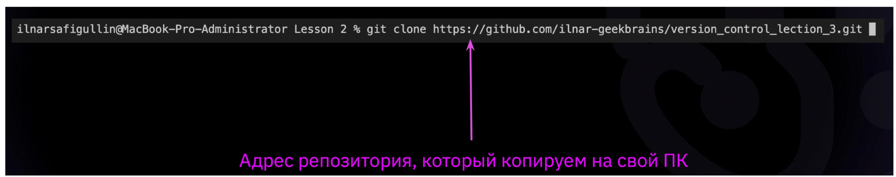

# Инструкция по работе с GIT и удаленными репозиториями

## Что такое Git?
Git — система управления версиями с распределенной архитектурой. В отличие от некогда популярных систем вроде CVS и Subversion (SVN), где полная история версий проекта доступна лишь в одном месте, в Git каждая рабочая копия кода сама по себе является репозиторием. Это позволяет всем разработчикам хранить историю изменений в полном объеме.

## Разграничение понятий Git / Hit Hub
**GIT**
* Освоить работу с удаленными репозиториями, которые находятся не на локальной, а на удаленной машине, например, на сервере git — одна из систем контроля версий
* Способ организации и поддержания версионности
* Самая популярная система контроля версий

**GITHUB**
* Сервис компании Майкрософт для организации работы удаленных репозиториев
* Самый популярный сервис Git 
* Много полезных функций 
* Огромный архив различного кода

## Подготовка репозитория

для создания репозитория, необходимо создать папку, открыть её в VS code, либо открыть из нее терминал. и прописать команду:  **git init**

## Создание коммитов

### Git add

после работы с файлом, необходимод обавить этот файл в комммит, прописав команду 

``
git add (file name)
``
### Просмотрт состояние репозитория

Что бы проверить статус репозитория, необходимо ввести команду 

``
git status
``

После - система выдаст статус по изменениям файла, файлов - если таковые были.

### Для того, что бы создать коммит к измененному фалу, необходимо:

Необходимо ввести команду 

``
git commit -m "статус, изменение и так далее"
``

### Уточеннеие статуса изменений

ЧТо бы проверить статус изменений , и все возможные коммиты, необходимо ввеси команду 

``
git log
``
Тогда мы увидим все возможноые коммиты к файлу, все изменения

###  Переход между версиями (коммитами)

Что бы перейти к другому коммиту (Вернутсья, отмотать назад), необходимо прописать следующую команду:

``
git ckeckout (номмер коммита)
``
### Вставляем картинки
для того, что бы вставить изображение, необходимо ввети следующую комбинацию:

``

``

###  Создание, удаление веток

Для того, что бы создать новую ветку, необходимо прописать следующую команду

``
git branch (eneter branch name)
``

###   Для того, что бы удалить ветку

``
git branch -d (eneter branch name u want to delete)
``

Для того, чтобы переключиться на нужную ветку, так же используем команду chekout

``
git checkout (eneter branch name)
``

###   Для того - что бы игнорировать файоы, необходимо:
* Создать файл с раширением .gitignore 
* Внутрь файлы вписывать файлы - которые необходимо игнорировать

###   Для того - что бы игнорировать файоы, необходимо дубль 2:
* Создать файл с раширением .gitignore 
* Внутрь файлы вписывать файлы - которые необходимо игнорировать

``

###   Для того объедить ветки, необходимо перейти в нужную ветку и прописать следующую команду

``
git merge (name_of_branch)
``

тогда произойдет слияние ветки из которой писалась команда с веткой которую необходимо объединить.

## Для того - что бы работать с удалённыи репозиторием - необходимо знать следующие команды и действия:
* СоздатьаккаунтнаGitHub.com
* Создатьлокальныйрепозиторий
* “Подружить”вашлокальныйиудалённыйрепозитории. GitHub при создании нового репозитория подскажет, как это можно сделать
* Отправить(push)вашлокальныйрепозиторийвудалённый(наGitHub),приэтом,возможно, 
 вам нужно будет авторизоваться на удалённом репозитории
* Провестиизменения“сдругогокомпьютера”
* Выкачать(pull)актуальноесостояниеизудалённогорепозитория

### Работа с удаленными репозиториями. Скачивание из текущего репозитория и слияние со своей версией

своить работу с удаленными репозиториями, которые находятся не на локальной, 
 а на удаленной машине, например, на сервере.
Копировать внешний репозиторий на свой ПК можно командой git clone.

* Создаём папку на своем компьюетер
* инициализируем репозиторий
* делаем "вилку" с необходимого репозитория
* клонируем все файлы на компьютер
* создаем новую ветку 
* делаем комит и выгружаем на удаленный репозиторий
* делаем запрос на слияние pull request

* команда для предложения изменений
* запрос на вливание изменений в репозиторий

В больших компаниях один ответственный за проект создает аккаунт. Другие пользователи дают команду pull request. Предлагать изменения на GitHub нужно в отдельной ветке. Сначала пользователь копирует репозиторий на свой компьютер, делает fork репозитория, затем клонирует версию на своём ПК, создаёт ветку с предлагаемыми изменениями, отправляет изменения командой push в свой аккаунт на GitHub и даёт команду pull request.
