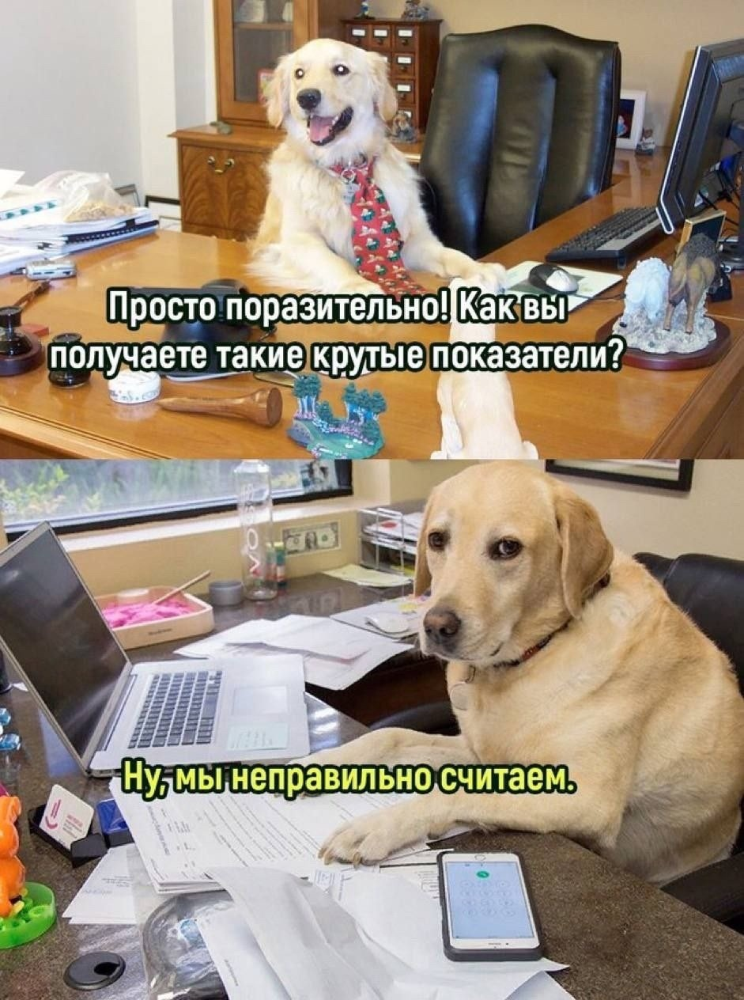

# Инструкция по языку MarkDown

## Стилизация текста

Обычный текст.

Новая строка

**Полужирный текст**

*Курсив*

## Цитирование в языке MarkDown
> Первый уровень
>>Второй уровень

## Списки
### Ненумерованный список
* Лист 1
* Лист 2

### Нумерованный список
1. Лист
2. Лист

## WEB ссылки
Текст [пример ссылки](http.example.com "всплывающая подсказка")

# Как добавлять картинки в Markdown
